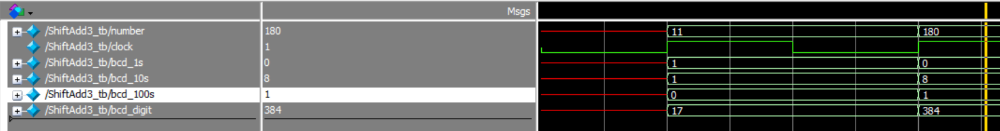

# ELEC5566M Mini-Project Repository

- #### Project Introduction (201715540)

  - This project is a plane war game implemented in Verilog using DE1-SoC and LT24 LCD on Quartus. The main architecture and concept are illustrated in the following diagram:

<b>Figure 1 Aeroplane Wars Architecture</b>

- #### State Machine (201715540)

  - For the overall framework of this project, we have divided it into a rough state machine. The state machine is depicted in the following diagram:

<b>Figure 2 Aeroplane Wars State Machine</b>

- #### BCD Adder (201715540)

  - By utilizing the double-dabble algorithm in Unit3-1, we can realize an N-Bit BCD adder, which can convert binary data into decimal representation and achieve parameterization. The following is a simple testbench verification diagram:

<b>Figure 3 NBit Converter Testbench</b>

- #### Audio Playback (201715540)

  - 1. Understanding Audio Decoders: According to the **DE1-SoC User Manual** provided by Minerva, the DE1-SoC board offers high-quality 24-bit audio through the Wolfson WM8731 audio codec. This chip supports microphone input, line input, and line output ports, and the sampling rate can be adjusted from 8 kHz to 96 kHz. The connection between the audio circuit and the FPGA is illustrated in the following diagram:

<b>Figure 4 WM8731 and DE1-SOC Connection</b>

  - 2. Producing the Audio MIF File:
    - Download the WAV file from a source of royalty-free music material: [Download Free Sound Effects for Videos | Mixkit](https://mixkit.co/free-sound-effects/)
    - Determine the memory_width of the WAV file, set it as 16-bit by default.
    - Determine the data of the WAV file:
      - Extract the data array using the audioread function from the WAV file.
      - As the data should be unsigned, process the data array as follows:
        - data = uint16(data * ((2^16 - 1) / max(data - min_value)))
    - Determine the memory_depth of the WAV file, which should be a multiple of 2 and slightly greater than numel(data).
    - Pass the above parameters to the mat2mif code to generate the MIF file.

  - 3. Completing the I2C Driver (this section mainly covers content gathered, organized, and learned from online sources, with a primary reference from "Embedded SoPC design with NIOS II processor and Verilog Examples"):
    - The WM8731 device can be configured via a control interface, supporting 2-wire and 3-wire Serial Bus protocol. The construction of the DE1 board supports the 2-wire I2C (Inter-Integrated Circuit) Bus protocol. The knowledge architecture of I2C is summarized in the following diagram:

    - 

    - 
<b>Figure 5 I2C Knowledge Architecture</b>

      - HDL Implementation:
        - The DE1 board can use the I2C interface to configure the audio codec device, with the main devices being the FPGA chip as the master device and the WM8731 chip as the slave device.
        - When configuring the internal registers of WM8731, a 7-bit register id is needed to store the register address and a 9-bit register data value. These two fields combined form 2 bytes. Despite having only one slave device, WM8731 always requires the slave address and the direction bit as 0 (with the master device responsible for writing).
        - Based on the above requirements, an FSM state machine related to I2C is created, where the data state transmits 8-bit data, and the ack state receives 2-byte data, as depicted in the following diagram:

          - 

        - 
<b>Figure 6 I2C FSM</b>

    - In practical scenarios, it is necessary to transmit 1 bit of data in each transfer. To ensure smooth data transmission, three states, data1-data3, are used, with data2 being the state for actual data read/write operations while data1 and data3 stabilize the data. The specifics are shown in the following diagram:

- 

- 
<b>Figure 7 Clock Cycles Occupied by Different States of IIC Master Device and Slave Device</b>

    - Based on the above analysis, we can understand the main data structure of HDL:
      - Main input message_in: 24 bits, mainly comprising 7-bit register ID address, 9-bit register data value, 7-bit WM8731 address, and 1-bit direction bit (0).
      - Two main outputs i2c_scl and i2c_sda: connected to bidirectional scl and sda.
      - Input command wr_i2c: used to control data transmission start and stop.
      - Three output status signals: i2c_idle, i2c_fail, and i2c_down_tick, corresponding to three states: idle state, transmission failure state, and transmission completion count state.
    - In addition, since the typical IIC transmission rate is 100K per second, which means each bit of data occupies 10 microseconds, while the clock of DE1-SOC is 50MHz, approximately 0.02 microseconds/period, to ensure that each state has enough time, we need to count the number of clock cycles and allocate the time for each state reasonably. According to Figure 7, we know that different states consume time in three types:
      - 1. Occupying half a clock cycle (5 microseconds): start, turn, stop, data2, or ack2 state.
      - 2. Occupying 1/4 of a clock cycle (2.5 microseconds): scl_begin, data1, data3, ack1, ack3, and scl_end states.
      - 3. Others: idle state.
    - During signal transmission, transient interference and unstable signals often occur. To solve this issue, we need to use a buffer for the output of the clock signal and the data signal separately to ensure signal stability.
      - The specific implementation of the state machine is shown in the following diagram:
        - 

- Complete the driver design of WM8731

- Reference:
  - [FPGA Configuration and Acquisition WM8731 Application Notes-CSDN Blog](https://blog.csdn.net/qq_41667729/article/details/120753491)
  - [FPGA Drive WM8731 Audio Transceiver Full Explanation of the Network, Provide 2 Sets of Engineering Source Code and Technical Support_vm8731-CSDN Blog](https://blog.csdn.net/qq_41667729/article/details/130668537)
  - [FPGA Operation WM8731 Audio Codec Slave Mode, Self-criticism of Novices-CSDN Blog](https://blog.csdn.net/qq_41667729/article/details/120953453)
  - "Embedded SoPC Design with NIOS II Processor and Verilog Examples"
  - "DE1-SoC_User_Manual"
  - "WM8731_Audio_Codec_Datasheet"

- #### Issues Encountered (201715540)

    - When writing NbitBCD-related code, I encountered an error "output or inout port xxx must be connected to a structural net expression". Later, I understood from the following website that the output in the main module cannot be in reg format.
        - [Error of "output or inout port xxx must be connected to a structural net expression" in FPGA-CSDN Blog](https://blog.csdn.net/m0_57079595/article/details/123858285)
    - The loop variable for generate for must be declared using genvar, while the variable for for loop can be declared using various types such as reg, integer, etc.
    - The condition in generate if must be a parameter.
    - When generating the mif file, I encountered the following errors:
        - "Length of input data depth greater than target memory depth" - This is because the length of my input data (i.e., `data_depth`) is greater than the target memory depth (i.e., `memory_depth`). It means that the data I want to store exceeds the capacity limit of the memory, so I need to modify memory_depth to be slightly larger than numel(data).
        - "Input data value at index 4482 is negative. Values must be unsigned." - This is because the wav file I downloaded from the internet and converted into data using audioread has not been processed, leading to negative values in the data.
        - Because
          - 

