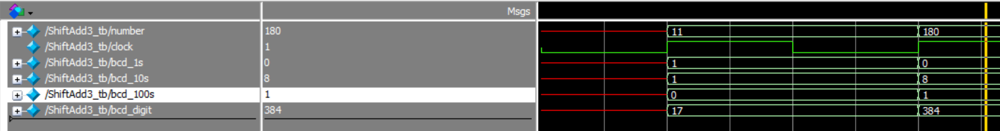
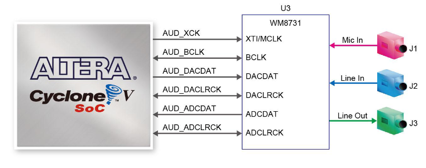
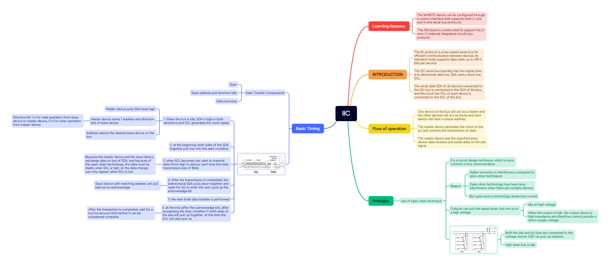
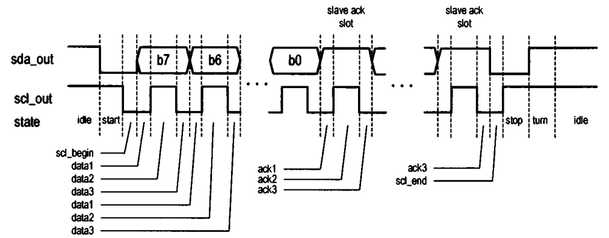
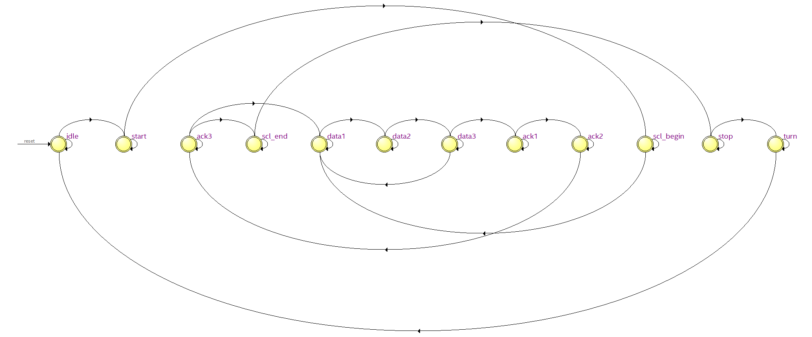
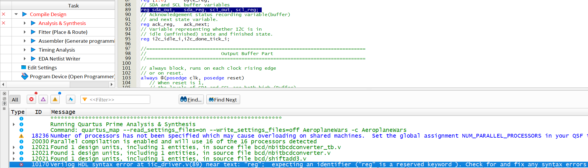

# ELEC5566M Mini-Project Repository

- #### 项目简介（201715540）

  - 该项目是基于DE1-SoC   和LT24 LCD  在Quartus上使用Verilog实现的一款飞机大战游戏，主要架构与思路如下图所示：

<b>Figure 1 飞机大战架构图</b>

- #### 状态机（201715540）

  - 对于该项目的整体框架，我们进行了一个大致的状态机划分，状态机如下图所示：

<b>Figure 2 飞机大战状态机</b>

- #### BCD加法器（201715540）

  - 利用Unit3-1里面的double-dabble算法，我们可以实现N-Bit的BCD加法器，然后通过这个可以将二进制数据转换成二进制表示的十进制数据，并且实现参数化，下图是一个简单的testbench验证图：
    - 

<b>Figure 3 NBit转换器testbench图</b>

- #### 音频播放（201715540）

  - ①了解音频解码器知识：根据Minerva提供的**DE1-SoC User Manual**资料我们可以知道：DE1-SoC 板通过 Wolfson WM8731 音频编解码器（编码器/解码器）提供高质量 24 位音频。该芯片支持麦克风输入、线路输入和线路输出端口，采样率可在 8 kHz 至 96 kHz 范围内调节。音频电路与 FPGA 的连接如下图所示：
    - 
  
- 
<b>Figure 4 WM8731与DE1-SOC连接图</b>

    - ②制作音频mif文件：
      - 下载wav文件：音乐素材来源：无版权可免费商用音乐素材网站[Download Free Sound Effects for Videos | Mixkit](https://mixkit.co/free-sound-effects/)
      - 确定wav文件的memory_width：默认设置为16bit。
      - 确定wav文件的data：
        - 使用audioread函数提取wav文件，得到data数组
        - 由于数据要求是无符号，所以对data数组数据进行处理：
          - data = uint16(data * ((2^16 - 1) / max(data - min_value)));
      - 确定wav文件的memory_depth：2的倍数，略大于numel(data)。
      - 将以上参数传入mat2mif代码即可生成mif文件

    - ③完成IIC驱动（该部分内容大部分从网上搜集整理学习，主要参考《Embedded SoPC design with NIOS II processor and Verilog Examples》）：WM8731 器件可通过控制接口进行配置，该接口支持 2 线和 3 线串行总线协议。 DEI 板的构造支持 2 线 I C（内部集成电路）总线协议。有关IIC的知识架构图总结如下图所示：
      
    - 
      
    - 
<b>Figure 5 IIC知识体系架构</b>

      - HDL实现
        - DE1板子可以使用IIC接口来配置编解码设备，总线架构主要包含两个设备，一个是主设备的FPGA芯片，一个是从设备的WM8731芯片。
        - 当配置WM8731的内部寄存器的时候需要7位寄存器id用来存放寄存器地址和9位寄存器数据值，这两个字段组合起来就是2个字节。虽然只有一个从设备，但是WM8731作为从机地址和方向位0（主设备只负责写）始终需要。
        - 根据以上要求，制作IIC相关的FSM自动机，data状态传输8bit数据，ack状态接收2byte数据，状态机如下图所示：
          
          - 
          
        - 
<b>Figure 6 IIC FSM</b>

    - 在实际情况中，我们需要在每次传输过程中传递1个bit的数据，为了使数据传输平稳，我们需要data1-data3三个状态，在data2状态的时候才执行数据的读写，data1和data3状态负责稳定数据。具体如下图所示：

       - 

       - 
<b>Figure 7 IIC主设备和从设备不同状态所占时钟周期</b>

           - 根据以上分析我们可以知道HDL主要的数据结构：
             - 主输入 message_in：24bit，主要包括7位寄存器id地址+9位寄存器数据值+7位WM8731地址+1bit方向位（0）
             - 两个主输出i2c_scl和i2c_sda：连接到双向scl和sda。
             - 输入命令wr_i2c：用于控制数据传输启动和停止。
             - 三个输出状态信号： i2c_idle 、 i2c_fail和i2c_down_tick，分别对应三种状态：待机状态，传输失败状态和传输完成计数状态。
         - 此外，由于一般IIC的传输速率为每秒100K，也就是每bit数据占10微秒，然而DE1-SOC的时钟为50MHz约为0.02微妙/周期，为了让每个状态有足够的时间，我们需要对时钟数进行计数并且合理分配每个状态所占时间，并且根据图7我们知道，不同状态所耗时间就三种类型：
           - 1、占用半个时钟周期（5微妙）：start、turn、stop、data2或者是ack2状态
           - 2、占用1/4个时钟周期（2.5微妙）：scl_begin、data1、data3、ack1、ack3和scl_end状态
           - 3、其他：idle状态
         - 在信号传输过程中，经常会出现瞬时干扰和不稳定信号的情况，为了解决这个情况，我们需要对时钟信号的输出和数据信号的输出分别做一个缓冲器来确保信号的稳定性。
           - IIC控制器代码逻辑：
             - s
           - 状态机具体实现如下图所示
             - 
             - 

    - ④完成WM8731的驱动设计

- Reference：
    - [FPGA配置采集WM8731小白应用笔记-CSDN博客](https://blog.csdn.net/qq_41667729/article/details/120753491)
    - [FPGA驱动WM8731音频收发全网最细讲解 提供2套工程源码和技术支持_vm8731-CSDN博客](https://blog.csdn.net/qq_41667729/article/details/130668537)
    - [FPGA操作WM8731音频编解码器从机模式，小白的自我批判-CSDN博客](https://blog.csdn.net/qq_41667729/article/details/120953453)
    - 《Embedded SoPC design with NIOS II processor and Verilog Examples》
    - 《DE1-SoC_User_Manual》
    - 《WM8731_Audio_Codec_Datasheet》
  
- #### 遇到的问题（201715540）

  - 在写NbitBCD相关代码时遇到了output or inout port xxx must be connected to a structural net expression的错误，后面根据下面网址明白了主模块中的output不能是reg格式
    - [FPGA中的output or inout port xxx must be connected to a structural net expression错误-CSDN博客](https://blog.csdn.net/m0_57079595/article/details/123858285)
  - generate for的循环变量必须用genvar声明，for的变量可以用reg、integer整数等多种类型声明；
  - generate if中的条件必须是参数
  - 在生成mif文件的时候产生了如下错误：
    - Length of input data depth greater than target memory depth
      - 这是因为我的输入数据的长度（即 `data_depth`）大于了目标存储器的深度（即 `memory_depth`），也就是说我要存储的数据超出了存储器的容量限制，所以我需要对memory_depth进行修改，它应该略大于numel(data).
    - Input data value at index 4482 is negative. Values must be unsigned.
      - 这是因为我从网上下载的wav文件经过audioread转换成data之后没有对数据进行处理，所以导致了data里面有负值。
    - 因为
      - 

