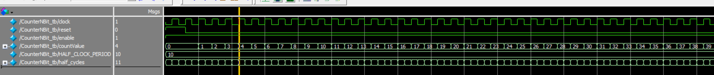
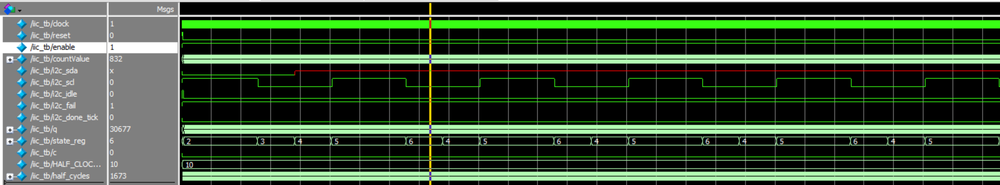
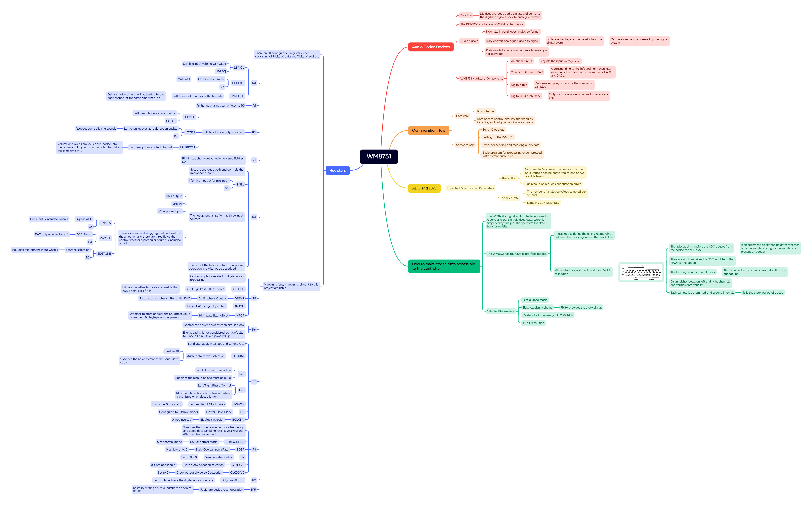
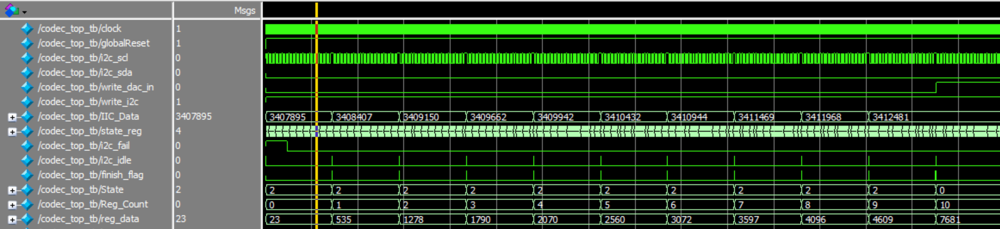
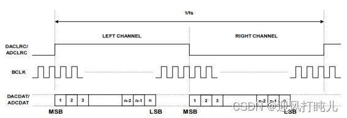
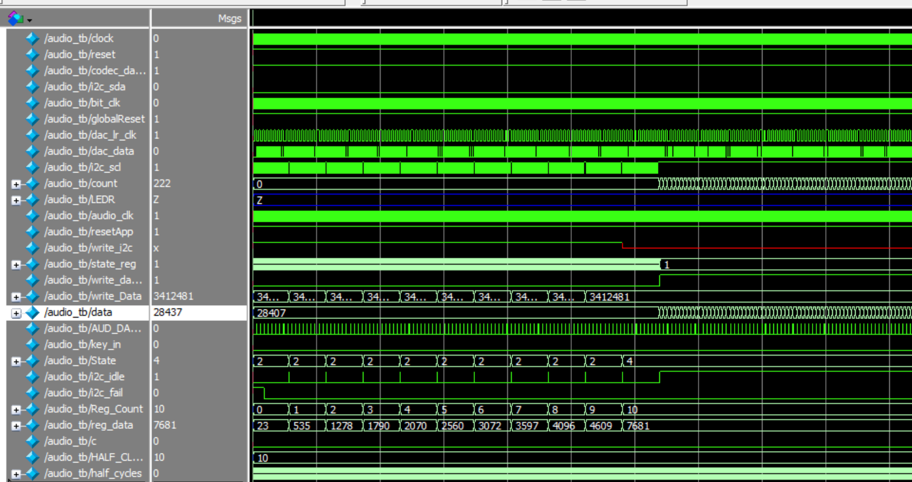

# ELEC5566M Mini-Project Repository

- #### 项目简介（201715540）

  - 该项目是基于DE1-SoC   和LT24 LCD  在Quartus上使用Verilog实现的一款飞机大战游戏，主要架构与思路如下图所示：

<b>Figure 1 飞机大战架构图</b>

- #### 状态机（201715540）

  - 对于该项目的整体框架，我们进行了一个大致的状态机划分，状态机如下图所示：

<b>Figure 2 飞机大战状态机</b>

- #### BCD加法器（201715540）

  - 利用Unit3-1里面的double-dabble算法，我们可以实现N-Bit的BCD加法器，然后通过这个可以将二进制数据转换成二进制表示的十进制数据，并且实现参数化，下图是一个简单的testbench验证图：
    - 

<b>Figure 3 NBit转换器testbench图</b>

- #### 音频播放（201715540）

  - ①了解音频解码器知识：根据Minerva提供的**DE1-SoC User Manual**资料我们可以知道：DE1-SoC 板通过 Wolfson WM8731 音频编解码器（编码器/解码器）提供高质量 24 位音频。该芯片支持麦克风输入、线路输入和线路输出端口，采样率可在 8 kHz 至 96 kHz 范围内调节。音频电路与 FPGA 的连接如下图所示：
    - 
  
- 
<b>Figure 4 WM8731与DE1-SOC连接图</b>

    - ②制作音频mif文件：
      - 下载wav文件：音乐素材来源：无版权可免费商用音乐素材网站[Download Free Sound Effects for Videos | Mixkit](https://mixkit.co/free-sound-effects/)
      
      - 确定wav文件的memory_width：设置为32bit，采样率设置为48000。
      
        - 
      
          
<b>Figure 5 设置音乐采样率核采样位数</b>

      
    - 确定wav文件的data：
        - 使用audioread函数提取wav文件，得到data数组
        - 由于数据要求是无符号，所以对data数组数据进行处理：
          - data = uint16(data * ((2^16 - 1) / max(data - min_value)));
        
      - 确定wav文件的memory_depth：2的倍数，略大于numel(data)。
      
      - 将以上参数传入mat2mif代码即可生成mif文件
      
    - ③完成WM8731的驱动设计

       - 首先我们需要实现一个CounterNBit模块实现对rom的IP核的数据遍历读取，本质上就是一个for循环来遍历输出值，接着我们写了一个testbench来验证：

          - 验证结果如下图所示，通过这个可以看到我们的countValue 在每个时钟上升沿进行了递增，说明该模块正常运行。
          - 

       - 接着我们需要使用ROM的ip核对生成的mif音乐文件进行读取，于是根据mif大小创建了一个65536word大小的32字节的rom，接着我们通过使用CounterNBit模块对其进行测试：
          
          - 测试结果如下图所示，当reset完成后，countValue开始计数，此时q的值随之改变，通过比对mif文件，发现数据一致，说明该IP核运行正常！
          - 
          
       - 读取ROM的ip核完成后，为了实现对WM8731的寄存器的配置，我们需要提前完善IIC的驱动代码编写。完成IIC驱动（该部分内容大部分从网上搜集整理学习，主要参考《Embedded SoPC design with NIOS II processor and Verilog Examples》）：

          - WM8731 器件可通过控制接口进行配置，该接口支持 2 线和 3 线串行总线协议。 DEI 板的构造支持 2 线 I C（内部集成电路）总线协议。有关IIC的知识架构图总结如下图所示：
          - 

       - 
<b>Figure 6 IIC知识体系架构</b>

       - DE1板子可以使用IIC接口来配置编解码设备，总线架构主要包含两个设备，一个是主设备的FPGA芯片，一个是从设备的WM8731芯片。

          - 当配置WM8731的内部寄存器的时候需要7位寄存器id用来存放寄存器地址和9位寄存器数据值，这两个字段组合起来就是2个字节。虽然只有一个从设备，但是WM8731作为从机地址和方向位0（主设备只负责写）始终需要。

          - 根据以上要求，制作IIC相关的FSM自动机，data状态传输8bit数据，ack状态接收2byte数据，状态机如下图所示：

            - 

          - 
<b>Figure  IIC FSM</b>

       - 在实际情况中，我们需要在每次传输过程中传递1个bit的数据，为了使数据传输平稳，我们需要data1-data3三个状态，在data2状态的时候才执行数据的读写，data1和data3状态负责稳定数据。具体如下图所示：

          - 

          - 
<b>Figure  IIC主设备和从设备不同状态所占时钟周期</b>

            - 根据以上分析我们可以知道HDL主要的数据结构：

              - 主输入 message_in：24bit，主要包括7位寄存器id地址+9位寄存器数据值+7位WM8731地址+1bit方向位（0）
              - 两个主输出i2c_scl和i2c_sda：连接到双向scl和sda。
              - 输入命令wr_i2c：用于控制数据传输启动和停止。
              - 三个输出状态信号： i2c_idle 、 i2c_fail和i2c_down_tick，分别对应三种状态：待机状态，传输失败状态和传输完成计数状态。

            - 此外，由于一般IIC的传输速率为每秒100K，也就是每bit数据占10微秒，然而DE1-SOC的时钟为50MHz约为0.02微妙/周期，为了让每个状态有足够的时间，我们需要对时钟数进行计数并且合理分配每个状态所占时间，并且根据图7我们知道，不同状态所耗时间就三种类型：

              - 1、占用半个时钟周期（5微妙）：start、turn、stop、data2或者是ack2状态
              - 2、占用1/4个时钟周期（2.5微妙）：scl_begin、data1、data3、ack1、ack3和scl_end状态
              - 3、其他：idle状态(空闲状态)

            - 在信号传输过程中，经常会出现瞬时干扰和不稳定信号的情况，为了解决这个情况，我们需要对时钟信号的输出和数据信号的输出分别做一个缓冲器来确保信号的稳定性。

              - 状态机具体实现如下图所示

                - 

                  
<b>Figure  WM8731与DE1-SOC连接图</b>

            - 完成IIC代码的编写后，我们可以写一个testbench文件来测试IICdriver是否正确运行：

              - 在testbench中，我们调用了CounterNBit模块来对address进行计数递增，让我们可以读取调用的ROMip核里面存储的数据，然后把读取到的数据使用IIC发送。
              - 通过下图我们可以发现sda拉低时，scl为高，此时为2状态也就是start状态。当scl开始拉低时进入了scl-begin状态，1/4周期后开始进入4（data1）状态，开始准备传输数据。
              - state_reg从2-3-4-5-6是从状态start->scl-begin->data1->data2->data3然后不断循环6-4-5状态也就是data3-data1-data2不断地传输数据，简单验证了一下IIC传输数据的正确。具体验证在后续testbench可以辅助证明该代码正确。
              - 

       - 我们需要对WM8731的寄存器进行配置，所以需要提前了解WM8731知识，总结如下图（路径：Audio/docx/WM8731.png）：

          - 

       - WM8731架构图如下图所示：

          - 

          - 根据上图我们可以知道，我们需要走的电路由放大电路（右边）、两个ADC、数字滤波器和数字音频接口组成，根据需求，我们只需要实现WM8731的寄存器配置和DAC数据的传输即可实现ROM中提取音乐文件并播放音乐，也就是虚线箭头所走路径，相关信号解释如下：

            - 模拟信号相关：
              - rlinein、llinein: 模拟信号右左声道线路输入
              - micin：麦克风输入
              - rhpout、lhpout：右左声道耳机输出
            - 数字信号相关：
              - dacdat：数据到DAC
              - adcdat：来自ADC的数据
              - mclk：主时钟信号
              - bclk：位时钟
              - daclrc：DAC左右信道的时钟信号
              - adclrc：ADC左右信道的时钟信号
            - 控制接口的信号
              - sdin：串行数据输入
              - sclk：串行时钟

          - 在了解完上述原理后，我们编写出codec_top.v文件来进行配置，根据配置手册的图片（如下图）我们做出配置：

          - 

            - R0：
              - LHPBOTH：是否将左线路的静音值和增益加载到右通道，此处选0.
              - LINMUTE: 左线输入静音，此处选0.不让静音。
              - LRINVOL：左线输入放大器音量，此处设置为默认音量10111（0dB）.
            - R1：配置与R0同理
            - R2与R3配置：
              - LHPVOL：左耳机音量，默认值为1111001（0dB），此处为了测试我将其调为了接近最大声7d'126。
              - LCZEN：是否启动过零检测电路，可以减少咔哒声，选1.
              - LRHPBOTH：表示是否将左耳机音量和过零值同时加载到右通道，选0。
            - R4配置：
              - INSEL：输入选择，1为线路输入，0为麦克风输入。此处选1.
              - BYPASS：是否选择旁路ADC输入，选0；
              - DACSEL：是否选择DAC输出，选1；
              - SIDETONE：是否选择麦克风输入，选0;
              - 其余为麦克风操作，都选0:MICBOOST,MUTEMIC,SIDEATT
            - R5配置：
              - ADCHPD：是否启动ADC高通滤波器，选0；
              - DEEMP：设置DAC的去加重滤波器，选0；
              - DACMU：DAC是否静音，选0；
              - HPOR：DAC高通滤波器禁用时是否存储或清除DC偏移值，选0；
            - R6因为控制各个电路的通断电，此处我们全选通电，也就是全0；
            - R7和R8设置数字音频接口和采样率：
              - FORMAT：指定串行数据流基本格式，选1；
              - IWL：指定分辨率也就是样本位数，选11：32位；
              - LRP：使用daclrc来指示DAC数据流通道，此处选0；
              - LRSWAP：左右时钟是否交换，选0；
              - MS：主从模式，选0;
              - BCLKINV：位时钟反转，选0；
              - USB/NORMAL：选0，正常模式；
              - BOSR：基本过采样率，选0；
              - SR：采样率控制，设置为0000，为48K采样率；
              - CLKDIV2：核心时钟二分频选择，选0；
              - CLKODIV2：时钟输出除以2选择，设置为0；
            - R9只有一个字段ACTIVE，选1激活数字音频接口。

          - 发送流程可以用以下状态机代替：

            - 

          - 设置完成后，将其地址+值+方向位也就是24位通过IIC发送出去，为了验证是否有效，我们写了一个testbench来验证是否发送正确数据：

            - 通过下图我们可以看到，IIC_Data为要传输的值，reg_data为要发送的值，通过比对我们发现：
            - R0: 24'b 00110100(Device_Address) 0000000(LIN_ADDR) 0(LHPBOTH) 0(LHPMUTE) 00 10111(LHPVOL) = 3407895 , 验证成功。
            - 

          - 在实现了I2C给WM8731寄存器配置值之后，我们需要在配置完WM8731后传输ROM里面的mif文件的音频数据给WM8731，这个地方需要考虑使用IIS协议。

          - 为了将ROM的数字信号转换为模拟信号来播放音乐，我们需要写一个IIS来实现相关的功能，当48K采样率情况下，主时钟为1843200，然后根据公式我们可以算出来比特时钟的分频数=MCLK/(SAMPLE_RATE\*DATA_WIDTH\*CHANNEL_NUM*2)-1≈5.

          - 因为传输位数也就是音频数据为32位，我们需要进行一个32位分频形成一个新的时钟AUD_BCLK，然后根据如下图像的左对齐模式实现IIS的传输。

            - 

          - 通过对比上图我们发现，下图的模拟还是有一点差距，那就是在开始时没有对齐时钟的下降沿，这是需要修改的地方。

            - 

          - 首先，我们需要实现在配置完之后才开始使用IIS协议传输数据，如下图所示，在I2C传输完成后count才开始计数，并且data开始读取到，此时i2c_scl持续拉高表示i2c过程已经结束。

            - 

            

       - 引脚配置

          - 根据《DE1-SoC_User_Manual》中对AUDIO部分的引脚描述，我们写下了相关的scl文件来分配引脚，引脚分配如下图所示：
             - 只对dac相关引脚进行了配置而没有对ADC配置，因为我们只用到了DAC的功能。
             - 

       - 成果展示

          - <video src="C:/Users/11440/Documents/WeChat%20Files/wxid_n56vfgg8uplc22/FileStorage/Video/2024-05/4ceb8194de777050c5b08e82a67d34f5.mp4"></video>

- #### Reference：
    
    - [FPGA配置采集WM8731小白应用笔记-CSDN博客](https://blog.csdn.net/qq_41667729/article/details/120753491)
    - [FPGA驱动WM8731音频收发全网最细讲解 提供2套工程源码和技术支持_vm8731-CSDN博客](https://blog.csdn.net/qq_41667729/article/details/130668537)
    - [FPGA操作WM8731音频编解码器从机模式，小白的自我批判-CSDN博客](https://blog.csdn.net/qq_41667729/article/details/120953453)
    - 《Embedded SoPC design with NIOS II processor and Verilog Examples》
    - 《DE1-SoC_User_Manual》
  - 《WM8731_Audio_Codec_Datasheet》
  - [探索 Arrow SoCKit 第 VIII 部分 - 音频编解码器 --- Exploring the Arrow SoCKit Part VIII - The Audio Codec (zhehaomao.com)](https://zhehaomao.com/blog/fpga/2014/01/15/sockit-8.html)
  
- #### 遇到的问题（201715540）

  - 在写NbitBCD相关代码时遇到了output or inout port xxx must be connected to a structural net expression的错误，后面根据下面网址明白了主模块中的output不能是reg格式
    - [FPGA中的output or inout port xxx must be connected to a structural net expression错误-CSDN博客](https://blog.csdn.net/m0_57079595/article/details/123858285)
  - generate for的循环变量必须用genvar声明，for的变量可以用reg、integer整数等多种类型声明；
  - generate if中的条件必须是参数
  - 在生成mif文件的时候产生了如下错误：
    - Length of input data depth greater than target memory depth
      - 这是因为我的输入数据的长度（即 `data_depth`）大于了目标存储器的深度（即 `memory_depth`），也就是说我要存储的数据超出了存储器的容量限制，所以我需要对memory_depth进行修改，它应该略大于numel(data).
    - Input data value at index 4482 is negative. Values must be unsigned.
      - 这是因为我从网上下载的wav文件经过audioread转换成data之后没有对数据进行处理，所以导致了data里面有负值。
    - 因为
      - 

