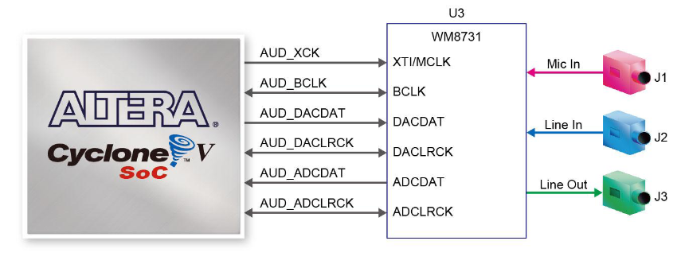
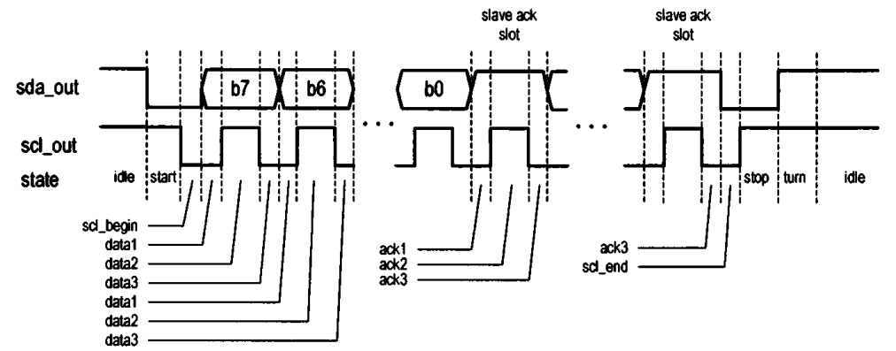
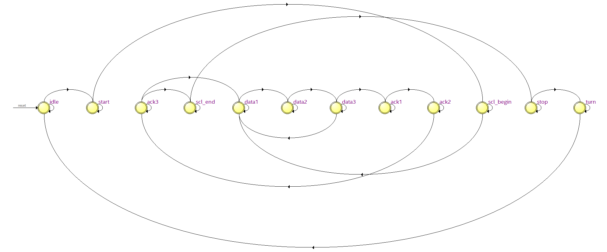
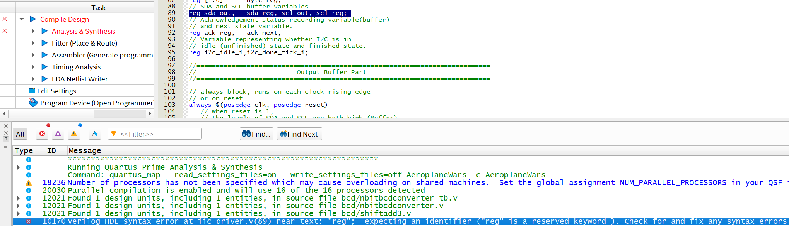

# ELEC5566M Mini-Project Repository

- #### Project Introduction (201715540)

  - This project is a plane combat game implemented in Verilog on Quartus based on DE1-SoC and LT24 LCD. The main architecture and idea are shown in the figure below:

<b>Figure 1 Aeroplane Wars Architecture</b>

- #### State Machine (201715540)

  - For the overall framework of this project, we have divided it into a rough state machine, as shown in the figure below:

<b>Figure 2 Aeroplane Wars State Machine</b>

- #### BCD Adder (201715540)

  - Utilizing the double-dabble algorithm from Unit3-1, we can implement an N-Bit BCD adder, which can convert binary data into decimal data represented in binary and be parameterized. The image below shows a simple testbench validation:
    - 

<b>Figure 3 NBit Converter Testbench</b>

- #### Audio Playback (201715540)

  - ① Understanding audio decoder knowledge: According to the information provided in the **DE1-SoC User Manual** by Minerva, we know that the DE1-SoC board provides high-quality 24-bit audio through the Wolfson WM8731 audio codec (codec/decoder). This chip supports microphone input, line input, and line output ports, with adjustable sampling rates ranging from 8 kHz to 96 kHz. The connection of the audio circuit to the FPGA is depicted in the figure below:
    - 

- 
<b>Figure 4 Connection between WM8731 and DE1-SOC</b>

    - ② Creating audio mif file:
      - Download WAV file: Music material source: [Download Free Sound Effects for Videos | Mixkit](https://mixkit.co/free-sound-effects/)
      
      - Determine the memory_width of the WAV file: Set to 32-bit, with a sampling rate of 48000.
      
        - 
      
          
<b>Figure 5 Setting Music Sampling Rate and Sampling Bit Depth</b>

      
    - Determine the data of the WAV file:
        - Extract data array using the audioread function from the WAV file.
        - As the data requirement is unsigned, process the data array as follows:
          - data = uint16(data * ((2^16 - 1) / max(data - min_value)));
        
      - Determine the memory_depth of the WAV file: A multiple of 2, slightly larger than numel(data).
      
      - Pass the above parameters to the mat2mif code to generate the mif file.
      
    - ③ Completion of the WM8731 driver design

       - Initially, we need to implement a CounterNBit module to traverse and read data from the ROM IP core, essentially using a for loop to iterate over output values. Subsequently, we wrote a testbench for verification:
       
          - The verification results are shown in the figure below, indicating that our countValue increments on each rising clock edge, demonstrating that the module operates correctly.
          - 

       - Next, we need to use the ROM IP core to read the generated mif music file. Therefore, we created a 65536-word size ROM with 32 bytes based on the mif size, and then tested it using the CounterNBit module:
         
          - The test results are shown in the figure below. Upon completion of reset, countValue begins counting, and the value of q changes accordingly. By comparing with the mif file, it is confirmed that the data matches, indicating the normal operation of this IP core.
          - 
          
       - After completing the ROM IP core reading, in order to configure the registers of WM8731, we need to enhance the IIC driver code. Complete the IIC driver (most of this content was collected and summarized through online search, mainly referencing "Embedded SoPC design with NIOS II processor and Verilog Examples"):

          - The WM8731 device can be configured through a control interface that supports both a 2-wire and 3-wire serial bus protocol. The DE1 board's construction supports the 2-wire I2C (integrated circuit) serial bus protocol. The knowledge architecture of IIC is summarized in the figure below:
          - 

- 
<b>Figure 6 IIC Knowledge System Architecture</b>

- The DE1 board can use the IIC interface to configure codec devices. The bus architecture mainly includes two devices: the FPGA chip of the master device and the WM8731 chip of the slave device.

  - When configuring the internal registers of the WM8731, a 7-bit register ID is needed to store the register address and a 9-bit register data value. These two fields combined make up 2 bytes. Although there is only one slave device, the WM8731, as the slave address with the direction bit set to 0 (indicating the master device only writes), is always required.

  - Based on the above requirements, create an FSM automaton related to IIC. The data state transmits 8-bit data, the ack state receives 2-byte data. The state machine is shown in the following figure:

    - 

  - 
<b>Figure IIC FSM</b>

- In practical situations, we need to transmit 1 bit of data during each transmission process. To ensure smooth data transmission, we need three states: data1, data2, and data3. The data2 state is responsible for executing data read/write operations, while data1 and data3 states stabilize the data. Details are as shown in the following figure:

  - 

  - 
<b>Figure IIC Master Device and Slave Device Clock Cycles Occupation in Different States</b>

    - Based on the above analysis, we can understand the main data structures in HDL:

      - Main input message_in: 24 bits, mainly including 7-bit register ID address, 9-bit register data value, 7-bit WM8731 address, and 1-bit direction bit (0).
      - Two main outputs i2c_scl and i2c_sda: connected to bidirectional scl and sda.
      - Input command wr_i2c: used to control data transmission start and stop.
      - Three output status signals: i2c_idle, i2c_fail, and i2c_down_tick, corresponding to three states: idle, transmission failure, and transmission completion count.

    - Furthermore, since the general IIC transfer rate is 100K per second, meaning each bit of data occupies 10 microseconds, while the DE1-SOC clock is 50MHz, approximately 0.02 microseconds per cycle. To ensure each state has enough time, we need to count clock cycles and allocate time for each state appropriately. Based on Figure 7, we understand that different states consume time in three categories:

      - 1. Half clock cycle occupation (5 microseconds): start, turn, stop, data2, or ack2 state.
      - 2. Quarter clock cycle occupation (2.5 microseconds): scl_begin, data1, data3, ack1, ack3, and scl_end states.
      - 3. Other: idle state.

    - During signal transmission, transient interference and unstable signal situations often occur. To address this, buffer units are needed for clock signal output and data signal output to ensure signal stability.

      - The specific implementation of the state machine is shown in the following figure:

        - 

          
<b>Figure WM8731 Connection with DE1-SOC</b>

    - After completing the IIC code writing, a testbench file can be created to test whether the IIC driver operates correctly:

      - In the testbench, the CounterNBit module is called to incrementally count the address, allowing reading of data stored in the ROMip core and then sending the retrieved data using IIC.
      - As observed in the figure below, when sda is pulled low, scl is high, indicating the 2 state, which is the start state. When scl begins to pull low, it enters the scl-begin state. After a quarter cycle, it enters the 4 (data1) state, preparing for data transmission.
      - The state_reg transitions from 2-3-4-5-6 represent the sequence from start->scl-begin->data1->data2->data3 before cyclically repeating 6-4-5 states, which is data3-data1-data2 continually transmitting data. This simple verification confirms that the IIC data transmission is correct. Further validation can be assisted by subsequent testbench analysis.
      - 

- There is a need to configure the registers of the WM8731, requiring prior understanding of WM8731 knowledge, summarized as shown in the following figure (path: Audio/docx/WM8731.png):

  - 

- The architecture of the WM8731 is illustrated in the following figure:

  - 

  - Based on the above figure, we can understand that the circuit path consists of an amplifier circuit (on the right), two ADCs, digital filters, and a digital audio interface. As per the requirements, only configuring the registers of WM8731 and transmitting DAC data is necessary to extract and play music files stored in the ROM, following the dashed line path shown in the diagram. The relevant signal explanations are provided below.

- Analog signal related:
  - rlinein, llinein: Line inputs for the right and left channels of analog signals
  - micin: Microphone input
  - rhpout, lhpout: Headphone outputs for the right and left channels

- Digital signal related:
  - dacdat: Data to DAC
  - adcdat: Data from ADC
  - mclk: Master clock signal
  - bclk: Bit clock
  - daclrc: Clock signal for DAC left and right channels
  - adclrc: Clock signal for ADC left and right channels

- Control interface signals:
  - sdin: Serial data input
  - sclk: Serial clock

- After understanding the above principles, we write the `codec_top.v` file for configuration. Based on the configuration manual's image (as shown below), we make the following configurations:

- Configuration details:
  - R0:
    - LHPBOTH: Whether to load the mute value and gain of the left line into the right channel, choose 0.
    - LINMUTE: Mute the left line input, choose 0 to unmute.
    - LRINVOL: Volume of the left line input amplifier, set to the default volume 10111 (0dB).
  - R1: Same configuration as R0
  - R2 and R3 configurations:
    - LHPVOL: Left headphone volume, default value is 1111001 (0dB), for testing purposes set it close to the maximum volume 7d'126.
    - LCZEN: Enable zero crossing detection circuit to reduce popping noise, choose 1.
    - LRHPBOTH: Whether to load left headphone volume and zero crossing value into the right channel simultaneously, choose 0.
  - R4 configuration:
    - INSEL: Input selection, 1 for line input, 0 for microphone input. Choose 1.
    - BYPASS: Select bypass ADC input, choose 0.
    - DACSEL: Select DAC output, choose 1.
    - SIDETONE: Select microphone input, choose 0.
    - Other microphone operations, all set to 0: MICBOOST, MUTEMIC, SIDEATT
  - R5 configuration:
    - ADCHPD: Enable ADC high pass filter, choose 0.
    - DEEMP: Set DAC de-emphasis filter, choose 0.
    - DACMU: Mute DAC, choose 0.
    - HPOR: Store or clear DC offset when DAC high pass filter is disabled, choose 0.
  - R6: Control power on/off for various circuits, choose all 0 for power on.
  - R7 and R8 set digital audio interface and sampling rate:
    - FORMAT: Specify basic format of the serial data stream, choose 1.
    - IWL: Specify resolution (sample bit depth), choose 01 for 16 bits.
    - LRP: Use daclrc to indicate DAC data stream channel, choose 0.
    - LRSWAP: Swap left and right clocks, choose 0.
    - MS: Master/slave mode, choose 0.
    - BCLKINV: Bit clock inversion, choose 0.
    - USB/NORMAL: Choose 0 for normal mode.
    - BOSR: Basic oversampling rate, choose 0.
    - SR: Sampling rate control, set to 0000 for 48K sampling rate.
    - CLKDIV2: Core clock division by 2, choose 0.
    - CLKODIV2: Clock output divided by 2, set to 0.
  - R9 has only one field ACTIVE, choose 1 to activate the digital audio interface.

- The transmission process can be replaced with the following state machine:

- After the settings are completed, the address + value + direction (24 bits) is sent through I2C. To verify its effectiveness, a testbench is written to check if the data is sent correctly:

- Based on the image below, after comparison:
  - R0: 24'b 00110100(Device_Address) 0000000(LIN_ADDR) 0(LHPBOTH) 0(LHPMUTE) 00 10111(LHPVOL) = 3407895, verification successful.

- Once the I2C has configured the values for the WM8731 registers, audio data from the mif file stored in ROM needs to be transmitted to the WM8731 after its configuration. This requires the use of the IIS protocol.

- To convert the digital signals from ROM into analog signals for playing music, an IIS needs to be written to implement the related functions. Specifically, at a 48K sampling rate, with a master clock of 1843200, the bit clock division number can be calculated using the formula mentioned - approximately 5.

- Since the audio data is 32 bits, a 32-bit division is needed to create a new clock AUD_BCLK. Subsequently, following the left-justified mode as shown in the image, the IIS transmission is implemented.

- 

  - By comparing the above image, we found that there is a slight discrepancy in the simulation of the image below, which is the lack of alignment of the falling edge of the clock at the beginning, which needs to be modified.

    - 

  - First, we need to implement the usage of the IIS protocol for data transmission after configuration. As shown in the figure below, after the I2C transmission is completed, the count starts counting, and data begins to be read, at which point i2c_scl remains high, indicating that the i2c process has ended.

    - 

        

 - Pin Configuration

    - According to the pin descriptions of the AUDIO section in the "DE1-SoC_User_Manual," we have written the relevant scl file to allocate pins. The pin allocation is as shown in the figure below:
       - Only the dac-related pins are configured, and the ADC is not configured because we only use the functionality of the DAC.
       - 

 - Results Display

    - <video src="C:/Users/11440/Documents/WeChat%20Files/wxid_n56vfgg8uplc22/FileStorage/Video/2024-05/4ceb8194de777050c5b08e82a67d34f5.mp4"></video>

- #### Reference：
  
  - [FPGA Configuration Collection WM8731 Novice Application Notes-CSDN Blog](https://blog.csdn.net/qq_41667729/article/details/120753491)
  - [FPGA Driver WM8731 Audio Transceiver Full Network Most Detailed Explanation Provide 2 Sets of Engineering Source Code and Technical Support_vm8731-CSDN Blog](https://blog.csdn.net/qq_41667729/article/details/130668537)
  - [FPGA Operation WM8731 Audio Codec Slave Mode, Novice Self-Critique-CSDN Blog](https://blog.csdn.net/qq_41667729/article/details/120953453)
  - "Embedded SoPC design with NIOS II processor and Verilog Examples"
  - "DE1-SoC_User_Manual"
  - "WM8731_Audio_Codec_Datasheet"
  - [Explore Arrow SoCKit Part VIII - Audio Codec --- Exploring the Arrow SoCKit Part VIII - The Audio Codec (zhehaomao.com)](https://zhehaomao.com/blog/fpga/2014/01/15/sockit-8.html)
  
- #### Issues Encountered (201715540)

  - When writing code related to NbitBCD, I encountered an error "output or inout port xxx must be connected to a structural net expression." Later, I realized that the output in the main module cannot be in reg format, according to the following website.
    - [Error "output or inout port xxx must be connected to a structural net expression" in FPGA-CSDN Blog](https://blog.csdn.net/m0_57079595/article/details/123858285)
  - The loop variable for generate for must be declared using genvar, while the variable for the loop can be declared using various types such as reg, integer, etc.
  - The condition in generate if must be a parameter.
  - When generating the mif file, the following errors occurred:
    - Length of input data depth greater than target memory depth
      - This is because the length of my input data (i.e., `data_depth`) is greater than the depth of the target memory (i.e., `memory_depth`). In other words, the data I want to store exceeds the capacity limit of the memory, so I need to modify `memory_depth` to be slightly larger than `numel(data)`.
    - Input data value at index 4482 is negative. Values must be unsigned.
      - This is because the wav file I downloaded from the internet and converted to data using audioread was not processed, resulting in negative values in the data.
    - Because
      - 

