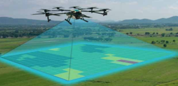
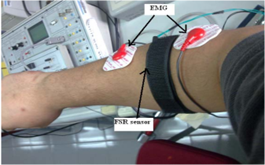
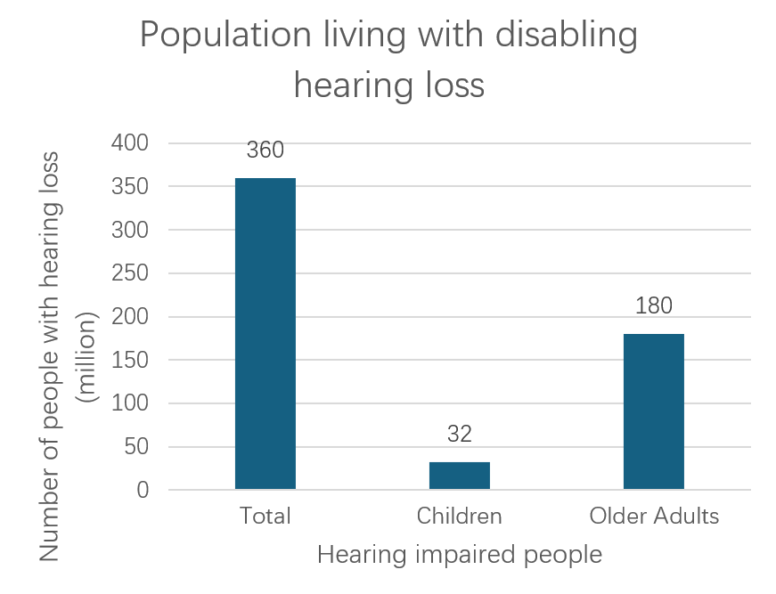

1	Projects related to selected goals.
After selecting the goals, we want to achieve or address, It’s time to start to find the projects related to. There are three projects which are suitable for our targets.
1.1	Precision Agriculture and Unmanned Aerial Vehicles
One of the most important things to address the hunger problem all over the world is to make full use of the arable land. From 1980s to 2020s, the reason of the improve of the production of rice is due to the hybrid rice yield increases rather than increase of the arable land.[1] In India, approximately 80% of the nation's total agricultural land is segmented into parcels smaller than 5 acres each. A significant portion of the agricultural produce relies on rainfall, with close to 45% of farming land receiving irrigation. This scenario reveals that about 55% of India's population is engaged in agriculture that predominantly depends on monsoon rains.[3] The way to increase area of arable is to use the Unmanned Aerial Vehicles, which not only can water some hard-to-reach farmland to improve the utility of the land, but also can use the machine learning algorithms to optimizing crop output.[2]

figure 1 Picture of drones working in terraced fields (left) and drones performing image recognition of farmland through machine learning (right), reproduced from [2]
For example, Pena et al. [4] scored up to 91% efficiency in sunflower fields with the help of a UAV. They using images collected by drones, combined with object-based image analysis (OBIA) processing, weeds can be accurately identified at an early stage. Weeding at this time can effectively prevent the occurrence and spread of weeds, thereby reducing crop competition pressure and indirectly improving Crop yield.
1.2	Using muscle sensors in rehabilitation devices.
The health of the human body improved a lot in the recent year. While there still have a lot of Vulnerable Groups we ignored, such as the Stroke people. Most of the people have stroke since the age. At the same time, the world is gradually entering an aging society, thus the number of people getting stroke increases sharply.[5] And consequently, the recover is becoming more and more important. Previous research on home rehabilitation processes has shown improvements in facilitating human motor recovery. However, existing rehabilitation devices are expensive and require the supervision of a physical therapist. Due to their large size and complex systems, some devices are not very efficient for use at home. Portable and simple home rehabilitation devices can aid patients in improving their daily rehabilitation activities.[6] 

figure 2 An image of an EMG sensor detecting muscle electrical signals, reproduced from [6].
For example, Dai et al [7] examined the use of electromyography (EMG) in measuring stroke effects. Findings showed significant changes in muscle coherence post-stroke, indicating potential origins of muscle activation disorders. A novel pattern recognition technique was introduced for differentiating functional movements in stroke survivors. Overall, the study provides insights for assessing muscle function and developing targeted rehabilitation strategies.
1.3	Digital behind-the-ear hearing aid
Approximately 90% of people with hearing loss reside in low- and middle-income countries, which often lack resources and strategies to address hearing loss. Individuals with hearing loss often encounter heightened levels of frustration, anxiety, irritability, depression, and disorientation compared to those with normal auditory capabilities. To reduce the unfairness, it is important to research an inexpensive hearing aid for developing countries. The standard rehabilitation tool for hearing impairment is an electronic hearing aid whose main components are transducers (microphone and receiver) and a digital signal processor.[8]

figure 3 The number and total number of hearing-impaired people in different age groups around the world, data from WHO.
For example, there is a digital hearing aid utilizes MEMS technology and achieves low cost and high efficiency through the measurement of MEMS loudspeaker vibration displacement using an optical interferometer. This technology addresses issues such as high cost, large size, and short battery life found in traditional hearing aids, bringing new possibilities to the hearing aid market.[9]

[1] Gerlach, C., 2024. How the World Hunger Problem Was not Solved.
[2]Sabir, R.M., Sarwar, A., Safdar, M. and Al Ansari, M.S., 2024. Precision Agriculture and Unmanned Aerial Vehicles (UAVs). In Agriculture and Aquaculture Applications of Biosensors and Bioelectronics (pp. 83-105). IGI Global.
[3] Gupta, S.K., Kumar, R., Limbalkar, O.M., Palaparthi, D. and Divte, P.R., 2019. Drones for future agriculture. AGRICULTURE & FOOD: e-newsletter, 16.
[4] Peña, José M., et al. "Quantifying efficacy and limits of unmanned aerial vehicle (UAV) technology for weed seedling detection as affected by sensor resolution." Sensors 15.3 (2015): 5609-5626.
[5] Ambar, Radzi Bin, et al. "Multi-sensor arm rehabilitation monitoring device." 2012 International Conference on Biomedical Engineering (ICoBE). IEEE, 2012.
[6] Li, Raymond C., et al. "The development, validity, and reliability of a manual muscle testing device with integrated limb position sensors." Archives of physical medicine and rehabilitation 87.3 (2006): 411-417.
[7] Klein, Cliff S., et al. "electromyography (EMG) techniques for the assessment and rehabilitation of motor impairment following stroke." Frontiers in neurology 9 (2018): 1122.
[8] Ferreira Bento, Ricardo, and Silvio Pires Penteado. "Designing of a digital behind-the-ear hearing aid to meet the World Health Organization requirements." Trends in Amplification 14.2 (2010): 64-72.
[9] Je, Sang-Soo, et al. "A compact and low-cost MEMS loudspeaker for digital hearing aids." IEEE Transactions on Biomedical Circuits and Systems 3.5 (2009): 348-358.