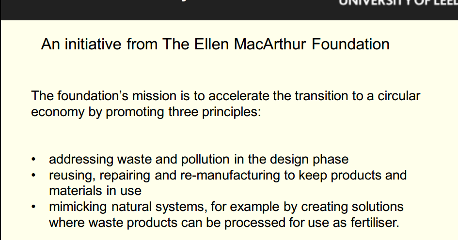

- #### What work did you carry out that week on the mini-project?那一周你在小项目上做了什么工作?

  In this week (week 17), I have finished the task of the phase 1 draft and find 4 different project based on the different goals we want to achieve. The context summarized as follows:

  - Using muscle sensors in rehabilitation devices (Based on SDG3 : Good Health and Well-Being).
    - Research shows home rehabilitation helps stroke recovery, but current devices are costly, bulky, and need professional oversight. There's a need for affordable, compact, easy-to-use devices for home use to enhance daily rehabilitation.
  - Digital behind-the-ear hearing aid (Based on SDG 10 : reduce inequality).
    - About 90% of people with hearing loss live in low- and middle-income countries, facing more emotional challenges than those without hearing issues. Developing affordable hearing aids, which mainly consist of a microphone, receiver, and digital signal processor, is crucial to address this inequality.

  #### Is your group mini-project proceeding on schedule and is everyone making a useful contribution?你的小组小项目是否按计划进行，每个人是否都做出了有益的贡献?•

  This week I continue with the LF to finish the phase 1 draft. I mainly focus on the Projects related to selected goals we selected. And LF mainly focus on the Introduction of SDGs. ZZ and CL mainly focus on making the poster of phase 1 based on our draft.

  #### To what extent you feel that you have achieved the learning outcomes* for this module?你觉得你在多大程度上达到了本模块的学习成果* ?•

  I think this week we successfully achieve the first goal of this module, which is select the goals and find the project which is suitable for these goals. I think we are already finish about 30% of this module.

  #### Which learning experiences had the biggest impact on you and why?哪些学习经历对你影响最大，为什么?

  When I was searching paper in the network to find the suitable project for me. I found the problem of the hearing loss live in low- and middle- income countries is so serious that many child and elder cannot have hearing aids since the economic burden. It shock me a lot and I want to do something to contribute my own effort to reduce the inequality.

  #### How do you think what you have learned in this module can affect your career and professional practice going forwards?你认为你在这个模块中学到的东西会如何影响你未来的职业和专业实践?

  I think the knowledge I learned from this module not only makes me have more understanding about the modern industry but also makes me became a more caring person. It is a very meaningful module!

  #### What did you find particularly interesting that week in the lecture and online content and what are the different opinions on any emerging topic raised? 在那一周的讲座和在线内容中，你发现了什么特别有趣的地方?对于新出现的话题，你有什么不同的看法?

- 资源的浪费  和资源的垄断

- 资源可持续利用的八项原则

- TSMC（台积电）的用水与环境消耗情况

- Restriction of Hazardous Substances Directive 有害物质限制指令

- 

- 

- 可持续性是至关重要的