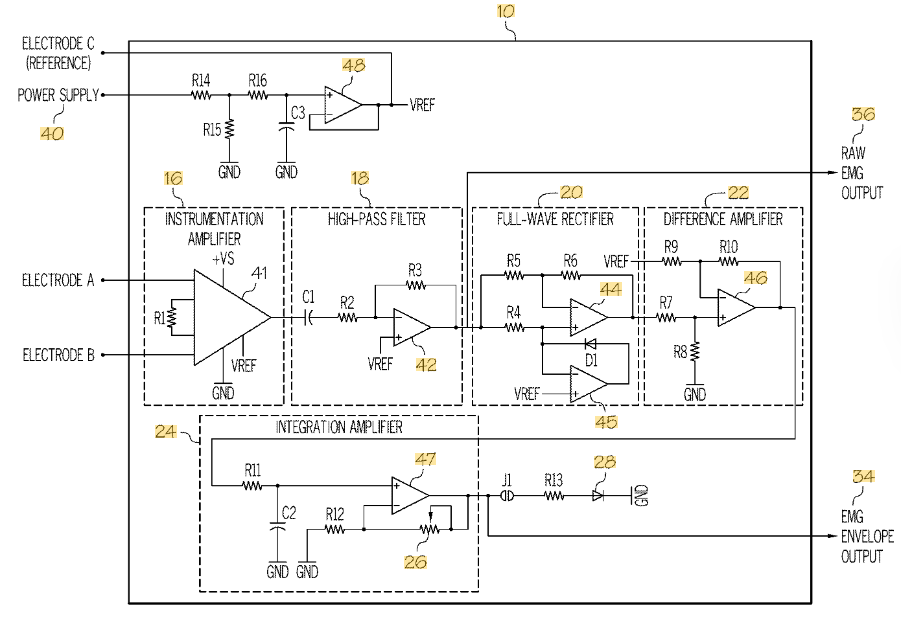
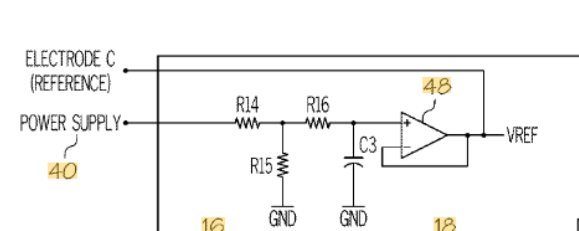
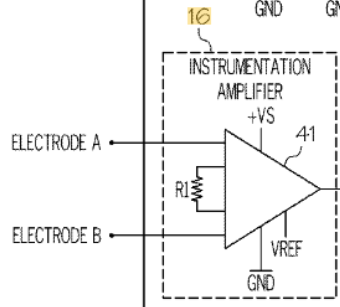
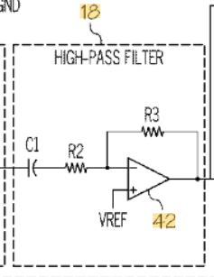
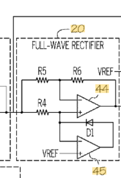
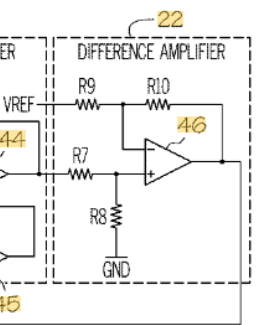
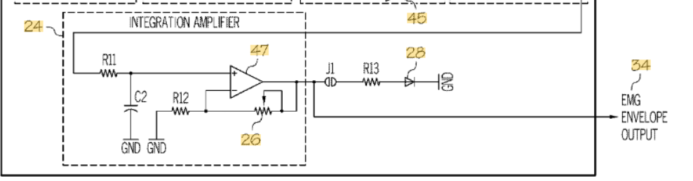

## Summary of Week 16 Study

Since I couldn't find the circuit diagram for MyoWare 2.0 online, I temporarily found the circuit diagram for MyoWare 1.0 and planned to study the working principle of the EMG sensor based on that diagram.

- #### Working Circuit Diagram of the EMG Sensor

As shown in the above diagram, we can draw the following conclusions.

- Power circuit: When the muscle sensor is attached to the muscle and detects current changes, electrode C will read a reference current (placed in a position insensitive to myoelectric signals).
- 
  - In order to prevent the power supply voltage (type C power supply) from affecting the voltage measured by the reference electrode, C3 is first added to filter out high-frequency noise on the power line.
  - An amplifier (48) is used to reduce power supply noise so that it does not affect the reference voltage.
- 16: Electrodes A and B are the electric signals collected on the muscle surface, which are amplified (default 200 times) after differential amplification in the amplifier.
- 
  - Amplifiers generally require high input impedance (high resistance R1), high gain stability (can provide high gain), and good common mode rejection capabilities (only amplify signals between different input terminals).
  - The reference voltage VREF mainly ensures that the signal can be amplified and biased correctly.
- 18: The amplified signal enters the high-pass filter to remove low-frequency signals and potential DC offsets, isolating muscle activity signals.
- 
  - The capacitor C1 and resistor R2 form the RC part of the filter, and R3 acts as a feedback resistor. The three devices together define the cutoff frequency of the filter.
  - R2 and R3 resistors should be the same to ensure a gain of 1.
- After passing through the high-pass filter, the original output is obtained, and then it enters the full-wave rectifier (20).
- 
  - The three resistors R4, R5, and R6 are used to limit current, set the gain of the amplifier, or provide bias.
  - The input amplifier (45) with VREF and the D1 diode form a lead-lag rectifier (precision rectifier), which is used to output the absolute value of the myoelectric signal.
- 22: Represents a differential amplifier that amplifies the difference between the two input signals, which are the reference voltage VREF and the myoelectric signal after full-wave rectification.
- 
  - R9 and R10 are feedback resistors, usually used to set the gain of the amplifier.
  - R7 and R8 are input resistors used to match the input impedance and set the gain.
  - 46 is the amplifier responsible for amplifying the difference between the two inputs.
- 24: Is an integrator used to form the envelope of the EMG signal.
- 
  - R11, R12, and capacitor C2 together define the time constant of the integrator, affecting the integration speed and filtering characteristics of the signal.
  - C2 is responsible for accumulating charge in the integrator to integrate the input signal.
  - 47 is an operational amplifier that performs integration while converting voltage changes into time integration to output a continuous signal.
  - J1 and R13 are jumpers or adjustable resistors used to adjust the working state or gain of the circuit.
  - 28 is a diode used to protect the circuit.

In summary, after measuring the myoelectric signal, this circuit amplifies and differentiates the signal between the reference signal and points A and B, rectifies it, removes offsets, and finally integrates it into an EMG envelope signal.

