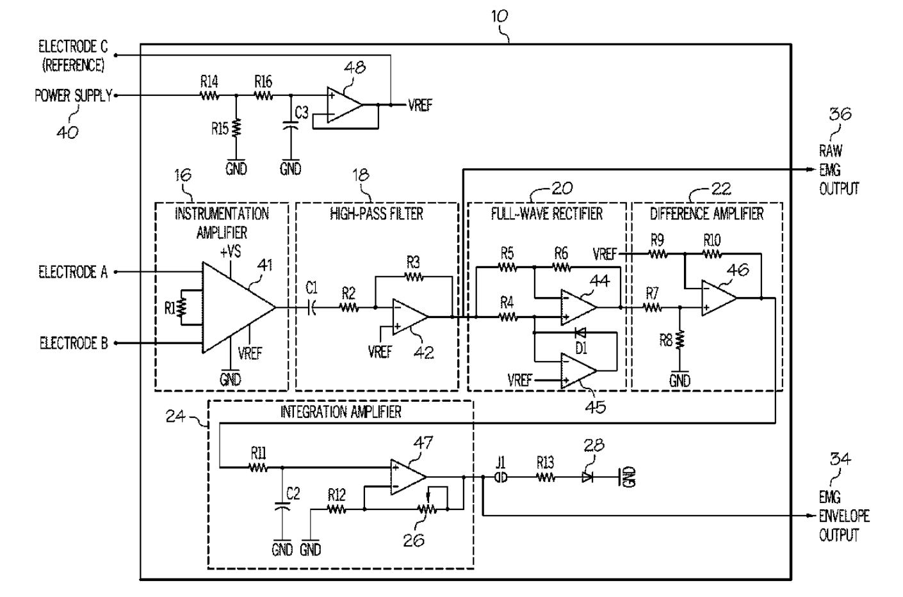
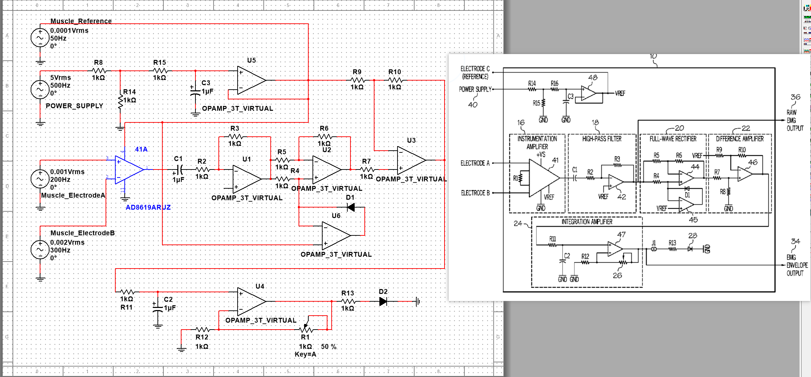
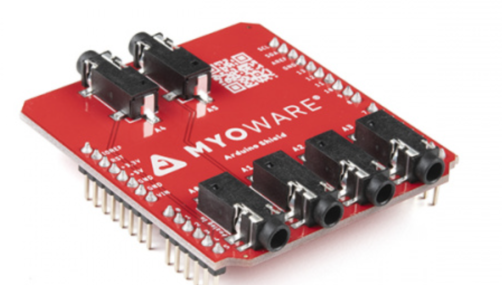
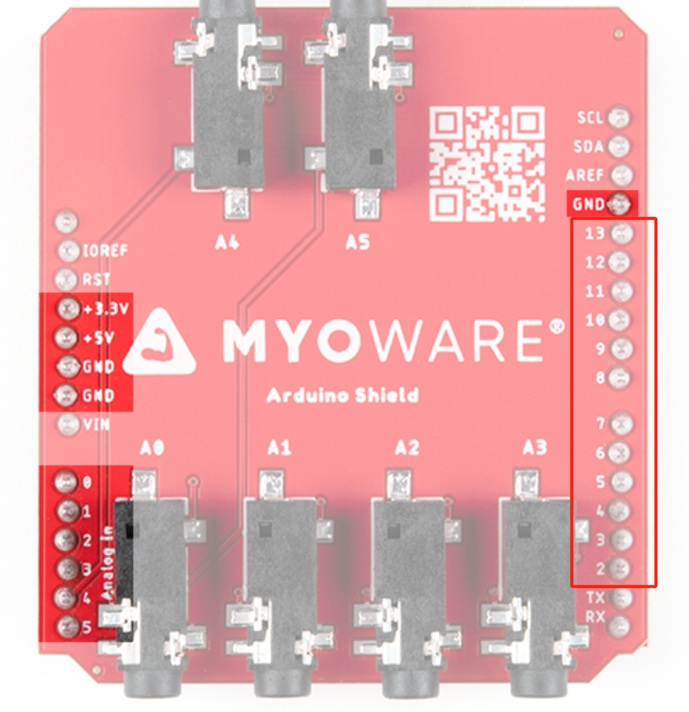
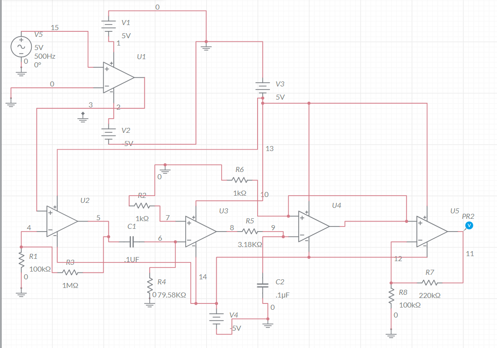

#### 17周学习总结

- 目前已经有Myoware 1.0 的电路图与Myoware 2.0的实物：

  

- 肌电图信号的能量在大约5Hz到500Hz之间。可以通过在极端和两者之间的间隔使用不同频率的正弦波来测试电路，以测试幅度、相位、失调和失真。还可以使用 Multisim 中的各种电路分析函数来生成波特图， 检查瞬态响应等。
- 在MyoWare 2.0 上面的AD8619应该就是Instrumentation Amplifier，所以在Instrmentation Amplifier部分使用AD8619ARUZ的放大器来代替，接下来的高通滤波器、全波整流器、差分放大器和积分放大器根据电路图搭建（如下图所示）。
- 

- 当看了许多MultisimLive里面的emg circuit相关的电路图后，我发现了一个问题:如果我们想要实现多个EMG传感器的同时测量的工作的话，并不需要了解EMG传感器的内部。因为EMG之间的连接是通过TRS线连接到Arduino上面的，所以我们如果需要大于6个EMG传感器的同时连接使用的话，我们应该更改适用于Arduino扩展版的TRS的连接数量而不是更改EMG传感器的内部。下图是Arduino的TRS扩展板：

  

  如下图所示，在这块板子中，只有0-5号位被A0-A5用来传递信号，而剩下的诸如右边红色框框标注的口我认为还是有可能有使用的可能。

  

- 上图中的2-13PIN口对应着下图的2-13接口，这12个接口在板子上应该是没有被使用过的，原理上讲应该是可以扩充。

  

- 网上有关EMG电路的电路图[emg circuit - Multisim Live](https://www.multisim.com/content/qx6NXfCixrxW7yPSZsbA2Q/emg-circuit/)

- 