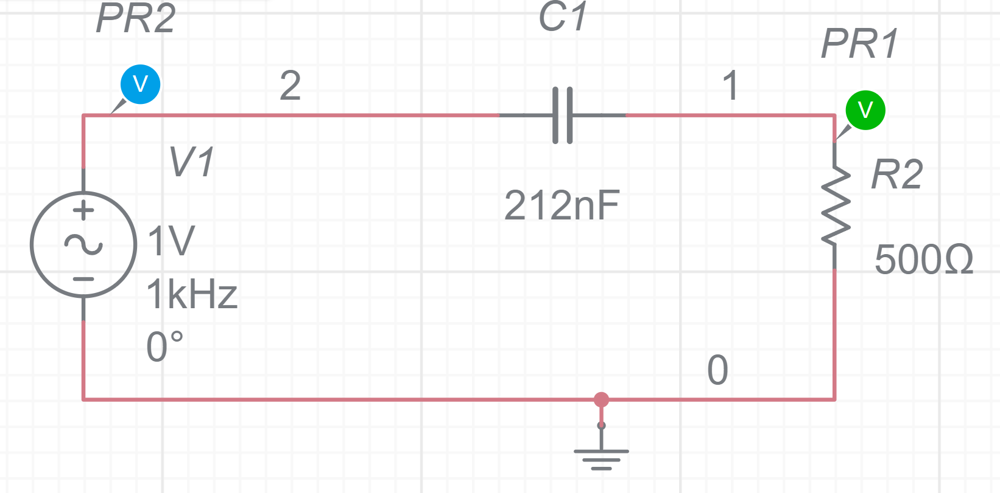
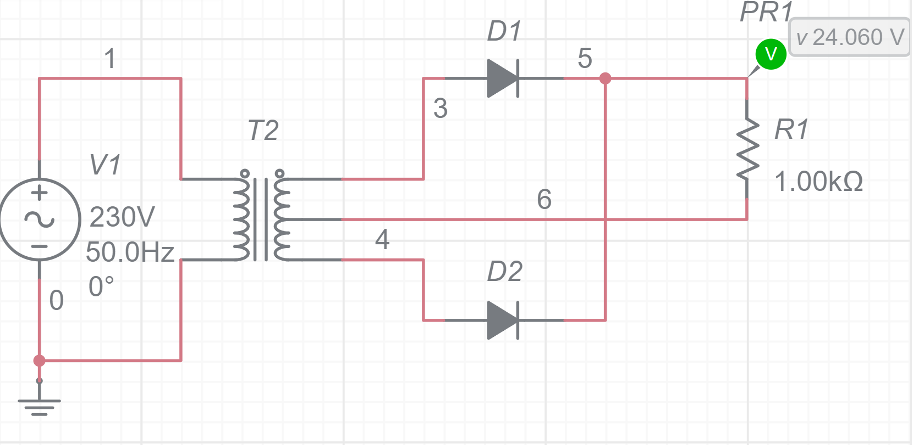
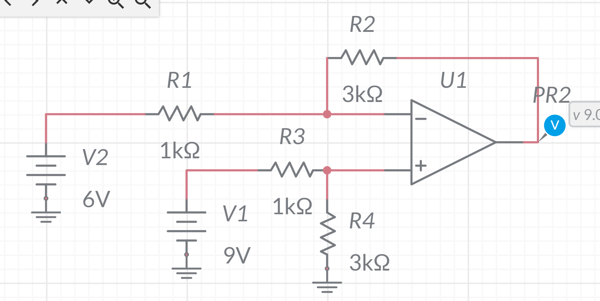
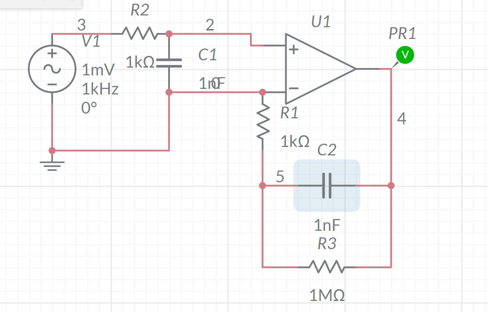

#### 17周学习总结

- 目前已经有Myoware 1.0 的电路图与Myoware 2.0的实物：

  

- 放大器[Instrumentation Amplifier - Multisim Live](https://www.multisim.com/content/JPLsGp4Yct5qUDc6BsK8J6/instrumentation-amplifier/)
- 

- 高通滤波器[RC high pass filter - Multisim Live](https://www.multisim.com/content/HhkmiAbUafLc4KDqQUBb6i/rc-high-pass-filter/)
- 

- 全波整流器[Full Wave Rectifier - Multisim Live](https://www.multisim.com/content/mwRKv5r5727mHPcDMHUykN/full-wave-rectifier/)
- 

- 差分放大器[Differential Amplifier - Multisim Live](https://www.multisim.com/content/7ZsfTZbnYSfpGa6QehiGND/differential-amplifier/)
- 

- 积分放大器
- 

肌电图信号的能量在大约5Hz到500Hz之间。您可以通过在极端和两者之间的间隔使用不同频率的正弦波来测试电路，以测试幅度、相位、失调和失真。您 还 可以 使用 Multisim 中 的 各种 电路 分析 函数 来 生成 波特 图， 检查 瞬态 响应 等。

- EMG电路[emg circuit - Multisim Live](https://www.multisim.com/content/qx6NXfCixrxW7yPSZsbA2Q/emg-circuit/)
- 