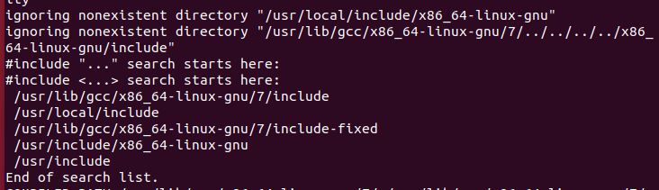
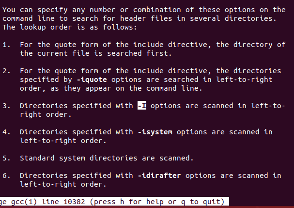
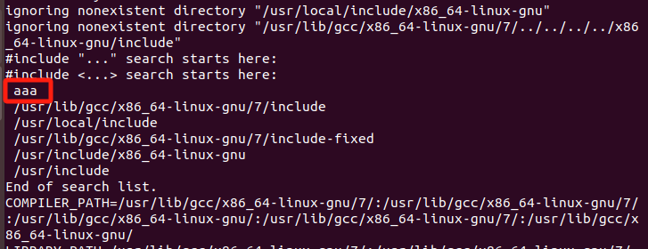
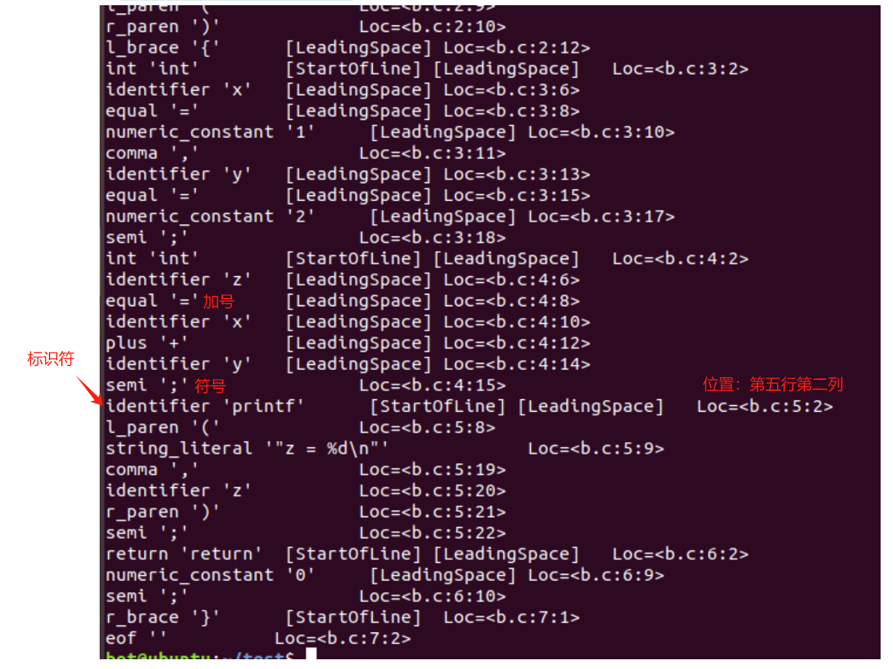
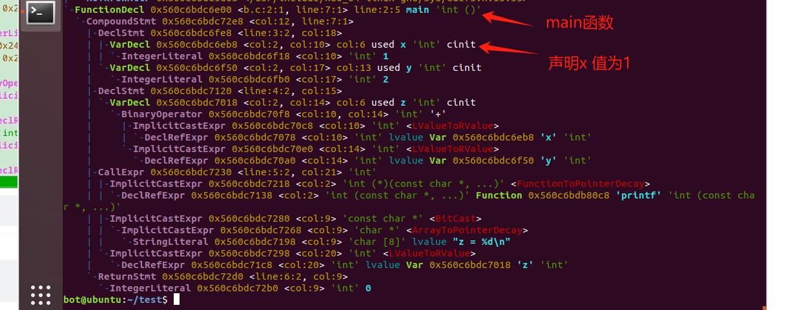
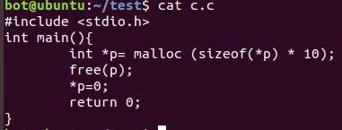
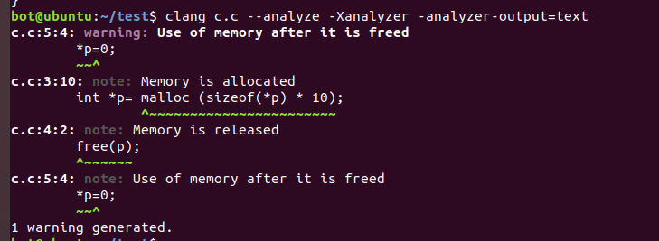
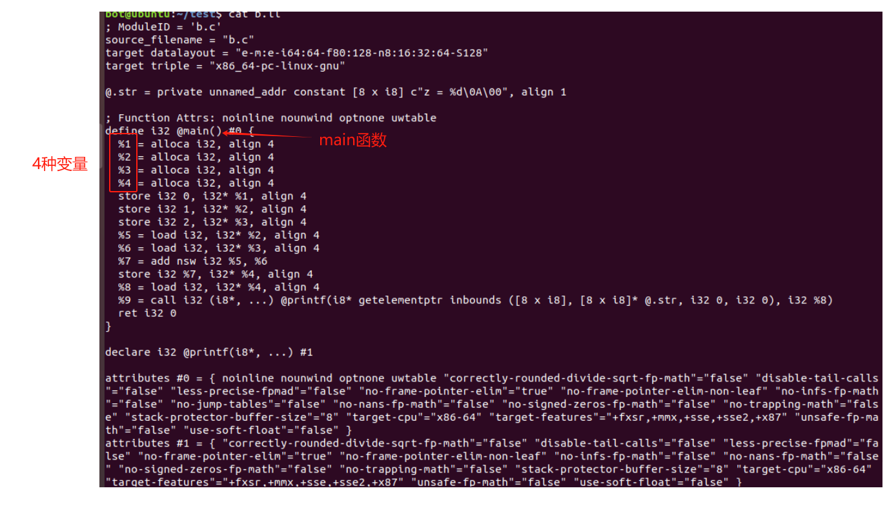

### 从c语言到二进制程序

1. #### 预处理

   1. 本质上就是一个文本粘贴
   2. gcc -E 可以查看预处理的结果

2. #### 头文件如何找到的？

   1. gcc -E a.c --verbose > /dev/null

      

   2. man gcc 并且搜索-I可以找到顺序

      1. 这张图可以说明尖括号的头文件不搜索当前目录，而引号包含的文件会搜索当前目录

      

      4. -I的使用：gcc -E a.c -Iaaa --verbose > /dev/null

         

3. 预处理的其他工作

   1. 去掉注释
   2. 连接因断行符而拆分的字符串
   3. 处理条件编译 #ifdef
   4. 字符化#
   5. 标识符连接##

4. 编译的过程

   1. 包括词法分析、语法分析、语义分析、中间代码生成、优化、目标代码生成

   2. 使用clang查看每个阶段在做什么

      1. clang -fsyntax-only -Xclang -dump-tokens b.c   词法分析

         

      2. 语法分析：clang -fsyntax-only -Xclang -ast-dump b.c

         1. 树结构 AST 抽象元树，可以检测是否少了一个分号什么的

         

      3. 语义分析：根据C语言的语义判断语句中的值的类型，它能检测出来未定义的引用、运算符操作数类型不匹配（struct+int）、函数调用参数的类型和数量不匹配等等，如上图

      4. 静态程序分析

         

         1. 如果用gcc是可以编译通过并且成功运行，但是用clang可以查找出它的错误。

         2. clang c.c --analyze -Xanalyzer -analyzer-output=text

            

      5. 中间代码生成

         1. 也叫中间表示 IR =编译器定义的一个面向编译场景的指令集

         2. 过程是C语言状态机翻译成IR状态机

         3. clang -S -emit-llvm b.c

            1. 变量->%1,%2,%3,%4
            2. 语句-> alloca, store , load ,add ,call , ret

            

      6. 为什么不直接把C语言翻译到ISA而是采取一个中间代码？

         1. 因为基于中间代码作为一个抽象层优化起来很容易
         2. 可以支持多种源语言和目标语言（硬件指令集）

      7. 优化 （-o1 参数优化）

         1. 两状态机“相同”的话，可以用简单的替代掉复杂的
         2. 相同：程序的可观测行为的一致性
            1. 对volatile修饰变量的访问要严格执行
            2. 程序结束时写入文件的数据要与严格执行时一致
            3. 交互设备输入输出要与严格执行时一致
         
      8. 目标代码生成
      
         1. 将IR状态机翻译成处理器ISA状态机
         2. 同时对目标ISA进行优化
            1. 经常使用的变量放到寄存器，不太常用的变量放到内存
            2. 选择指令数量较少的指令序列
         3. 可以通过 clang -s a.c -ftime-report 来观察clang尝试了哪些优化工作
   
5. 二进制的世界

   1. 汇编
      1. 根据指令集手册，将汇编代码翻译成二进制目标文件
      2. 二进制文件使用binutils(Binary Utilities) 或者llvm的工具链也就是objdump命令来打开
         1. 指令：objdump -d a.o
         2. 

