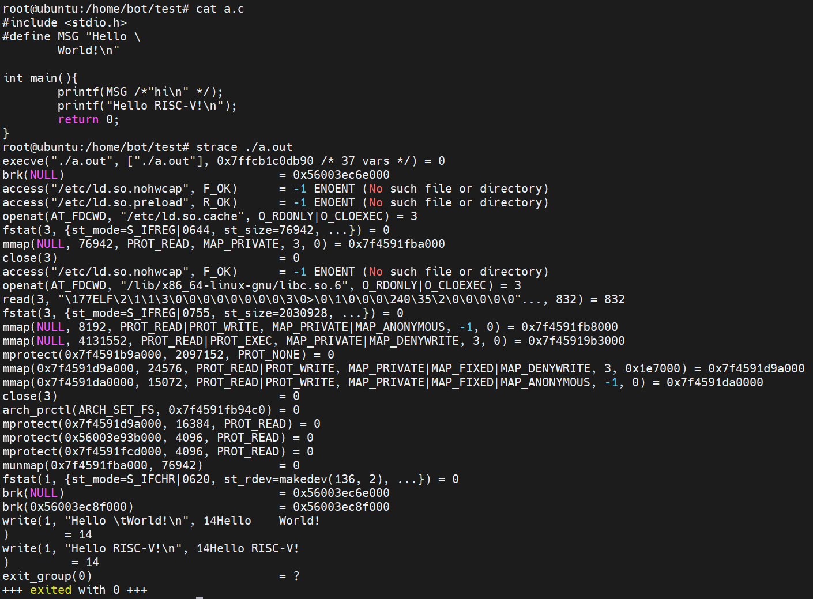
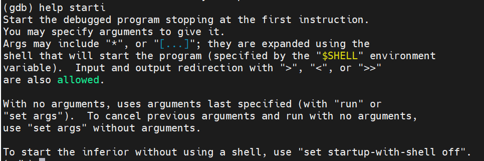
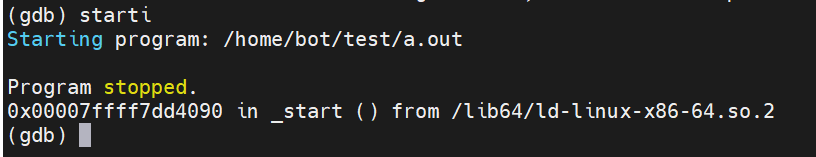
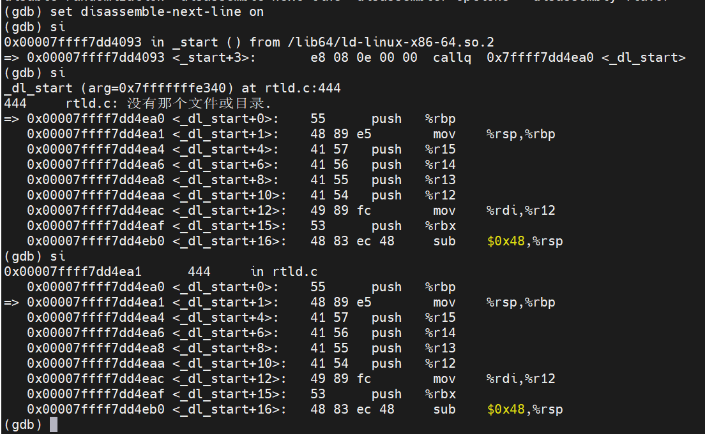
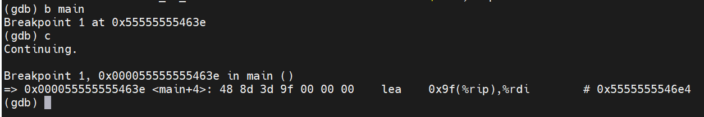
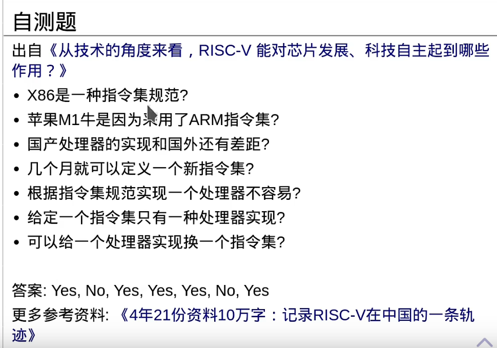
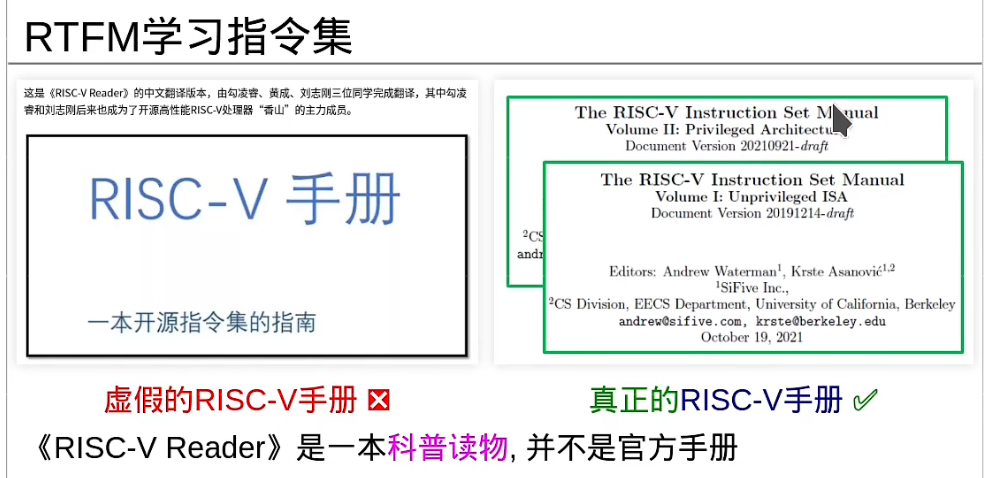
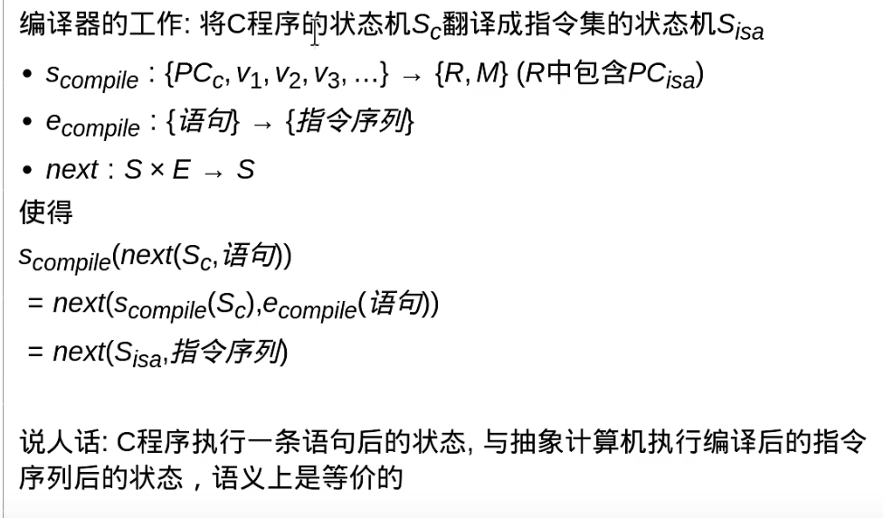
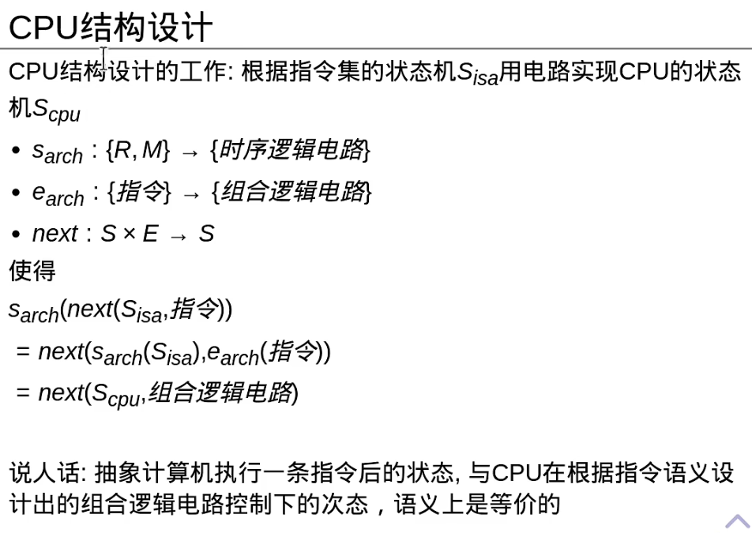
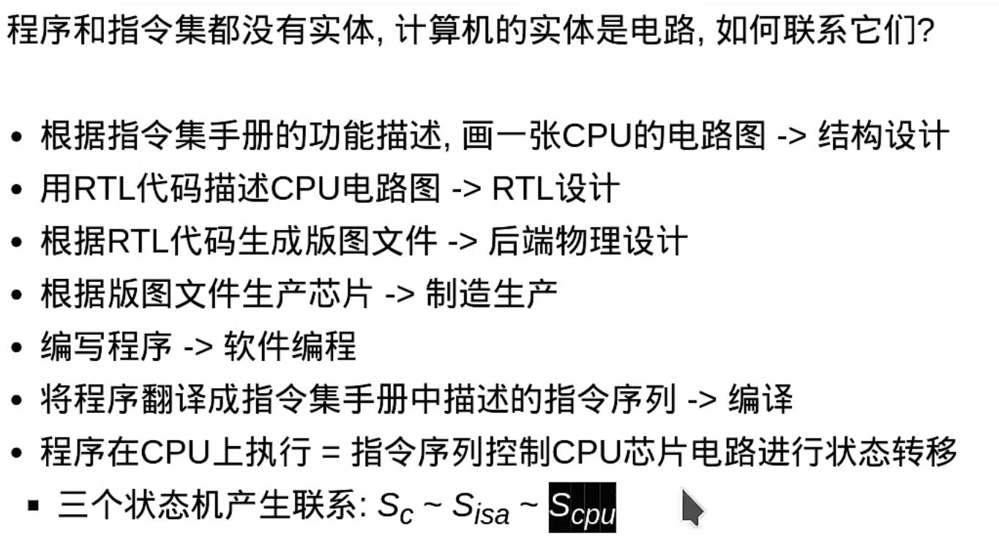

# class 2 summarize

1. #### 程序真的是从第一行开始运行的吗？

   1. 使用trace工具跟踪程序行为（strace）

      1. strace可以跟踪一个进程进入内核态之后使用的系统调用，包括参数，返回值，执行消耗的时间。

         

   2. gdb 工具    

      1. starti  断点在程序开始位置

         

      2. starti执行

         

      3. 打开反汇编

         

      4. 进入main函数

         

   3. 执行环境有两种：1.独立环境 2. 宿主环境
      1. 执行环境里面专门的函数调用了main函数
      2. 宿主环境下这个专门c函数名称为main

   4. argv[0]是程序的名字 后面才是参数

   5. C程序是一个状态机

2. #### C程序的状态机模型  

   1. S={<V,PC>}
      1. V={V1,V2,V3...}:程序中所有变量的取值（全局+局部）
      2. PC:程序计数器 也就是当前执行的语句位置 还未执行
   2. 激励事件E  ：语句
      1.  会导致状态机状态转移
   3. 状态转移规则：next：S×E -> S
      1. 语句的语义
   4. 初始状态S0=<V0,main函数的第一条语句>

3. #### CPU也是一个状态机

   1. CPU=数字逻辑电路=状态机
   2. 数字逻辑电路=组合逻辑电路（无状态）+时序逻辑电路（有状态）
   3. 状态集合S={<时序逻辑元件的值>}
      1. 具体包括寄存器，存储器，触发器
   4. 激励事件E={组合逻辑电路}
   5.  状态转移规则 next：S×E->S
   6.  初始状态S0=<复位时时序逻辑元件的值>

4. #### 指令集也是一个状态机

   1. 指令集是软件和硬件之间的接口
   2. 指令集是一本手册的规范 定义了CPU执行指令的行为

5. RISC-V reader  这本书   科普读物

1. 指令的两种表示

   1. 符号化表示：面向程序员
   2. 编码表示：面向电路设计

2. #### 指令集手册不仅包括指令，它作为指令集体系结构还包括

   1. 输入输出
   2. 系统状态
   3. 中断异常
   4. 虚存管理
   5. 内存模型

3. 指令集手册通过定义状态机进行状态转移的规则，来从概念上描述一台抽象计算机所具备的程序可以使用的功能。

4. #### 编译

   1. 工作：将C程序的状态机Sc翻译成指令集的状态机Sisa

	1. 汇编指令=指令的符号化表示
	2. 汇编程序=驱动指令集状态机的输入
	  	1. 执行汇编程序=指令集状态机发生状态转移
	3. 汇编课=RTFM（指令集手册）

#### 1. CPU结构设计

1. 用R,M实现寄存器和存储器
2. 组合逻辑电路实现指令的语义

