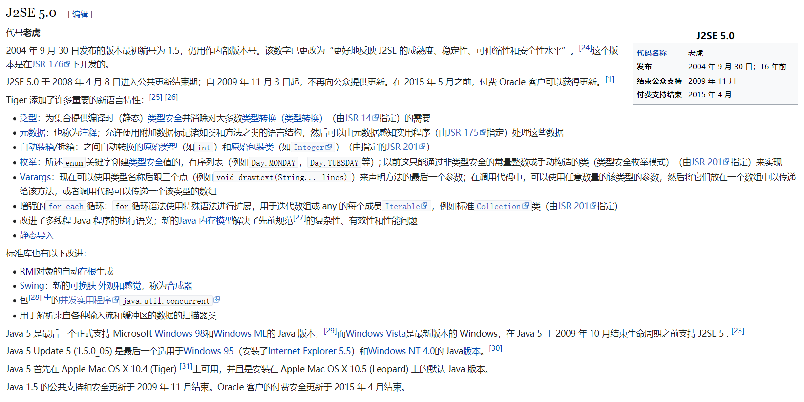

| **(1).下载、安装"Java SE Development Kit 16.0.2"最新的版本，需要进行系统环境变量的设置。每一步操作请在报告中附上截图（至少包括一个全屏截图，其他可以不用全屏截图）和文字说明。（15分）** 1、打开oracle官方网站（图1-1-1）：https://www.oracle.com/java/technologies/  图1-1-1 2、点击java SE（图1-1-2）  图1-1-2 3、找到java平台标准版11，并点击下载。（图1-1-3）  图1-1-3 4、找到java SE 16，点击JDK Download。（图1-1-4）  图1-1-4 5、找到Windows x64 Installer项并下载。（图1-1-5）  图1-1-5 6、下载完成后，点击文件并点击下一步安装。（图1-1-6）  图1-1-6 7、点击下一步安装，等待安装完成即可。（图1-1-7）  图1-1-7 8、计算机-\>属性-\>高级系统设置-\>环境变量-\>系统变量:开始设置系统变量。   图1-1-8 9、新建JAVA_HOME设为D:\\Program Files\\Java\\jdk-16.0.2  图1-1-9 10、在Path系统变量后添加 ; D:\\Program Files\\Java\\jdk-16.0.2\\bin（图1-1-10）。  图1-1-10 11、在CLASSPATH系统变量后添加.; D:\\Program Files\\Java\\jdk-16.0.2\\lib;（图1-1-11）  图1-1-11 12、左下角开始菜单输入cmd，在打开的命令行里输入java –version，得到当前java版本，说明java sdk安装完成！  图1-1-12  **(2).下载、安装"Eclipse IDE for Java Developers"（2021-06版本），需要进行JDK等的设置。每一步操作请在报告中附上截图（至少包括一个全屏截图，其他可以不用全屏截图）和文字说明。（15分）** 1、打开Eclipse 官网：<http://www.eclipse.org/downloads/> ，并且点击Download x86_64.（图1-2-1）  图1-2-1 2、点击Download（图1-2-2）  图1-2-2 3、下载完后点击文件，并点击第一项，后点击install，出现错误，初步判断为未下载JDK故导致安装不了eclipse。（图1-2-3）  图1-2-3 4、安装完JDK后，发现eclipse安装程序正常。（图1-2-4）  图1-2-4 5、安装完成后打开，选择工作文件存放区域，至此安装完成！！（图1-2-5）  图1-2-5   **(3).将第一章讲义中的三个应用程序在Eclipse中运行。每一步操作请在报告中附上截图（至少包括一个全屏截图，其他可以不用全屏截图）和文字说明。（30分）** 1、点击桌面的eclipse，并点击ok。（图1-3-1）  图1-3-1 2、进入eclipse界面，并新建一个项目。（图1-3-2）  图1-3-2 3、对项目名称，文件位置，JRE版本进行设置，并点击finish完成创建。（图1-3-3）  图1-3-3 4、将老师课上的代码复制进入文本框中，却出现报错。（图1-3-4）  图1-3-4 5、当修改module demo1{}后出现不可修复的错误，只能重新新建项目。查阅资料发现，module-info.java为**jdk9的feature，模块化更安全，同时也能根据需求定制化jre。**因此可以删除，需要我们自己重新创建java文件，才可写入。  6、对src右键并new一个class，出现弹框中设置类名。（图1-3-5）  图1-3-5 7、创建好class后，通过研究代码分布，可以知道老师的ppt，与我们的有重复代码，也就是类的定义声明，因此有选择的复制代码，这样就不会出错了。（图1-3-6、1-3-7）  图1-3-6  图1-3-7 8、点击右上角绿色按钮，运行代码，并在console界面看到相应代码print，成功！（图1-3-8）  图1-3-8 9、根据老师ppt指引，我们创建第二个class，名为Hello。（图1-3-9）  图1-3-9 10、将ppt中的主类复制在代码中。（图1-3-10）  图1-3-10 11、仔细查阅ppt发现，其中要编译源文件，使用javac指令，故推断不在该软件上执行。[查阅资料](https://blog.csdn.net/qq_43597130/article/details/102881865)，并根据步骤实现此代码。（图1-3-11）  图1-3-11 12、在工作区域创建Hello.java（图1-2-16）  图1-3-12 13、将后缀改为java，并输入老师的代码保存。（图1-3-13）  图1-3-13 14、进入cmd命令提示符，输入cd C:\\Users\\11440\\Desktop\\procedure\\java\\eclipse java课，进入Hello.java所在目录，然后输入javac Hello.java，完成后查看目录，发现已经生成A.class，B.class，Hello.class 。（图1-3-14）  图1-3-14 15、输入java Hello时，出现如下错误，（图1-3-15）在确定编译环境正确（图1-3-16），编译成功后，[查阅资料](https://blog.csdn.net/weixin_44527588/article/details/102596461)（图1-3-17）得知，为classpath环境变量配置出错。  图1-3-15  图1-3-16  图1-3-17 16、在删除了系统变量中的CLASSPATH选项后，重新运行，程序运行成功，但是出现了乱码（图1-3-18）。  图1-3-18 17、查阅资料发现其为编码问题，[新建xx.java时，默认编码格式为utf-8，而编译时系统默认编码为ANSI](https://blog.csdn.net/wandugu/article/details/105347602)。因此在系统变量里创建JAVA_TOOL_OPTIONS的系统变量，值为-Dfile.encoding=UTF-8。（图1-3-19）  图1-3-19 22、将之前编译产生的文件删除，打开cmd，进入目录下，输入javac -encoding utf-8 Hello.java与java Hello，然后成功出现预期结果！成功！（图1-3-20）  图1-3-20 23、有了第二题的教训，我们这次根据老师ppt指示直接创建Tom.java文件，并将其代码复制进入记事本，保存后打开cmd，输入javac -encoding utf-8 Tom.java与java Example。结果出现下列结果“腿:4条 头:猫头 我今天要和Jerry拼了”实验成功！  图1-3-21  **(4).浏览**[**https://www.oracle.com/java/technologies/**](https://www.oracle.com/java/technologies/)**，并对网站（包含子目录）上的内容做一个简单的介绍。（10分）**  进入网址，映入眼帘的是java是充满无限可能的语言的标语，实际上也说明了利用java可以创造出无限的作品，作为一门语言，java有着强大的可移植性，跨平台性，又具有垃圾回收机制，且没有烦扰的指针，让其流行显得必然。（图1-4-1） 在热门下载选项下，有java SE与java EE，在我查阅资料之后发现，其为Java Platform Standard Edition与Java Platform Enterprise Edition的简称，这么看来就很好理解了，一个是标准版，一个是企业版，企业版可能意味着更加安全，可扩展。 而glassfish则是配套Java EE的商业兼容应用服务器，为开发者提供免费服务器源代码，使java更加风靡。 Java Card 则类似于NFC那种（我认为），不过其是在sim卡方面植入了java card虚拟机，运行特定的代码应用。特点是安全防护性强。 而JDeveloper我认为是作为前端构建网站那种的免费的非开源的集成开发环境，ADF为在那个开发环境下使用的框架，全称为ArcGIS Java Web Application Developer Framework，对于开发web应用的工程师来说可能是很有用的，不过我不懂。 Enterprise Pack for Eclipse很简单，就是eclipse的企业版。 NetBeans IDE 顾名思义，就是一个java的IDE，不过我查阅资料得知，其可以用在其他语言诸如C、C++、PHP、HTML5等等语言下，甚至还可以安装插件扩展，我觉得很强大，但我还是喜欢idea。 Java SE 11.0.11 (LTS) 与Java SE 16.0.1我认为就是版本不同的问题，现在版本更替不能一蹴而就，有很多软件框架什么的都是用的老版本，有些不兼容的地方，所以我们的有些程序还得需要特定的老版本才能正常运行。  图1-4-1 到了技术板块，（图1-4-2）Java SE那些我们上文已经提到了，不再赘述。  Java Embedded顾名思义，就是嵌入式java，融入了java的api在内，让更多智能家居或者是别的嵌入式领域能够使用java的api，能够拥有java的运行环境。  Java EE上文提到，不再赘述。  Java ME是为机顶盒、移动电话和PDA之类设备提供java的api与运行环境。  Java card上文提到，不再赘述。  Java TV顾名思义用于电视的接收机，为数字电视的许多需求提供解决方案，例如广告的下载与缓存，广播方式的选择等等。 Java DB顾名思义就是java的database 以java为基础语言的数据库。  图1-4-2 3、可以看到，Java现在依然保持高的更新速度，现在已经出到java SE 16了（图1-4-3），并且还有专业人员开启直播为大家讲解java的新特性（图1-4-4）。  图1-4-3  图1-4-4  **(5).浏览**<http://en.wikipedia.org/wiki/Java_version_history>**，并对网页上的内容做一个简单的介绍。（10分）** 1、进入网址，发现其为java版本历史的维基百科，里面记录了java的历史版本的跟新情况以及各个版本JDK的特性，总体上JDK跟新较快，在1-3年跟新一个版本，说明其语言的活跃性。（图1-5-1）  图1-5-1 2、对于JDK1.0，其是JDK的第一个稳定版本，起始于1995年，具有里程碑意义（图1-5-2）。  图1-5-2 3、JDK1.1发布于1997年，添加了Unicode编码支持，图形用户界面的api（AWT），以及添加了内部类的特性，使得java拥有成员类、本地类、匿名类等概念……（图1-5-3）  图1-5-3 4、1.2版本JDK就改名为J2SE，其全称翻译为JAVA2平台标准版，并且开始取代JDK，拥有企业版和微型版两种概念，并且加入了限制浮点运算的strictfp关键词，使其在浮点运算时更具有可移植性，更重要的是增加了即时编译的功能，并且使用户直接运行java程序变成可能，因为这个版本把代码变成了字节码，用户在虚拟机直接运行字节码即可运行程序。  图1-5-4 5、这个1.3版本包含了JVM在内，并且使得Java的代码可以自动的优化好，并且发明了JPDA，使得可调用API来调试JAVA代码。（图1-5-5）  图1-5-5 6、1.4在语言方面添加了assert关键字，使得程序员对于判断程序运行正确与否更加有逻辑性，不用一直if else。在网络方面，开始支持ipv6，使得其在网络编程里成为首选语言。支持perl的正则表达式，使得报告处理更加方便。（图1-5-6）  图1-5-6 7、这个版本本应为1.5（开发者版本），但是现在修改为5.0（产品版本，其更好的反映了J2SE的成熟、稳定、可靠），且这个版本之后的JDK就不支持windows 98 和windows ME 版本了，并且其更新了许多新语言特性，比如声明参数可以用…来省略中间的参数，而定义后面的参数。并且在枚举方面提高了安全性，在集合进行编译时也消除了许多类型转换，提高了更多的安全性。（图1-5-7）  图1-5-7 8、从这个6版本（不是6.0）开始J2SE又改名了，叫做JAVA SE，该版本主题我认为是前端的支持，其开始支持javascript等脚本语言，并且提供了web支持，在编程时允许程序员调用java编译器的api，软件框架JAXB也升级了，提供了API用于读写XML文档，且对JVM的编译器进行了优化，垃圾回收算法也进行了升级。（图1-5-8）  图1-5-8 9、7版本是个十分重要的跟新，JVM开始支持动态语言，也就是脚本语言，并且能够在多语言虚拟机完成工作，并且把指针压缩到了64位，排序方法不再使用归并排序而是使用归并与插入排序混合的稳定算法，提高了性能，对XML标记语言进行了编码的跟新。  图1-5-9 10、由于版本太多，我们直接简要介绍一下JAVA SE 16的特性（图1-5-10）：  1．添加了矢量计算的API  2．允许在JDK C++的源码里使用C++14 的新特性  3．从OPENJDK社区将源代码迁移到Github  4．支持UNIX套接字  ……  图1-5-10 11、JAVA SE 17现在还处于更新阶段，并且他是长期支持的版本（图1-5-11）：  1、浮点计算恢复严格，有利于高精度计算。  2、增强随机数算法，使得调用更加方便，消除里面的代码重复，并且使其更好地支持流编程。  3、为了提高安全性，对JDK内部进行了强封装，并且增强了可维护性  4、使用密封类的接口，以此增强java语言，让类或者是接口的作者控制负责实现它的代码。  ……  图1-5-11  ++++++++++++++++++++++++++++++++++++++++++++++++++++++ **其他（例如感想、建议等等）。** 通过此次试验，我对JAVA有了更加清晰的认识，并且对于JDK的历史版本有了深刻的理解，明白了JDK每个版本的特性以及版本号的变迁，并且学会了eclipse与JDK的环境配置与eclipse的JAVA编程。 在实验过程中我也遇到了一些问题，比如说，在安装eclipse时，如果没有安装JDK，就会安装失败，所以我明白eclipse也可能是基于JDK上面安装出来的程序。 我发现老师的ppt在环境配置那一个ppt里对于classpath的环境配置可能没有必要（图1-3-15），它会使程序无法加载到主类，因为在JAVA SE 8以后的版本好像都自动配置这个的了，并且老师对于编码问题没有ppt上显示出来，应该在系统变量里创建JAVA_TOOL_OPTIONS的系统变量，值为-Dfile.encoding=UTF-8（图1-3-19），并且在编译的时候在中间加上 encoding=utf-8，如此才能正确显示中文，否则编码不匹配，会乱码。    
