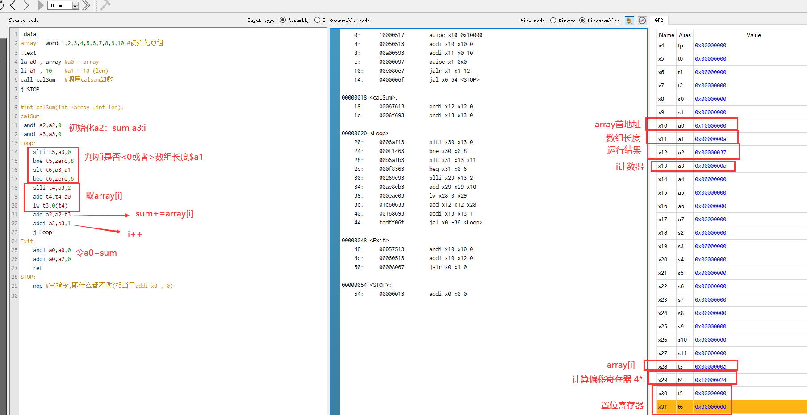
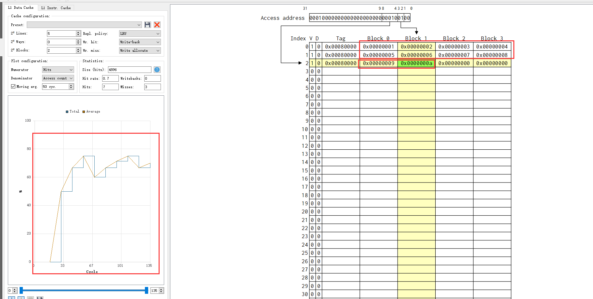
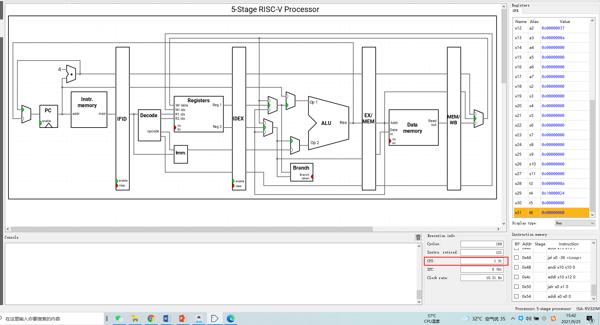

1.  如图1-1，汇编代码在图左侧部分，右侧部分为运行结束时寄存器的值。
-   右图a0说明array数组起始地址为0x10000000
-   运行结果为0x37即为55，结果正确
-   代码设计前首先初始化了data节的array数组的值，然后给寄存器a0赋予了array的起始地址，a1赋予了数组长度10
-   各寄存器含义如下：
-   a0:array数组首地址
-   a1：数组长度
-   a2：sum
-   a3：i
-   t3：存放数组array[i]的值
-   t4：存放距离array[0]的距离，即4\*i
-   t5与t6：在代码中属于置位寄存器，判断i是否超过数组长度或者小于零

图1-1

2、在图2-1中，我们看到了程序运行时分别访问了block0-block3，并且从1-a访问期间速度有区别，在从block3跳转到block0时，速度有明显下降，所以合理设计访问block可以提高程序运行速度。

图2-1

3、在图3-1中，我们看到array数组是从低地址往高地址存储的，并且是用大端存储。

图3-1

4、如图4-1，在运行过程中我发现CPI在1.3-1.4之间波动，且processor为流水线运行指令的，非常高效，让我十分震撼。

图4-1

5、源代码如下：

.data

array: .word 1,2,3,4,5,6,7,8,9,10 \#初始化数组

.text

la a0 , array \#a0 = array

li a1 , 10 \#a1 = 10 (len)

call calSum \#调用calsum函数

j STOP

\#int calSum(int \*array ,int len);

calSum:

andi a2,a2,0

andi a3,a3,0

Loop:

slti t5,a3,0

bne t5,zero,8

slt t6,a3,a1

beq t6,zero,6

slli t4,a3,2

add t4,t4,a0

lw t3,0(t4)

add a2,a2,t3

addi a3,a3,1

j Loop

Exit:

andi a0,a0,0

addi a0,a2,0

ret

STOP:

nop \#空指令,即什么都不做(相当于addi x0 , 0)
