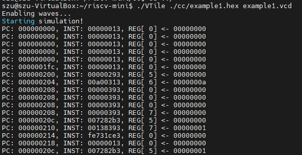

一、编译运行程序

1、在riscv-mini目录下写下test.s文件。

2、汇编程序编写完成后通过riscv32-unknown-elf-gcc进⾏编译。

3、编译完成后我们便可得到elf⽂件，通过readelf -h我们可以看到，该elf文件的系统架构为riscv，并且入口点地址为0x200。

4、使⽤riscv32-unknown-elf-objdump对elf⽂件进⾏反汇编，可以看到程序在start时，起始地址为0x200。

5、将elf⽂件转化为特定格式的hex⽂件，为了后面的仿真。

6、执行./VTile ./test_jx3/test.hex test.vcd进行仿真，仿真过程会输出每个每个时钟周期的PC、执⾏指令以及相关的寄存器操作，也会生成.vcd的文件。

7、使用vim书写factorial.c，并保存。

8、使用riscv32-unknown-elf-gcc -nostdlib -Ttext=0x200 –march=RV32I -o factorial.elf factorial.c生成elf文件，警告不必理会。

9、对生成的elf文件使用objdump获取反汇编代码。

10、通过以下指令生成hex文件，并且使用VTile仿真。

elf2hex 16 4096 factorial.elf \> factorial.hex

./VTile ./exampleCode/c/factorial.hex

二、通过波形图观察指令的执行过程

1、使用vim书写exqmple1.S。

2、将example1.S编译后生成elf文件，对其objdump，观察每条指令所在的地址，并且生成其hex文件。

3、对其进行VTile仿真并且生成vcd文件。

4、使用GTKWave并选择exqmple1.vcd打开波形图，由于之前的objdump我们知道0x208是li t1,10指令的地址，并且我们发现在20ns前后req_addr=npc，所以此处若cache命中，则下一周期立即取得指令，我们在下一周期可以看到cache命中，因为其读取出了指令 00A00313 ，并将其写⼊到了fe_inst寄存器中以供执⾏阶段使⽤。

5、观察波形图，对于这⼀条指令 addi x6 x0 10 ，需要根据指令产⽣⽴即数10，从寄存器x0中读取数值，并使⽤ALU将⽴即数与读出的数值相加。从下⾯的波形图中可以观察到，⽴即数⽣成单元(immGen)、控制单元(ctrl)的输⼊均为流⽔寄存器中的inst。⽴即数⽣成单元给出对应的⽴即数0xA。同时寄存器⽂件也给出了x0寄存器读取的结果(x0寄存器始终为0)。alu中以寄存器读取的结果以及⽴即数作为输⼊，根据控制信号将其相加得到结果0xA，并将结果写⼊到流⽔线寄存器ew_alu中以供写回阶段使⽤。

6、对于 addi x6 x0 10 指令便需要将ALU计算出的结果0xA写⼊到x6寄存器当中。观察如下的波形图，可以看到寄存器⽂件的写地址信号为06，写数据信号为ew_alu中的数值0xA，且写信号为⾼。查看寄存器⽂件中的x6寄存器，可以发现0xA已经被成功写⼊到x6寄存器当中。

三、FPGA烧写

1、打开Vivado，导入实验所提供的.v文件，复制constraints于xdc文件中，并且设置Block Memory Generator（如下图所示）。

2、连接板子，并且烧录程序并编译，然后用UART线根据ppt所提供的方法一次有序连接板子的VCC、RX、TX、GND口。

3、如下图所示，打开common串口工具，串口号选择COM4,选择字符模式，发送数据，窗口显示发送的信息，说明实验成功。

4、如上个实验一样的配置，只是文件与约束改了一点，其余一致，完成后打开common，我们输入1并发送（如下图）。

5、发送1之后，我们发现板子的LD1上的灯亮起来了，说明试验成功。

6、我们再次尝试发送2（如下图）.

7、可以看到，板子的LD2灯亮了，我们的实验完美成功！

