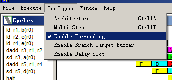
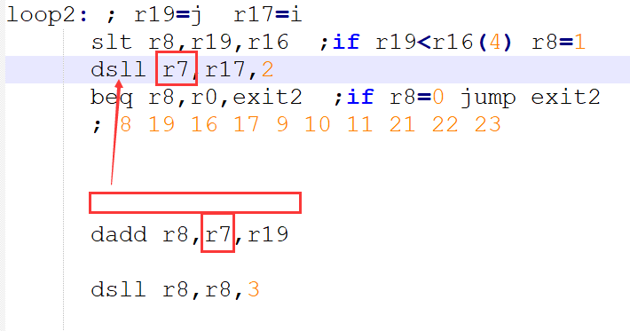
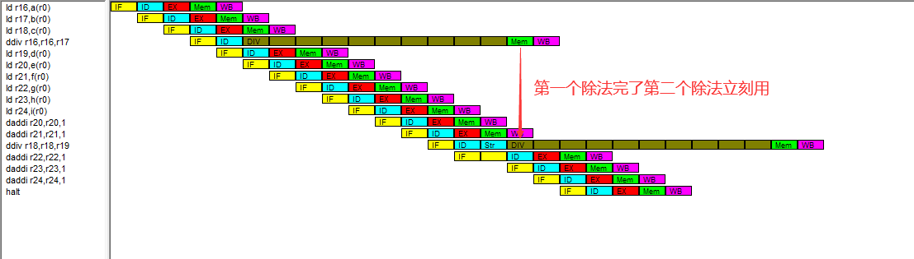

**一、 实验目标：**

了解MIPS的五级流水线，和在运行过程中的所产生的各种不同的流水线冒险

通过指令顺序调整，或旁路与预测技术来提高流水线效率

更加了解流水线细节和其指令的改善方法

更加熟悉MIPS指令的使用

**二、实验内容**

观察一段代码并运行，观察其中的流水线冒险，并记录统计统计信息。

对所给的代码进行指令序列的调整，以期避免数据相关，并记录统计信息。

启动forward功能，以获得性能提升，并且记录统计信息。

（选做：用perf记录x86中的数据相关于指令序列调整后的时间统计、

调整指令，以避免连续乘法间的阻塞。）

**三、实验环境**

硬件：桌面PC

软件：Windows，WinMIPS64仿真器

**四、实验步骤及说明**

首先，我们给出一段C代码，该段代码实现的是两个矩阵相加。

设有4\*4矩阵A和4\*4矩阵B相加，得到4\*4矩阵C：

for(int i = 0; i \< 4; i++)

For(int j = 0; j \< 4; j++)

C[i][j] = A[i][j] + B[i][j];

根据上述的C代码，我们将其转换成MIPS语言，然后运行，并进行分析。

MIPS代码如下：

.data

a: .word 1,1,1,1,2,2,2,2,3,3,3,3,4,4,4,4

b: .word 4,4,4,4,3,3,3,3,2,2,2,2,1,1,1,1

c: .word 0,0,0,0,0,0,0,0,0,0,0,0,0,0,0,0

len: .word 4

control: .word32 0x10000

data: .word32 0x10008

.text

start:daddi r17,r0,0

daddi r21,r0,a

daddi r22,r0,b

daddi r23,r0,c

ld r16,len(r0)

loop1: slt r8,r17,r16

beq r8,r0,exit1

daddi r19,r0,0

loop2: slt r8,r19,r16

beq r8,r0,exit2

dsll r8,r17,2

dadd r8,r8,r19

dsll r8,r8,3

dadd r9,r8,r21

dadd r10,r8,r22

dadd r11,r8,r23

ld r9,0**(r9**)

ld r10,0(r10)

dadd r12,r9,r10

sd r12,0(r11)

daddi r19,r19,1

j loop2

exit2:daddi r17,r17,1

j loop1

exit1: halt

实验前请保证winMIPS64配置中“Enable Forwarding”没有选中。将这段代码加载到WinMIPS64中，运行后观察结果（提供Statistic窗口截图）。 从Statistic窗口记录：本程序运行过程中总共产生了多少次RAW的数据相关。接下来，我们对产生数据相关的代码逐个分析，请列出产生数据相关的代码，并在下一步中进行分析和优化。

1.  调整指令序列

在这一部分，我们利用指令调整的方法对数据相关代码进行优化，规避数据相关。

通过**调整序列**来规避这个数据相关，在statics窗口中记录其效果。将此结果与初始的结果进行对比，报告**RAW相关的次数减少**的数量。

1.  Forwarding功能开启

接下来，我们要展示Forwarding功能的优化效果。

首先，我们要知道如何开启Forwarding功能。法如下：点开**configure**下拉窗口，给**Enable Forwarding**选项左侧点上勾。

开启了Forwarding功能之后，我们再运行，查看结果，解释哪些数据相关的问题得到解决，并以截图说明问题解决前后的差异所在。

1.  结构相关优化

流水线中的结构相关，指的是流水线中多条指令在同一时钟周期内争用同一功能部件现象。即因硬件资源满足不了指令重叠执行的要求而发生的冲突。

在WinMIPS64中，我们可以在除法中观察到这种现象。要消除这种结构相关，我们可以采取调整指令位置的方法进行优化。在这个部分，我们首先给出几条C代码，然后将该代码翻译成MIPS代码（为了观察的方便，我们这里MIPS代码并不是逐一翻译，而是调整代码，使得其他部分数据相关已经优化，而两条除法指令连续出现），运行并查看结果。接着，调整代码序列，重新运行。观察优化效果。

下面是给出的C代码：

a = a / b

c = c / d

e = e + 1

f = f + 1

g = g + 1

h = h + 1

i = i + 1

j = j + 1

根据上述的C代码，我们给出数据相关优化的指令如下：

.data

a: .word 12

b: .word 3

c: .word 15

d: .word 5

e: .word 1

f: .word 2

g: .word 3

h: .word 4

i: .word 5

.text

start:

ld r16,a(r0)

ld r17,b(r0)

ld r18,c(r0)

ld r19,d(r0)

ld r20,e(r0)

ld r21,f(r0)

ld r22,g(r0)

ld r23,h(r0)

ld r24,i(r0)

ddiv r16,r16,**r17**

ddiv r18,r18,r19

daddi r20,r20,1

daddi r21,r21,1

daddi r22,r22,1

daddi r23,r23,1

daddi r24,r24,1

halt

上面的指令运行，在**Cycle**窗口结果如下（程序运行前请将configure-\>architecture-\>division latency改为10）：

在**Statistics**窗口的结果如下：

通过观察，我们可以发现，两个连续的除法产生了明显的结构相关，第二个除法为了等待上一个除法指令在执行阶段所占用的资源，阻塞了9个周期。

显然，这样的连续的除法所导致的结构相关极大的降低了流水线效率，为了消除结构相关，我们需要做的是调整指令序列，将其他无关的指令塞入两条连续的除法指令中。

给出指令序列的调整方案并给出流水线工作状态的截图，做出解释。

1.  提交报告

    记录实验过程，保存实验截图，给出分析结果，形成实验报告。初始代码准备（10分），后面每个优化方法各30分。

**五、实验结果**

1、将代码复制进入.S文件中，运行WINMIPS64打开运行该文件，得到如下结果，说明发生了220次RAW数据相关。以下是代码分析：、

.text

start:daddi r17,r0,0

daddi r21,r0,a

daddi r22,r0,b

daddi r23,r0,c

ld r16,len(r0)

loop1: slt r8,r17,r16

beq r8,r0,exit1

daddi r19,r0,0

loop2: slt r8,r19,r16

beq r8,r0,exit2

dsll r8,r17,2

dadd r8,r8,r19

dsll r8,r8,3

dadd r9,r8,r21

dadd r10,r8,r22

dadd r11,r8,r23

ld r9,0**(r9**)

ld r10,0(r10)

dadd r12,r9,r10

sd r12,0(r11)

daddi r19,r19,1

j loop2

exit2:daddi r17,r17,1

j loop1

exit1: halt

2、通过把图示ld指令提前，再运行时，我们可看到RAW数据相关减少了两个，变成了218个.

3、将下图daddi指令上移到beq指令前，发现RAW减少了13次，从218降到了205。.

4、将下图指令的r8与下一条dadd指令中rs寄存器r8改为r7，并且将dsll指令移动至分支指令中间，发现RAW降低了52，从205降到了153.

5、将下图中daddi指令移动至箭头处dsll r8,r8,3指令下，消除dsll与dsdd的r8数据相关，可见RAW从153减少了16次到了137.

6、38个数据相关是我调整序列能达到的最小相关数，当我打开enable forwarding之后，如下图所示，RAW数据相关减少到了16个！

7、对调整序列之后的代码关闭enable forwarding与开启enable forwarding的cycles窗口（如下图）对比发现，enable forwarding消除了大部分Raw，除了J loop1这种无条件跳转指令会有一个气泡外（Mips恒预测不跳转），其他气泡均已消除。

8、将代码写入程序， 用MIPS打开并运行，结果发现DIV确实占用了过多周期（如下图）。

9、根据上图得知，连续两个除法会导致结构相关，所以我们要尽量将其分开，错开使用EX的时机，分析发现ddiv r16,r16,**r17**指令相关寄存器在代码中比较靠前，于是把它移动至R16,R17相关指令下（如图）。

10、开启enable forwarding，运行程序，可以发现我们消除了结构相关，两个除法不存在阻塞的情况（如图）。

**五、实验总结与体会**

1、调整指令顺序对RAW，以及Structural Stalls有作用，但是对RAW只能起部分作用，更多还需要硬件的forward，那样优化才彻底。

2、对于Structural Stalls，我们可以利用软件来观察并且调整指令顺序，来预防结构相关的发生。

3、此外，在避免结构冒险的时候，也不要忘记了考虑数据冒险，两者对运行速度都有很大影响。

| **指导教师批阅意见：**       **成绩评定：**        指导教师签字：   年 月 日 |
|------------------------------------------------------------------------------|
| 备注：                                                                       |
