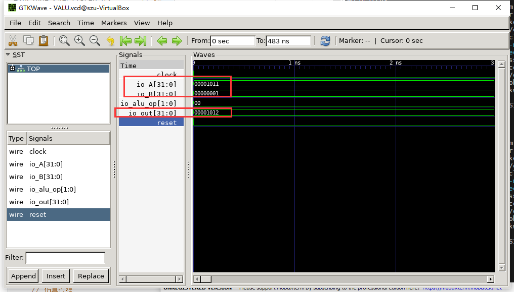

1） 修改测试激励程序 （harness.cpp），仅观察1011+0001、0111-0010，给出verilator上的仿真波形，并解释结果

1、修改harness.cpp，将top-\>io_A=a改为top-\>io_A=0x1011; 将top-\>io_B的值改为0x0001,将top-\>io_alu_op值改为0。

2、生成波形文件后，运行gtkwave，显示如下波形，发现io_A与io_B加法结果为1012，

3、相同方法修改harness.cpp，将top-\>io_A=a改为top-\>io_A=0x0111; 将top-\>io_B的值改为0x0010,将top-\>io_alu_op值改为1。

4、生成波形图并打开gtkwave发现答案正确:0111-0010=0101.

2） 2号功能（乘法）替换成取反功能，然后观察0101和1100的仿真结果并记录波形截屏

1、进入// src/main/scala/ALU/ALU.scala，并修改如下代码

2、回到chisel-template目录，运行sbt run，编译通过后修改harness.cpp，top-\>io_A=a改为top-\>io_A=0x0101;将top-\>io_alu_op值改为2。

3、修改harness.cpp，将top-\>io_A=a改为top-\>io_A=0x0101;将top-\>io_alu_op值改为2，生成波形图并打开gtkwave发现答案正确:\~0101=FFFFFEFE.

4、修改harness.cpp，将top-\>io_A=a改为top-\>io_A=0x1100;将top-\>io_alu_op值改为2，生成波形图并打开gtkwave发现答案正确:\~1100=FFFFEEFF.

3） FPGA板上加法和乘法功能的照片，并说明你所施加的操作数和结果数值。

1、将multiplier.v导入项目中，填写约束文件如下，设置乘数与被乘数的io为1，将高2位设置成1，低两位用于板子上面的G15.P15.W13.I16进行操作，M14.M15.G14.D18.V12.W16.J15.H15作为结果输出，K18设置为复位键。

2、连接板子，进行编译与烧录，出现如下界面。

3、对板子进行操作，因为板子只能看到前四位结果的亮灯，图中计算的是1100\*1101，其结果应该为1001 1100，而看到低四位所连接的灯分别为亮亮灭灭，所以为1101，结果正确。

4、新建一个项目，导入ALU.V的文件进入项目中，更改ALU.V为四位加法计算文件，内容如下：

module ALU(

input clock,

input reset,

input [2:0] io_A,

input [2:0] io_B,

input [1:0] io_alu_op,

output [2:0] io_out

);

wire [2:0] \_io_out_T_1 = io_A + io_B; // @[ALU.scala 26:24]

wire [2:0] \_io_out_T_3 = io_A - io_B; // @[ALU.scala 27:24]

wire [2:0] \_io_out_T_4 = \~io_A; // @[ALU.scala 28:20]

wire [2:0] \_io_out_T_6 = 2'h0 == io_alu_op ? \_io_out_T_1 : 3'h0; // @[Mux.scala 80:57]

wire [2:0] \_io_out_T_8 = 2'h1 == io_alu_op ? \_io_out_T_3 : \_io_out_T_6; // @[Mux.scala 80:57]

assign io_out = 2'h2 == io_alu_op ? \_io_out_T_4 : \_io_out_T_8; // @[Mux.scala 80:57]

endmodule

5、对ALU.V的限制文件写成下列语句，M14.M15.G14.D18分别控制加法的输出，V13.U17.T17.Y17为两个加数的高两位，分别设置为0，G15.P15.W13.T16为两个加数的低两位，设置为开关控制，K18设置为复位键。

6、连接板子，烧录结果如下所示：

7、对板子按下复位键，开关设置为关开关开即两个加数为0001+0001，所以结果为0010，其灯亮灭顺序也如图一致。

