**深 圳 大 学 实 验 报 告**

**课 程 名 称： 计算机系统(3)**

**实验项目名称：   MIPS指令集实验**

**学 院：   计算机与软件学院**

**专 业： 计算机与软件学院所有专业**

**指 导 教 师：   罗秋明**

**报告人： 刘俊楠   学号： 2017303010  班级：  01**

**实 验 时 间：   2021.10.5**

**实验报告提交时间：  2021.10.21**

**教务处制**

**一、 实验目标：**

了解WinMIPS64的基本功能和作用；

熟悉MIPS指令、初步建立指令流水执行的感性认识；

掌握该工具的基本命令和操作，为流水线实验作准备。

**二、实验内容**

按照下面的实验步骤及说明，完成相关操作**记录实验过程的截图**：

1）下载WinMIPS64；运行样例代码并观察软件各个观察窗口的内容和作用，掌握软件的使用方法。（80分）

2）学会正确使用WinMIPS64的IO方法；（10分）

3）编写完整的排序程序；（10分）

**三、实验环境**

硬件：桌面PC

软件：Windows，WinMIPS64仿真器

**四、实验步骤及说明**

WinMIPS64是一款指令集模拟器，它是基于WinDLX设计的，如果你对于WinDLX这款软件十分熟悉的话，那么对于WinMIPS64也会十分的容易上手。DLX 处理器 (发音为 "DeLuXe")是Hennessy 和Patterson合著一书《**Computer Architecture - A Quantitative Approach**》中流水线处理器的例子。WinDLX是一个基于Windows的模拟器。

本教程通过一个实例介绍WinMIPS64的使用方法。WinMIPS64模拟器能够演示MIPS64流水线是如何工作的。

本教程使用的例子非常简单，它并没有囊括WinMIPS64的各个方面，仅仅作为使用WinMIPS64的入门级介绍。如果你想自己了解更多的资料，在给出的winmips64.zip中，有WinMIPS64 — Documentation Summary.html和winmipstut.docx两个文件可以供你随时参考，其中涵盖了WinMIPS64的指令集和模拟器的组成与使用方法。

虽然我们将详细讨论例子中的各个阶段，但你应具备基本的使用Windows的知识。现假定你知道如何启动 Windows，使用滚动条滚动，双击执行以及激活窗口。

（一）、安 装

请按以下步骤在Windows下安装WinMIPS64 ：

1.  为WinMIPS64 创建目录，例如**D:\\ WinMIPS64**
2.  解压给出的winmips64.zip压缩文件到创建的目录中。

（二）、一个完整的例子

1.  **开始和配置WinMIPS64**

在winmips64这个子目录下，双击winmips64.exe文件，即打开了WinMIPS64模拟器，其外观如下图：

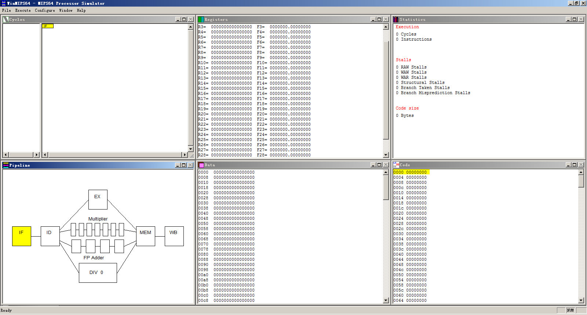

为了初始化模拟器, 点击**File** 菜单中的 **Reset all（Ctrl+R）** 菜单项即可。**OKOK**

WinMIPS64可以在多种配置下工作。你可以改变流水线的结构和时间要求、存储器大小和其他几个控制模拟的参数。点击 **Configuration** / **Floating Point Stages**（点击**Configuration**打开菜单，然后点击**Architecture**菜单项），选择如下标准配置：

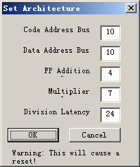

如果需要，可以通过点击相应区域来改变设置。然后，点击**OK** 返回主窗口。

在 **Configuration** 菜单中的其他四个配置也可以设置，它们是：**Multi-Step, Enable Forwarding, Enable Branch Target Buffer** 和 **Enable Delay Slot**。 点击相应菜单项后， 在它的旁边将显示一个小钩。 本次实验要求不要勾选“Enable Forwarding”。

**2. 装载测试程序**

用标准的text编辑器来新建一个名为sum.s的文件，这个文件的功能是，计算两个整数A、B之和，然后将结果传给C。程序如下：

.data

A: .word 10

B: .word 8

C: .word 0

.text

main:

ld r4,A(r0)

ld r5,B(r0)

dadd r3,r4,r5

sd r3,C(r0)

halt

在将该程序装载进WinMIPS64之前，我们必须用asm.exe来检验该输入程序的语法正确性。asm.exe程序文件在所给的winmips压缩包里有，用命令行使用它。具体操作为，打开终端，利用cd命令进到**D:\\ WinMIPS64**目录中，然后直接使用asm.exe sum.s命令，检查输出结果是否无误。

在开始模拟之前，至少应装入一个程序到主存。为此，选择**File** / **OPEN**，窗口中会列出当前目录中所有汇编程序，包括sum.s。

按如下步骤操作，可将这个文件装入主存。

点击 **sum.s**

点击 **open** 按钮

现在，文件就已被装入到存储器中了，现在可以开始模拟工作了。

你可以在**CODE**窗口观察代码内容，可以在**DATE**窗口观察程序数据了。

**3. 模 拟**

在主窗口中，我们可以看见七个子窗口，和一条在底部的状态栏。这七个子窗口分别是**Pipeline**, **Code**, **Data**, **Registers**, **Statistics**, **Cycles**和**Terminal**。在模拟过程中将介绍每一个窗口的特性和用法。

#### (1) *Pipeline* 窗口

在**Pipeline**窗口中，展示了MIPS64处理器的内部结构，其中包括了MIPS64的五级流水线和浮点操作（加法/减法，乘法和除法）的单元。展示了处于不同流水段的指令。

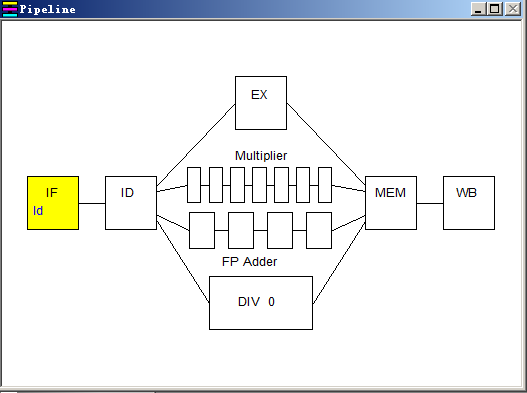

#### (2) *Code* 窗口

我们来看一下 **Code** 窗口。你将看到代表存储器内容的三栏信息，从左到右依次为：地址 (符号或数字)、命令的十六进制机器代码和汇编命令。

我们可以看到，初始时，第一行为黄色，表示该行指令处于“取指”阶段。

现在，点击主窗口中的 **Execution**开始模拟。在出现的下拉式菜单中，点击**Single Cycle**或按 **F7**键。

这时，第一行变成了了蓝色，第二行变成了黄色，这表示第一行指令处于“译码”阶段，而第二行指令处于“取指”阶段。这些不同的颜色代表指令分别处于不同的流水线阶段。黄色代表“取指”，蓝色代表“译码”，红色代表“执行”，绿色代表“内存数据读或写”，紫色代表“写回”。

接着按F7，直到第五个时钟周期的时候，有趣的事情发生了，“dadd r3，r4，r5”指令没有从“译码”跳到其下一个流水阶段“执行”，并且“sd r3，C(r0)”指令，仍然停留在“取指”阶段，同时在**terminal**窗口显示一行信息“RAW Stall in ID (RS)”，思考一下这是为什么？

#### (3) *Cycls*窗口

我们将注意力放到**Cycls**窗口上。它显示流水线的时空图。

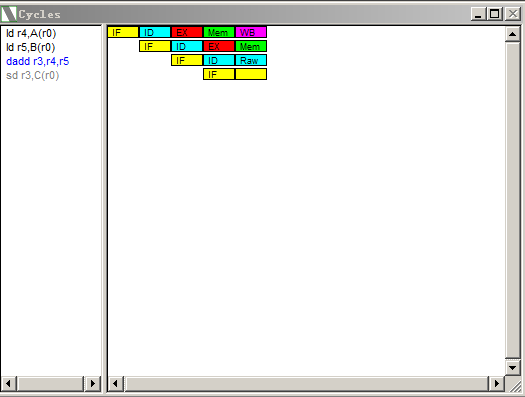

在窗口中，你将看到模拟正在第五时钟周期，第一条指令正在WB段，第二条命令在MeM段，第四条命令在处于暂停状态（installed），第五条指令也因此停滞不前。这是因为发生了数据相关（第四条指令的dadd命令需要用到寄存器r5的值，但是r5的值并不可用）。

接着点击**F7**，到第五个时钟周期时，再次发生相关，造成停滞。接着点击**F7**，直至第十三个时钟周期全部指令执行结束。

值得一提的是，**Cycls**窗口是分为两个子窗口的，左边的子窗口是一系列的指令，右边的窗口是图示的指令执行过程。其中，左边子窗口的命令是动态出现的，当一条指令在进行“取指”时，该指令才出现，而且，当出现了数据相关的时候，所涉及到的指令会变色，暂停的指令会变成蓝色，而被其影响的后续指令会变成灰色。

#### (4) *Data* 窗口

在**Data**中，我们可以观察到内存中的数据，包括数据内容和地址两个方面，其中地址使用64位表示。

如果想改变一个整型的数据的值，左键双击该值所在的行，如果是想改变一个浮点类型的数据的值，那么请右键双击该值所在的行。

上图即为第十三个时钟周期的**data**窗口的图示，其中，左边一行即为用64位表示的内存地址，中间行为数据的内容，右边的一行为相关的代码。可以看出，在这个时钟周期，A与B的值分别为0xa和0x8，C的值为0x12，表明A与B的值之和已经相加并保存到了C中。

#### (5) *Registers* 窗口

这个窗口显示存储在寄存器中的值。

如果该寄存器为灰色，那么它正处于被一条指令写入的过程，如果它用一种颜色表示，那么就代表，该颜色所代表的的流水线阶段的值可以用来进行前递（forwarding）。同时，这个窗口允许你交互式的该变寄存器的值，但是前提是该寄存器不能处于被写入或者前递的阶段。如果想改变一个整型的数据的值，左键双击该值所在的行，如果是想改变一个浮点类型的数据的值，那么请右键双击该值所在的行，然后按**OK**来进行确定。

上图即为第十三个时钟周期的**Registers**窗口的图示，很显然，其中可以很清楚的看出每个寄存器的值是什么。

#### (6) *Statistics* 窗口

最后我们来看一下**Statistics** 窗口。

这个窗口是用来记录一些模拟周期的统计数据。其中包括**Execution**，**Stalls**，和**Code Size**三个大项。其中，**Execution**用来显示模拟周期中指令数，执行周期数和CPI（没条指令所用周期数），**Stalls**用来表示暂停的周期数，并且分门别类的进行了统计，其中包括**RAW Stalls**，**WAW Stalls**，**WAR Stalls**, **Structural Stalls**, **Branch Taken Stalls**和**Branch misprediction Stalls**。**Code Size**表示了代码的大小，用**byte**表示。

上图即为**Statistics**窗口的图示，其中表示了该程序有13个时钟周期，5条指令，CPI

为2.600，有4个**RAW Stalls**，代码大小为20个Bytes。

（三）、更多操作

首先，点击File/Reset MIPS64（ctrl + R）进行重置。如果你点击File/Full Reset，你将删除内存中的数据，这样你就不得不重新装载文件，所以点击File/Reload（F10）是一个很方便的重置的方法。

你可以一次推进多个时钟周期，方法是点击Execute/Multi cycle（F8），而多个时钟周期数是在Configure/Multi-step中设置的。

你也可以通过按F4一次完成整个程序的模拟。同时，你可以设置断点，方法是，在Code窗口中左键双击想要设置断点的指令，该指令会变成蓝色，然后点击F4，程序就会停在这条指令执行“ 取指”的阶段，如果想要清除断点，再次左键双击改行指令。

（四）、终端I/O的简单实例

通过上面对WinMIPS64的了解，我们可以开始简单的使用该工具了。

这里，需要我们编写一个简单的终端输出“Hello World！！”的小程序，运行并且截图。所以，我们需要了解如何将数据在终端中输出输入。

下图是I/O区域的内存映射，一个是控制字，一个是数据字：

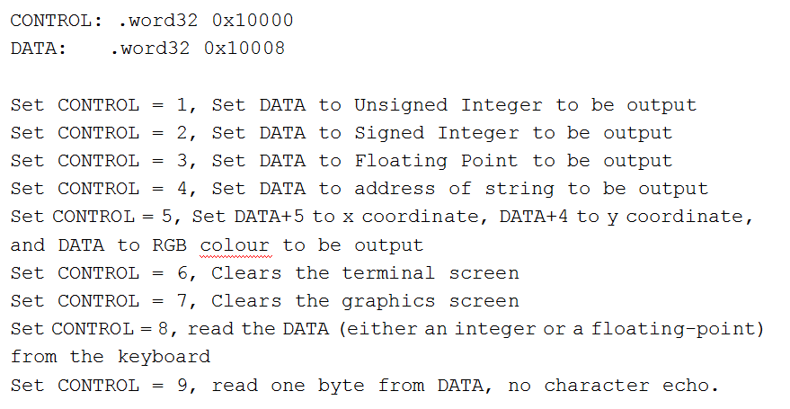

所以我们需要先将CONTROL和DATA地址读取到寄存器，然后分别在这两个区域内存储相应的序列号（如上图所示）和要显示在Terminal窗口的数据，同时，设置CONTROL为9，我们能对其进行读取数据。

请编写完整程序，输出“Hello World!”字符串。然后通过asm.exe来检验该程序的语法正确性，然后在WinMIPS64中的File栏中open打开文件。最后一步步按F7，同时观察各个窗口。最终还要截取Terminal窗口，图如下：

证明你的程序结果输出了“Hello World！”。

（五）、编写排序算法

在这一部分，我们要求编写一个排序算法，对一组int型数据进行排序。该算法使用冒泡排序法，并且在其中嵌入一个swap函数过程（该算法在课本上有完整的程序，但是其中的数据初始化、寄存器映射、命令的映射以及I/O部分还需要自己手动编写）。编写完成后，在asm.exe中进行检测，然后运行。

初始数据要求为：“array: .word 8,6,3,7,1,0,9,4,5,2”

该程序需要对0到10，十个数进行了排序，其中使用了sort和swap两个函数过程，并且swap是嵌套在sort中的，在编写程序的时候一定要注意使用栈来保留寄存器的值，嵌套时还额外需要保存\$ra的值。在WinMIPS64运行上述程序，将得到如下结果（这里只给出Terminal窗口的截图即可）：

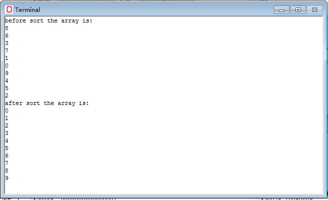

观察实验截图， 证明你的程序确实做到了对数组排序的效果。

注意：需要将SP初始化为内存最高地址，否则为初始化SP为0，SP-1将指向FFFFFFFF,该地址将超出winmips默认的内存空间。

（六）、结束语

本实验通过一个例子介绍了WinMIPS64的重要特性，使你对流水线和MIPS64的操作类型有了一定的了解。当然，你还必须学习更多的知识，才能更深入地了解WinMIPS64。请参阅在winmips.zip压缩文件中的相关资料。

**五、实验结果**

1．为WinMIPS创建目录，并把WinMIPS文件复制入该文件夹，如图5-1，并解压（图5-2）。

图5-1

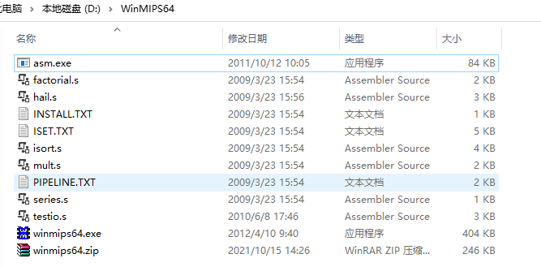

图5-2

2．打开winmips64.exe后，按下CTRL+R来初始化，然后点击configure来set Architecture，并且把Enable Forward选项取消勾选，如图5-3.

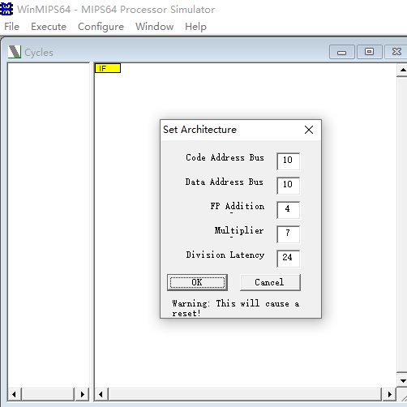

图5-3

3．在文件夹创建sum.s文件并写入代码，如图5-4.

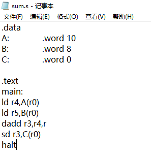

图5-4

4\. 在命令行中进入D:\\WinMIPS64，后运行asm.exe sum.s，发现pass2有errors（图5-5）。

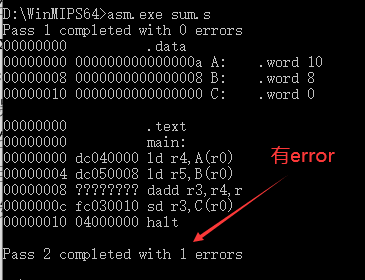

图5-5

5．[查阅资料](http://hk.uwenku.com/question/p-mnagweyo-bkt.html)发现，一开始我认为是dadd的指令问题，因为老师说了32位指令也能用，于是我该回了add指令，但是发现直接报错，于是又改回来了最后发现dadd后面第三个寄存器没有标上号，并且我发现这些寄存器直接使用的连号的，由于担心会造成数据覆盖，于是将他们调成了相邻的偶数寄存器，修改完毕后显示了正确的结果（图5-6）。

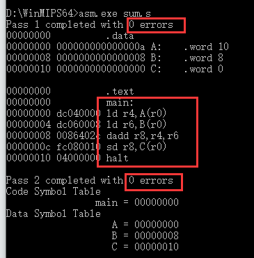

图5-6

6\. 打开WinMIPS64，点击File-\>Open，然后选择刚刚的sum.s，点击打开（图5-7），即可看到对应sum.s的六大窗口（图5-8）。

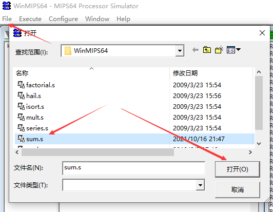

图5-7

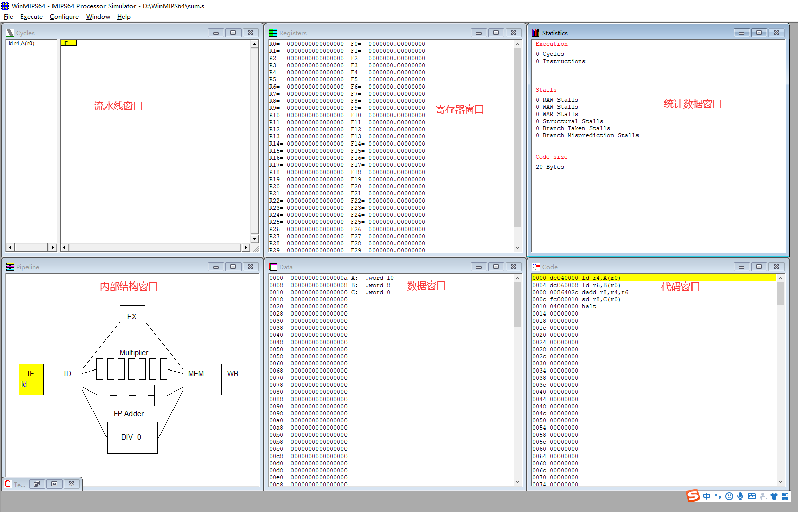

图5-8

7\. 我们放大pipeline窗口（图5-9），可以看到MIPS64处理器的内部结构，以及了解到不同流水段的指令。

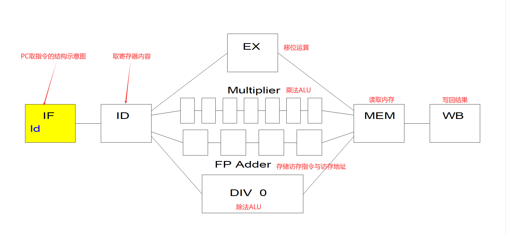

图5-9

8\. 我们看到未运行的代码中的code窗口（图5-10），可以看到窗口显示了与cmd显示的一样的信息，在一开始时，第一行永远处于黄色的“取指”阶段。

图5-10

9\. 当点击single cycle到第五步时，dadd r8,r4,r6指令并没有像预期那样进入红色的执行阶段，而是等待前面两个ld指令经过第五步写回后，dadd才能进入执行阶段（图5-11、图5-12），思考了一会，明白了dadd指令涉及前两个指令取数写回的寄存器，倘若前两个指令没有回到内存里去，寄存器的值就为空值，那dadd这个指令就没有任何意义，因此，dadd指令的暂停甚至还影响了后续的sd指令（图5-13）。

图5-11

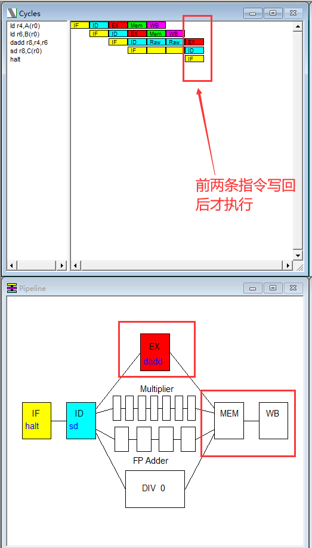

图5-12

图5-13

10\. 程序运行完后，可以看到Data窗口的C从0变成十六进制的12，也就是十进制的18，这与A+B的计算结果一致（图5-14），我们双击第一行更改A的值为8（图5-15），重新运行该程序得到C为十六进制的10，说明计算正确，程序正确（图5-16）。

图5-14

图5-15

图5-16

11\. 我们看寄存器窗口，当运行到第四条指令时，因为要取R4的值，所以R4寄存器为灰色（图5-17）。

图5-17

12\. 接下来看数据窗口，有两个大项，execution项显示执行的周期数与周期中指令数，stalls项指出暂停的周期数，code size项指出代码的大小（图5-18）。

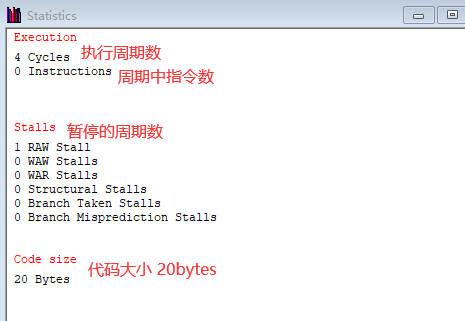

图5-18

13\. 接下来我们在D:\\WinMIPS64创建一个helloworld.s文件，并写下如下代码，以实现输出helloworld的功能（图5-19），在cmd中输入asm.exe helloworld.s指令，显示无错误（图5-20）。

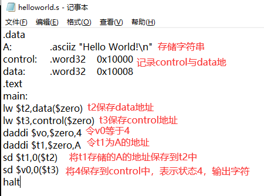

图5-19

图5-20

14\. 进入WINMIPS64，并打开helloworld.s文件，运行完成后打开终端窗口查看，发现输出Hello World!，运行成功（图5-21）！

图5-21

15\. 写代码过程中发现move指令、add指令、sll指令都不可用（图5-22），上网查阅资料后发现，add与sll指令必须变成64位才可用（图5-23）。

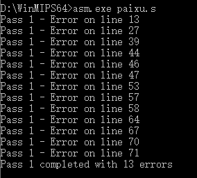

图5-22

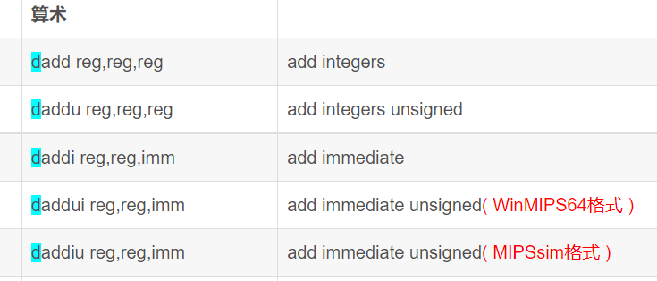

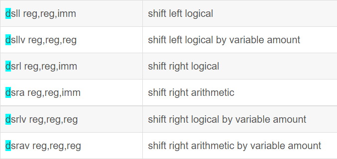

图5-23

16\. 修改完毕后，cmd显示正确无错误（图5-24），

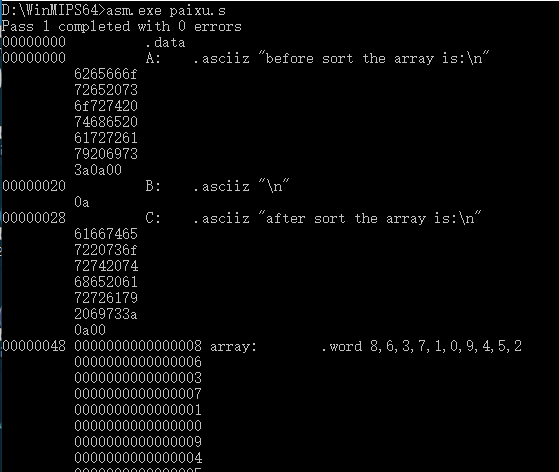

图5-24

17\. 遇到的错误：

-   Dadd指令加载的是地址而不是值，值需要lw取
-   64位取数组下一位要+8而不是+4
-   J无条件跳转指令之后的指令要注意，因为winmips64在运行时跳转时会有延迟一个指令，会导致j指令之后的一个指令会运行，尽量不要让其影响到程序（图5-25）。

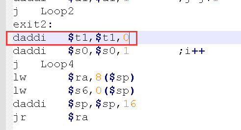

图5-25

18\. 程序写完后共113行（图5-26），main函数主要写了输出函数与跳转，并写了paixu函数的冒泡排序，与sort函数的交换函数（图5-27）。

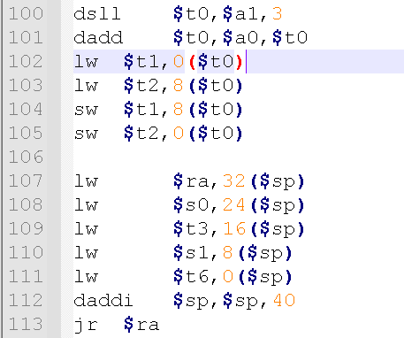

图5-26

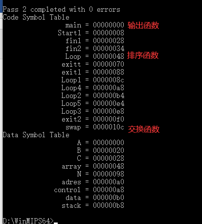

图5-27

19\. 排序算法程序输出如下（图5-28）。

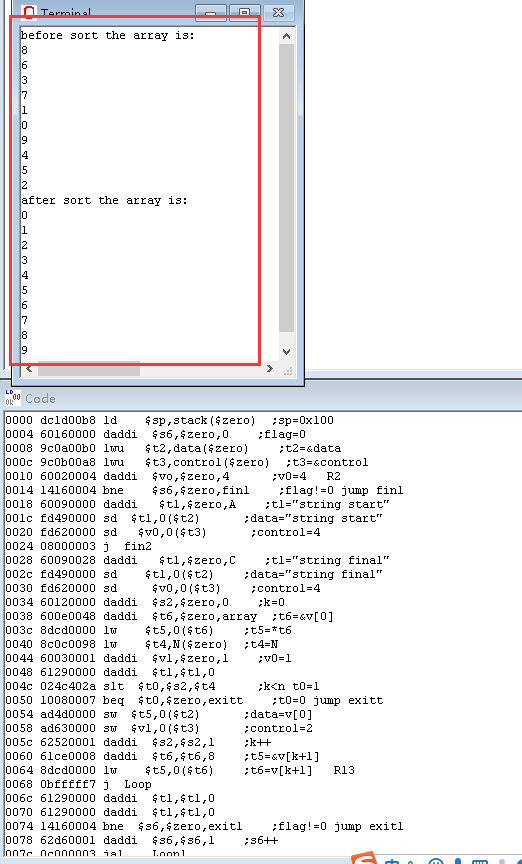

图5-28

**五、实验总结与体会**

1、通过这次实验，我体会到了MIPS64位与32位指令上的区别，比如32位的add，sll与move等都不可用，必须得换成dadd，dsll等指令。

2、我明白了机器执行指令时的流水过程，并且由于这种模式会造成j指令并不能及时地跳转，往往会延续至下一条指令才被跳转。

3、明白了MIPS的汇编与大二学的计算机系统1的LC3的汇编有异曲同工之妙，并且因此比较容易上手，所以学习知识需要我们举一反三。

4、在函数跳转时需要利用堆栈保存寄存器的值，至少需要保存ra寄存器，并且我深刻意识到函数是很有必要的，尤其是在代码量较大的情况下，否则写起来容易迷惑。

5、在函数保存寄存器时需要调用堆栈，而堆栈需要初始化，这是LC3没有的，通过上网查阅我明白了怎么设置堆栈并初始化。

6、了解WinMIPS64的基本功能和作用，明白了各个寄存器的作用与如何保存，在函数跳转时a0、a1寄存器不需要保存，因为他们属于函数的参数。

| **指导教师批阅意见：**       **成绩评定：**        指导教师签字：   年 月 日 |
|------------------------------------------------------------------------------|
| 备注：                                                                       |
