**一、 实验目标：**

实际运用WinMIPS64进行试验，以期更了解WinMIPS64的操作；

更加深入地了解MIPS程序的语法；

深入地了解在计算机中乘法的实现以及加法与乘法之间的关系。

**二、实验内容**

按照下面的实验步骤及说明，完成相关操作记录实验过程的截图：

首先，我们使用加法操作设计一个不检测溢出的乘法操作；完成后，我们对此进行优化，以期获得一个可以对溢出进行检测的乘法操作。（100分）

**三、实验环境**

硬件：桌面PC

软件：Windows，WinMIPS64仿真器

**四、实验步骤及说明**

本次试验分为两个部分：第一部分、用加法器设计一个不考虑溢出的乘法器；第二部分、用加法器设计一个考虑溢出的乘法器（编程熟练的同学，也可以用除法器、浮点加法器等替代）。

1、忽略溢出的乘法器

首先，我们得了解乘法器如何由加法器设计得到，此处，我们以32位乘法为例。

总共分为4步：

1.  测试乘数最低位是否为1，是则给乘积加上被乘数，将结果写入乘积寄存器；
2.  被乘数寄存器左移1位；
3.  乘数寄存器右移一位；
4.  判断是否循环了32次，如果是，则结束，否则返回步骤1。

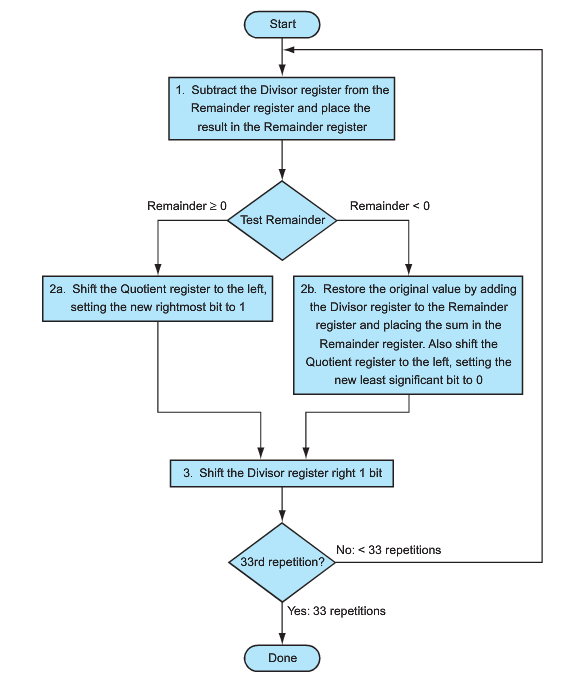

运行显示运行结果的例子如下，由于我们这里展示的是忽略了溢出的乘法，所以结果有两种：1、小于32位；2、大于32位。

第一种情况截图：

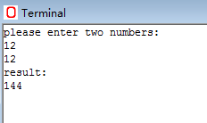

第二种情况截图：

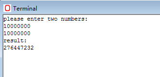

根据上面的程序代码和截图，我们可以很清楚的看出，当结果小于32位时，结果正常；当结果大于32位时，结果只截取了低32位的结果，而高32位的结果直接忽略掉了。

2、溢出提示的乘法器

上述的程序，用加法实现了32位乘法，但是，其中，对溢出情况没有进行考虑是其中的弊端。这里，我们来完善上述的乘法器，使得该乘法器会在结果溢出时候提示。

其实，这个小优化是十分简单的，只需要对64位的寄存器中的高32位进行检测即可。当高32位为0时，说明结果没有溢出，否则，结果溢出。

上述代码运行结果也有两个，一个是没有溢出的情况下的结果，一个是溢出了的情况下的结果。

首先，我们看没有溢出的情况结果：

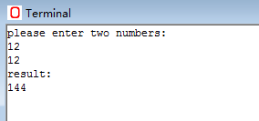

结果正确，其次，我们看溢出的情况结果如何：

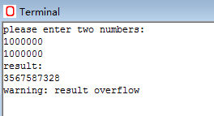

可以看到，当结果溢出时，程序会给出提示“warning：result overflow”。

4 结束语

本实验介绍了通过加法器来设计乘法器的原理，并且在编写该实验程序的时候，我们更加了解了：1、计算机乘法器工作原理的内容；2、进一步熟练MIPS的编程方法；3、WinMIPS64的使用方法。当然，如果想要更加深入的学习，我们也可以课外继续编写对除法的模拟。Perf软件的使用让学生初步熟悉性能测评的主要工具。

**五、实验结果**

1、根据实验要求，写下如下代码（未检测溢出乘法器）

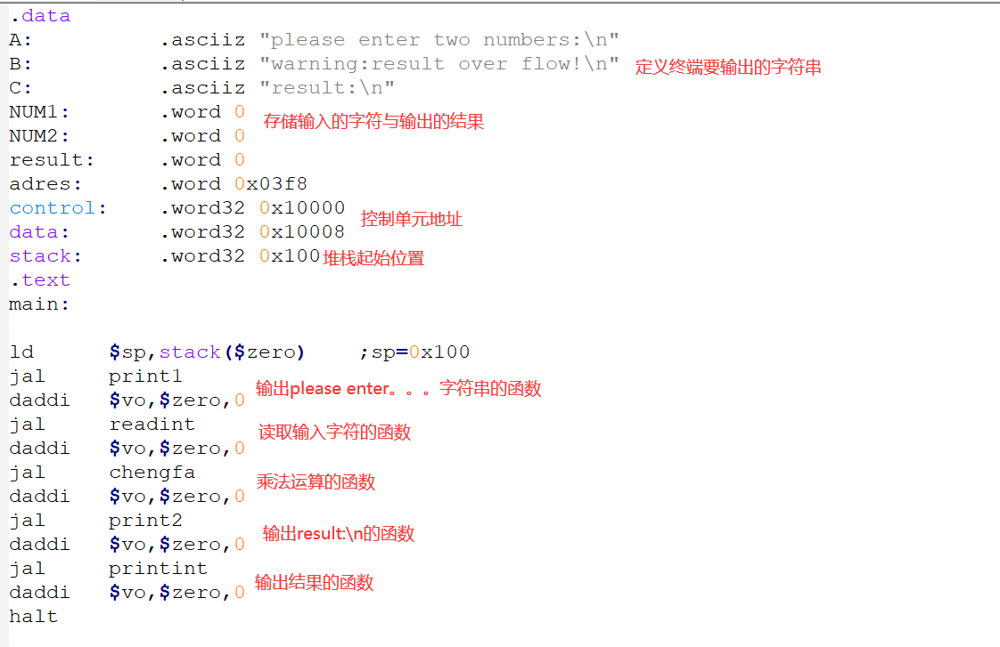

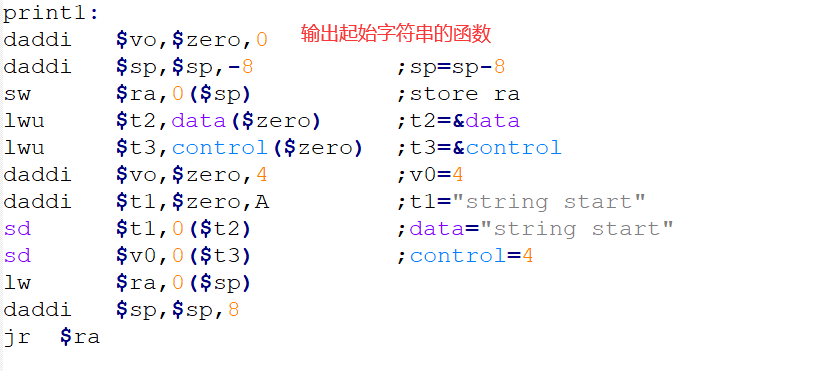

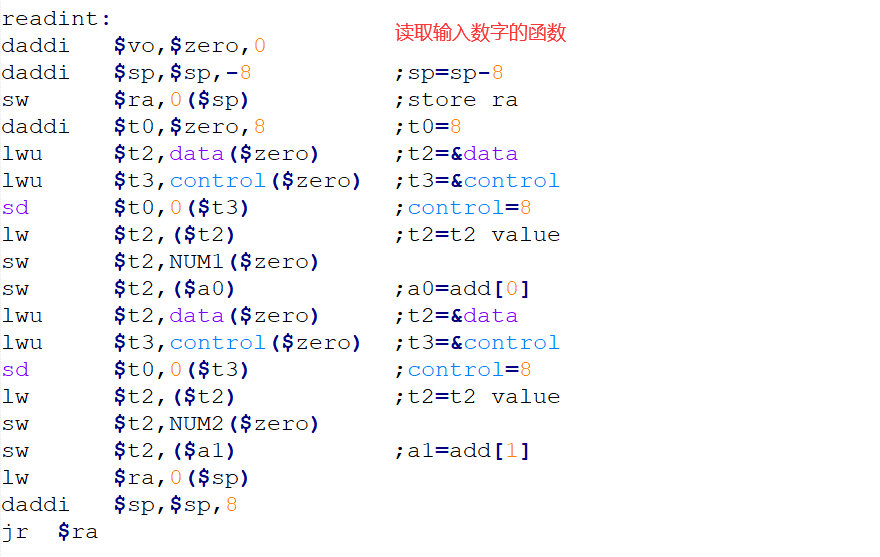

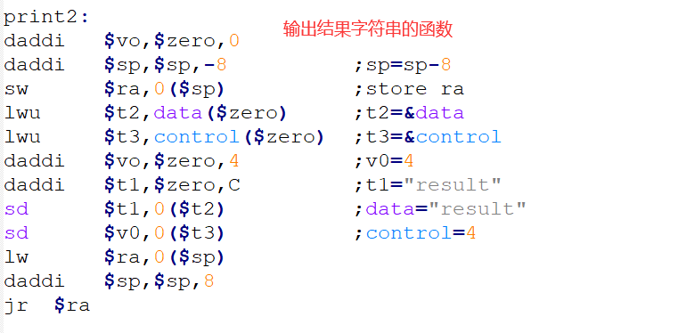

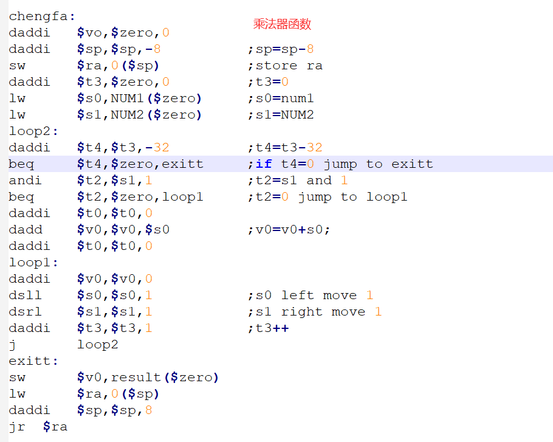

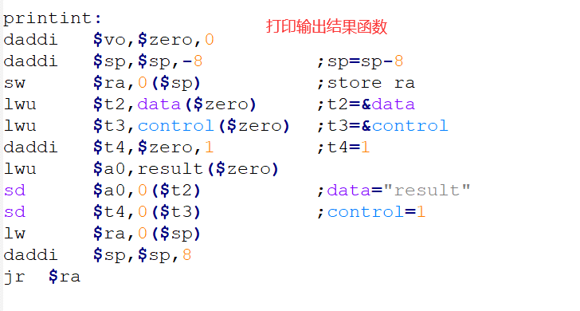

2、结果展示

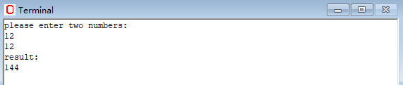

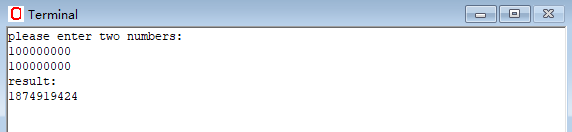

-   从结果可以看出，我们的乘法器在32位以前是结果正确的，但是到了32位之外就会出错溢出，所以我们需要设置检测溢出的功能。

3、添加溢出检测功能

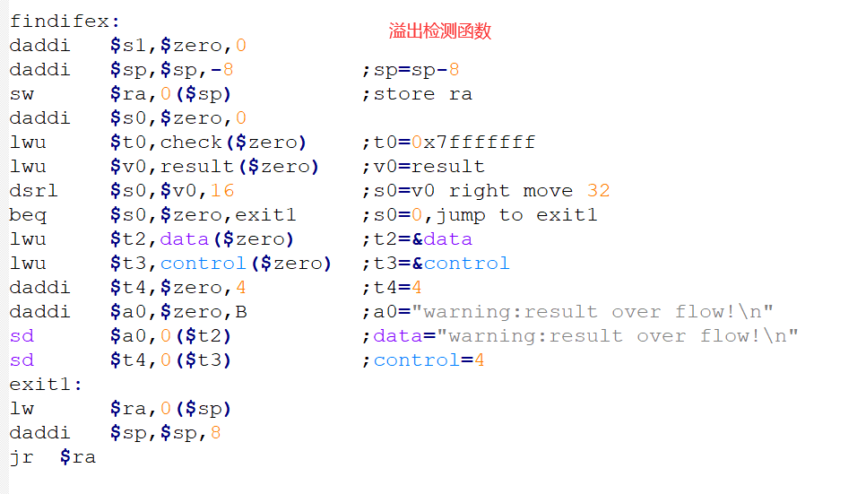

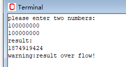

**五、实验总结与体会**

1、通过实验，我明白了乘法器的基本原理，对乘法器的实现有了更深的理解，并且明白了溢出检测的原理，以后在面对溢出时能有更敏锐的直觉，对64位MIPS有了更全面的了解，更加深入地了解MIPS程序的语法；深入地了解在计算机中乘法的实现以及加法与乘法之间的关系。

2、在实验中我发现，在检测溢出时，如果使用sd来输出数字，则在64位里没有溢出的情况，如果用sw来输出，则超过32位就会溢出，本质上是因为寄存器是64位，本来就可以存储64位的数字，所以在sd时没有溢出可能。

| **指导教师批阅意见：**       **成绩评定：**        指导教师签字：   年 月 日 |
|------------------------------------------------------------------------------|
| 备注：                                                                       |
