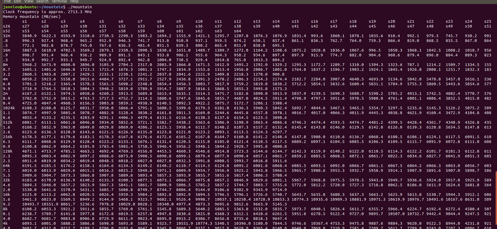
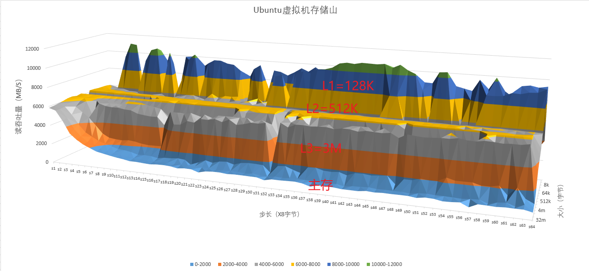
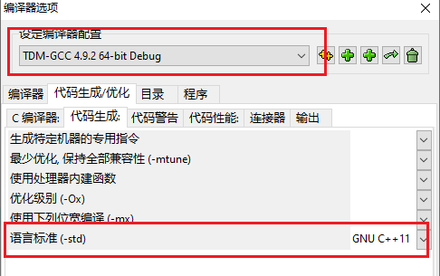
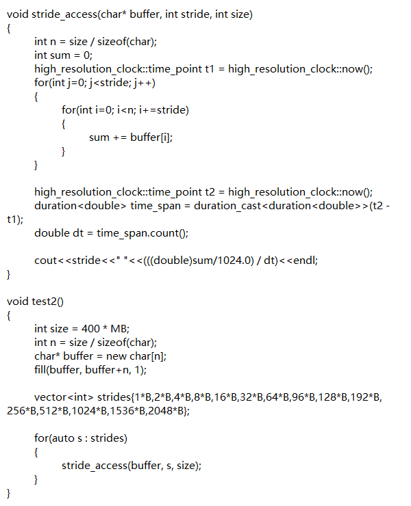
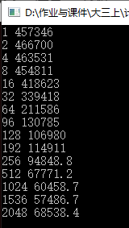
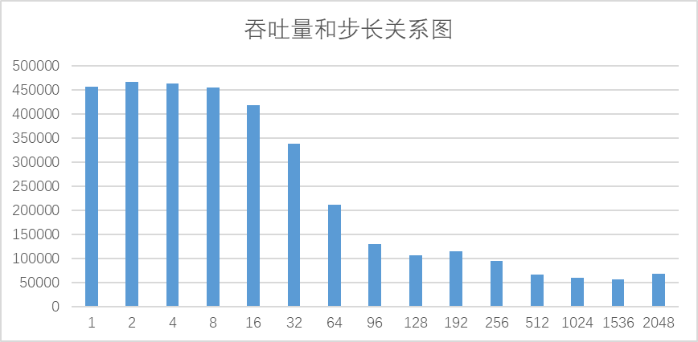

**深圳大学实验报告**

**课程名称： 计算机系统(3)**

**实验项目名称： 存储体系实验**

**学院： 计算机与软件学院**

**专业： 计算机与软件学院所有专业**

**指导教师： 罗秋明**

**报告人： 刘俊楠 学号： 2017303010班级：  01**

**实验时间：  2021.12.10**

**实验报告提交时间：  2021.12.13**

**教务处制**

**一、实验目的**

增进对cache工作原理的理解

体验程序中访存模式变化是如何影响cahce效率进而影响程序性能的过程；

学习在X86真实机器上通过调整程序访存模式来探测多级cache结构以及TLB的大小。

**二、实验内容**

按照下面的实验步骤及说明，完成相关操作记录实验过程的截图：

（1）x86 cache 层次结构的测量 **（90分）**

首先，设计一个用于测量x86系统上的cache层次结构的方案，然后设计出相应的代码；

然后，运行你的代码获得相应的测试数据。

最后，根据测试数据分析你的x86机器有几级cache，各自容量是多大。

（2）选做：尝试测量你L1 cache行的大小；

（3）选做：尝试测量你的x86机器TLB有多大

**（报告撰写质量10分）**

**三、实验环境**

硬件：桌面PC

软件：Windows

**四、实验步骤及说明**

关于x86层次结构的测量，可以参考计算机系统二课本6.6小节的内容。

一个程序从存储系统中读取数据的速率为读吞吐量，或者有时称为读带宽。如果一个程序在 s 秒的时间段内读 n 个字节，那么这段时间内的读吞吐量就等于 n/s，典型的是以兆字节每秒(MB/s)为单位的。如果我们要编写一个程序，它从一个紧密程序循环中发出一系列读请求，那么测量出的读吞吐量能让我们看到对于这个读序列来说的存储系统的性能。

**五、实验结果**

x86 cache 层次结构的测量

1、将mountain文件夹中的代码导入至ubuntu，并且make mountain编译。

2、输入./mountain 运行编译生成的可执行文件，得到如下数据集。

3、将数据集拷贝到excel表中，并且排版分析。

4、对着excel表的数据画出存储山图，并分析发现与cpu的三个等级相符合。

z轴是读吞吐量，单位是MB/S，x轴是步长，单位是\*8字节，y轴是工作集大小，单位为字节。从存储山图中可以看出在工作集大小为 128KB，521KB 和3M之间有较大的波动。故可以推断分别为 L1，L2，L3Cache 的大小分别大约为：128KB，521KB 和 3M。

5、查看自己电脑的cpu L1-L3的缓存大小，分别为128KB/512KB/3.0MB，符合预期实验结果。

测量 L1 cache行的大小

1、首先打开devc++，设置好语言标准，并防止优化代码的行为发生。

2、编写一个函数名叫 stride_access的函数，它根据传入的 stride，按照步长 stride，进行若干次顺序地内存访问，并且计算吞吐量，并且通过穷举步长stride调用stride_access来进行测试。

3、根据程序返回结果我们可以绘制如下图像，其中横轴为步长（b），纵轴为吞吐量（kb/s）。

。

根据图像我们可以总结出来：

在步长 stride 位于 1-32 byte 之间时，吞吐量几乎不变

在步长 stride 位于 32-128 byte 之间，吞吐量逐步下降

在步长 stride 大于 128 byte 之后，吞吐量几乎不变

又因为当步长 stride 小于 L1 cache line 时，若干次访问才会发生一次miss，而当步长 stride 大于 L1 cache line，每次访问都会miss。

根据测试数据，推测 L1 cache line 约为 32-64 b。而经验表明一般 cpu 都拥有 64b 或者 128b 的 cache line 大小，这与我们的测试结果相吻合。

六、实验总结与体会

综合来看，能够得出这几个结论：

第一，当步长很小时，就算工作集很大，访问速率也在没有过多下降。这是因为，充分利用了空间局部性，相同 cache 块内的数据，只有第一个发生了 miss，而在这次 miss 之后，其他数据被一同加载了进来。（空间局限性）

第二，当步长很大工作集很小时，访问速度也很高。其实这里的步长并未对访问速度造成什么影响，因为整个工作集都会加载到 cache 中。（时间局部性）

第三，对于大的工作集合和大的步长，那么 cache 就形同虚设，因为根本就不存在局部性，cache 是为局部性而生的，因此，访问速度只能是 memory 级别。

第四，根据测试数据，推测 L1 cache line 约为 32-64 b。而经验表明一般 cpu 都拥有 64b 或者 128b 的 cache line 大小，这与我们的测试结果相吻合。

| **指导教师批阅意见：**       **成绩评定：**       指导教师签字： 年月日 |
|-------------------------------------------------------------------------|
| 备注：                                                                  |
