**一、试验目的**

进一步了解RISC-V MINI架构，学习如何新增一条指令

**二、实验内容**

1\. 给处理器新增一个乘法指令，给出设计指引（即需要修改什么地方，怎么修改）

2\. 编写程序，验证乘法功能

**三、实验环境**

硬件：桌面PC

软件：Windows、Virtual Box

**四、实验步骤及说明**

1、MDU(Multiplication Division Unit) 模块的功能是完成乘法与除法相关的运算，在这里我们暂时只实现有符号数乘法的功能。首先在scala目录创建MDU.scala。

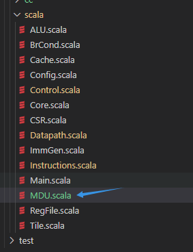

2、定义操作码，这里定义一个三位的无符号整数来表示操作。0表示不使用MDU的结果，1表示输出mul的结果。随后定义IO以及根据输入确定输出的结果。当mdu_op为MDU_MUL时将rs1与rs2看做有符号数进行乘法运算，随后将运算结果视为无符号数输出。

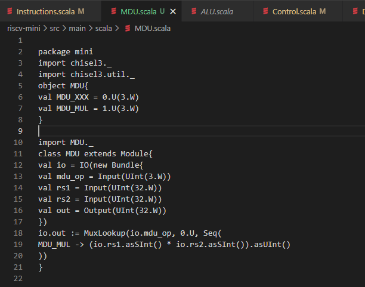

3、根据RISC-V手册，添加如下BitPat，其中寄存器位使用?????表示为无关位置。

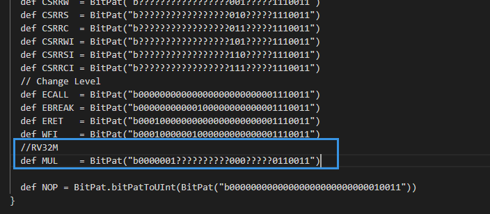

4、修改控制单元以产生乘法指令执行时的控制信号。在映射中添加MUL指令，根据数据通路，MUL指令的执行后的PC数为PC+4、操作数为RS1和RS2、不使用立即数以及ALU、非分支指令、不需要冲刷流水线、不需要访存、在写回阶段将ALU流水寄存器中的

数值写会到寄存器文件当红在哪个、非CSR指令、非异常指令、MDU的控制信号为MDU_MUL。

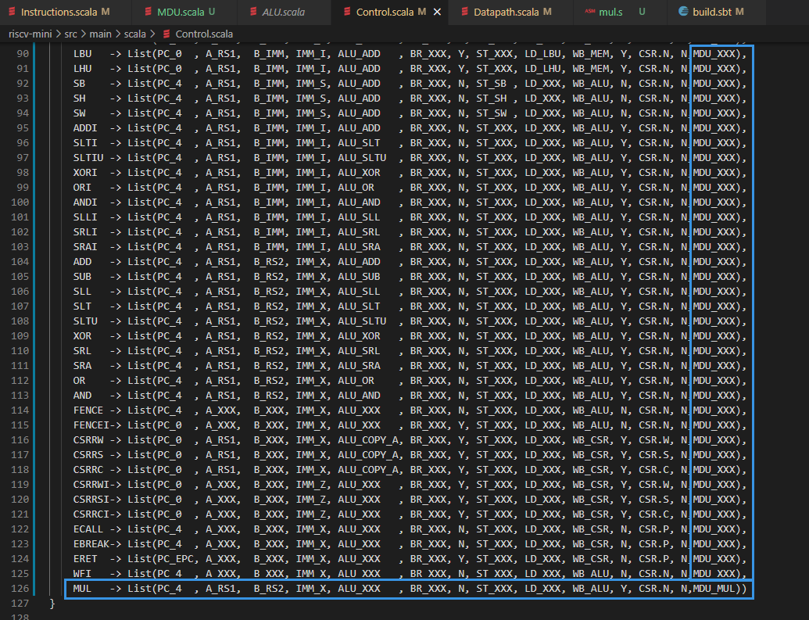

5、对Control模块进行修改，以添加对于MDU模块控制信号的输出。首先修改Control模块的端口，添加mdu_op的输出。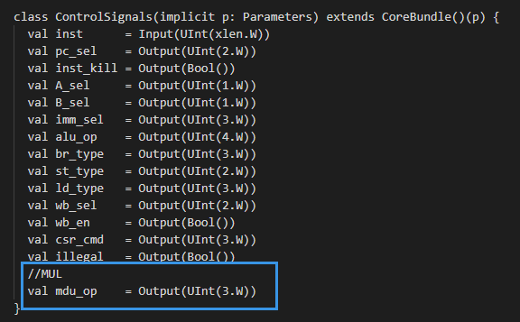

6、后在Control模块中添加mdu_op的输出。

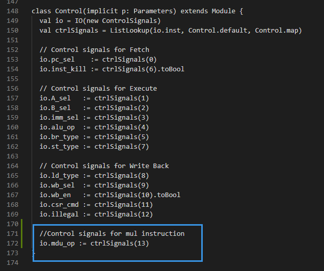

7、对Datapath.scala进行修改添加MDU模块以及相关的线路。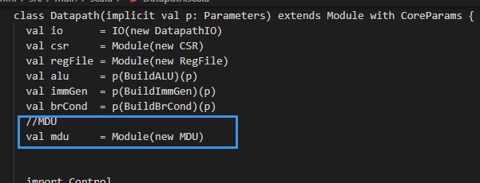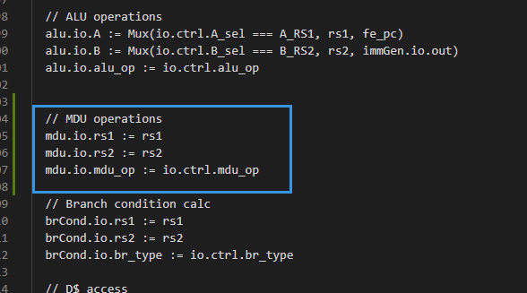

8、对于流水线，需要添加一个多路选择器，根据控制信号选择对于ALU流水线寄存器的写入数值，当没有执行乘法指令时写入的是alu输出的数据，否则写入的是mdu输出的数据。

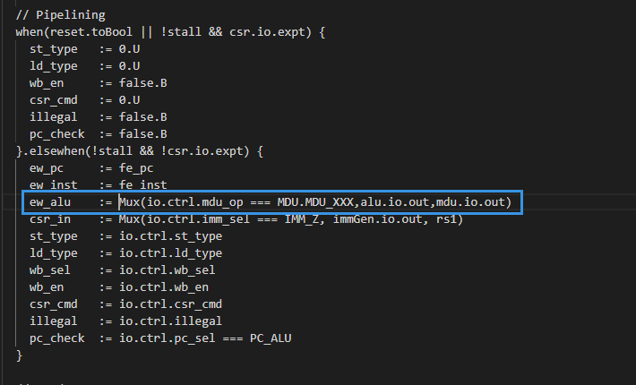

9、修改完成后在riscv-mni目录下执行 make 命令即可生成对应的Verilog文件

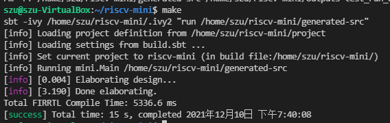

10、随后执行 make verilator即可通过verilator生成用于仿真测试使用的可执行文件Vtile。

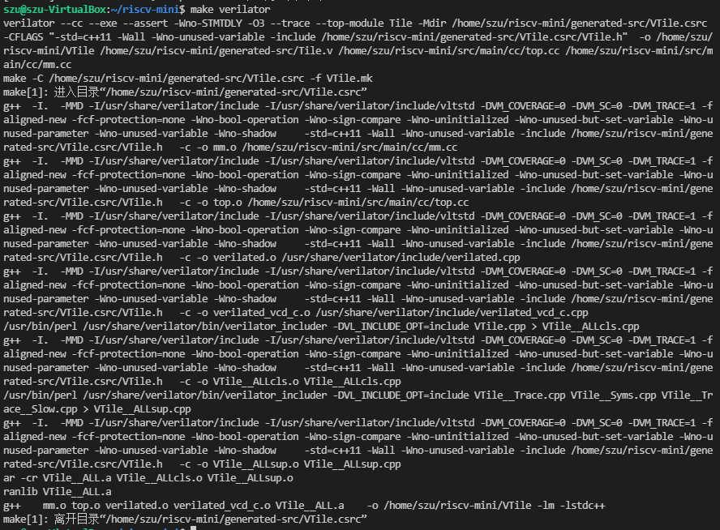

11、按照实验二中的过程编写如下汇编程序，其功能是通过 mul 指令计算3 \* 11的并将计算结果存放至x7寄存器当中。

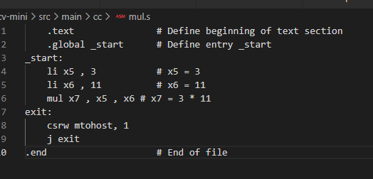

12、汇编程序编写完成后通过riscv32-unknown-elf-gcc进⾏编译

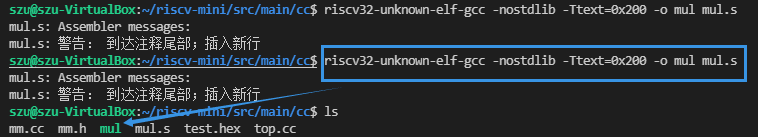

13、将elf⽂件转化为特定格式的hex⽂件。这⾥通过elf2hex⼯具来进⾏，在这个当中需要将elf⽂件转化为宽度为16字节的⼗六进制⽂件。

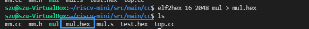

14、编译并通过VTile执行该代码，得到仿真过程中各个时钟周期的执行情况。通过观察仿真数据我们可以了解mul指令执行的结果。在PC=208为mul指令，从输出中可以看到其将0x21写回到x7寄存器当中，符合预期。

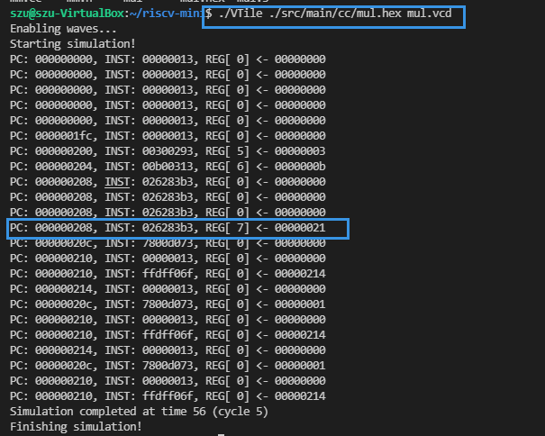

15、我们在riscv-mini上运行自己编写的C程序。编写如下C程序，其功能是使用递归的方式计算阶乘。

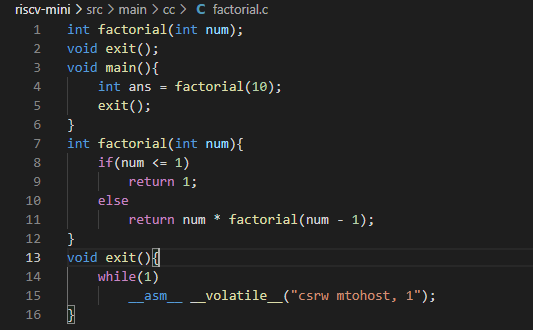

16、使用 riscv32-unknown-elf-gcc 将C代码编译为elf文件，在使用 elf2hex 转化为仿真所需要的格式，即可运行该程序。

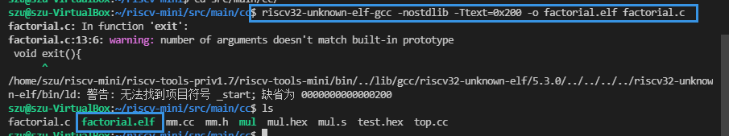

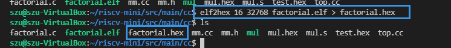

17、运行仿真程序，得到仿真的输出。按照RISC-V的规范约定，函数的返回值放置在a0(x10)寄存器中，因此只需要查看最后在该寄存器中写入的结果即可知道函数返回的结果。反正输出的节选如下，可以在**最后出现的**PC:000000264处观察到向x10寄存器中写入了0x00375f00，该数值即为10！= 3628800的十六进制表示，因此计算结果符合预期。

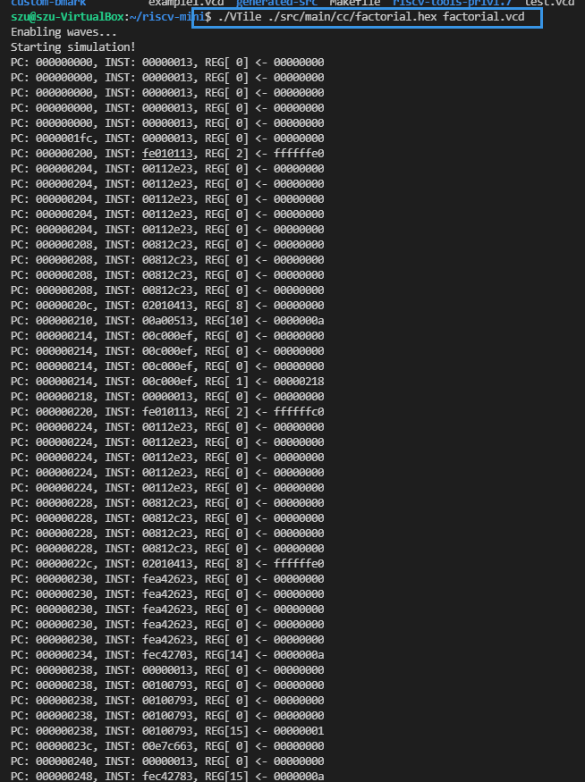

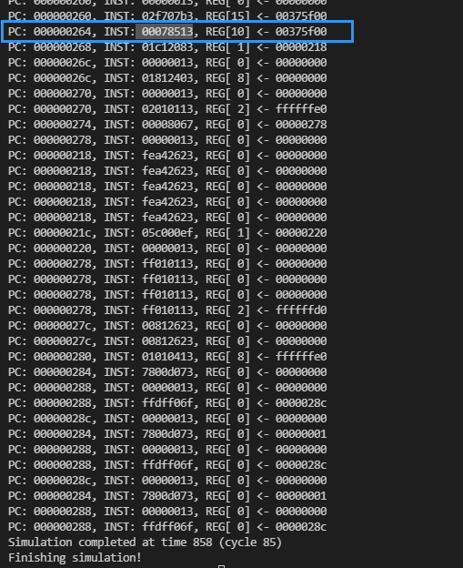

**五、实验结果**

1、成功给处理器新增一个乘法指令（mul），并且成功运行仿真程序。

2、分别使用c语言与汇编语言验证了新增的乘法指令的功能。

**五、实验总结与体会**

1、通过本次实验，我进一步了解了RISC-V MINI的架构，并且学习到了如何新增一条指令。

2、明白了Instruction.scala Control.scala Datapath.scala build.sbt的运行原理，理解了其中代码的结构。

3、进一步学习了如何通过波形图调试代码，能够对riscv代码具备一定的代码分析能力。

| **指导教师批阅意见：**       **成绩评定：**       指导教师签字： 年月日 |
|-------------------------------------------------------------------------|
| 备注：                                                                  |
