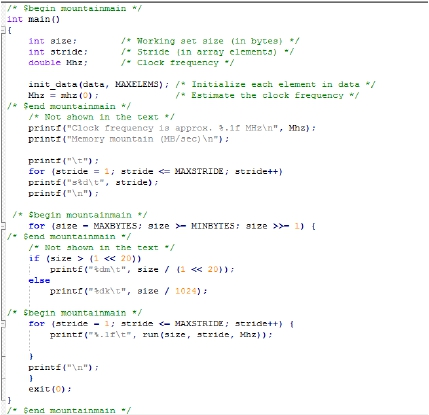
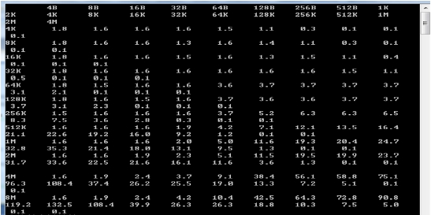
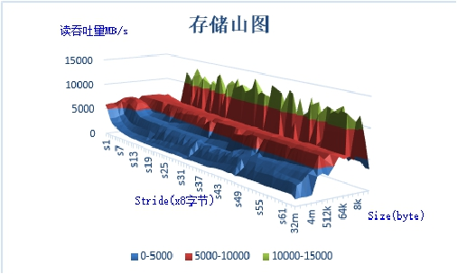
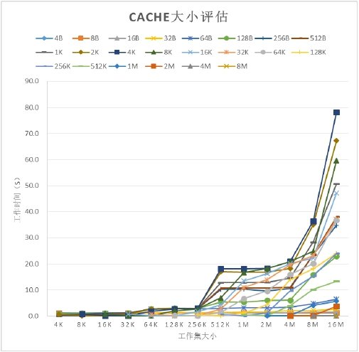
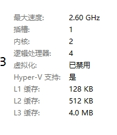

**一、实验目的**

增进对 cache 工作原理的理解

体验程序中访存模式变化是如何影响 cache 效率进而影响程序性能的过程；

学习在 X86 真实机器上通过调整程序访存模式来探测多级 cache 结构以及 TLB 的大小。

**二、实验内容**

按照下面的实验步骤及说明，完成相关操作记录实验过程的截图：

（1）x86 cache 层次结构的测量 **（90 分）**

首先，设计一个用于测量 x86 系统上的 cache 层次结构的方案，然后设计出相应

的代码；

然后，运行你的代码获得相应的测试数据。

最后，根据测试数据分析你的 x86 机器有几级 cache，各自容量是多大。

（2）选做：尝试测量你 L1 cache 行的大小；

（3）选做：尝试测量你的 x86 机器 TLB 有多大

**（报告撰写质量 10 分）**

**三、实验环境**

硬件：桌面 PC

软件：Windows

**四、实验步骤及说明**

**（1） x86 cache 层次结构的测量**

一个程序从存储系统中读取数据的速率为读吞吐量，或者有时称为读带宽。如果

一个程序在 s 秒的时间段内读 n 个字节，那么这段时间内的读吞吐量就等于 n/s，典型

的是以兆字节每秒(MB/s)为单位的。

如果我们要编写一个程序，它从一个紧密程序循环中发出一系列读请求，那么测

量出的读吞吐量能让我们看到对于这个读序列来说的存储系统的性能。

**关于这个测试，有两个基本的概念：时间局部性与空间局部性。**

**时间局部性：**

被引用过一次的存储器位置在未来会被**多次引用**（通常在循环中）。

**空间局部性：**

如果一个存储器的位置被引用，那么将来他**附近的位置**也会被引用。

本实验使用的是 x64 位系统，配置如下图：

注：1、报告内的项目或内容设置，可根据实际情况加以调整和补充。

2、教师批改学生实验报告时间应在学生提交实验报告时间后 10 日内。

程序主程序代码如下图：

**五、实验结果**

**运行程序，结果如下：**

注：1、报告内的项目或内容设置，可根据实际情况加以调整和补充。

2、教师批改学生实验报告时间应在学生提交实验报告时间后 10 日内。

| **工作时间**                               | **工作集大小** |        |         |         |         |          |          |          |        |        |        |        |       |
|--------------------------------------------|----------------|--------|---------|---------|---------|----------|----------|----------|--------|--------|--------|--------|-------|
|                                            | **4K**         | **8K** | **16K** | **32K** | **64K** | **128K** | **256K** | **512K** | **1M** | **2M** | **4M** | **8M** |       |
|  **工** **作** **步** **幅** **大** **小** | **4B**         | 1.8    | 1.8     | 1.8     | 1.8     | 1.8      | 1.8      | 1.5      | 1.6    | 1.6    | 1.6    | 1.6    | 1.6   |
|                                            | **8B**         | 1.6    | 1.6     | 1.6     | 1.6     | 1.5      | 1.6      | 1.6      | 1.6    | 1.6    | 1.6    | 1.9    | 1.9   |
|                                            | **16B**        | 1.6    | 1.6     | 1.6     | 1.6     | 1.6      | 1.5      | 1.6      | 1.6    | 1.6    | 1.9    | 2.4    | 2.4   |
|                                            | **32B**        | 1.6    | 1.3     | 1.5     | 1.6     | 1.6      | 1.6      | 1.6      | 1.9    | 2.0    | 2.3    | 3.7    | 4.2   |
|                                            | **64B**        | 1.5    | 1.6     | 1.6     | 1.6     | 3.6      | 3.7      | 3.7      | 4.2    | 5.0    | 5.1    | 9.1    | 10.4  |
|                                            | **128B**       | 1.1    | 1.4     | 1.3     | 1.6     | 3.7      | 3.6      | 5.2      | 7.1    | 11.6   | 11.5   | 38.4   | 42.5  |
|                                            | **256B**       | 0.3    | 1.1     | 1.5     | 1.6     | 3.7      | 3.6      | 6.3      | 12.1   | 19.3   | 19.5   | 56.1   | 64.3  |
|                                            | **512B**       | 0.1    | 0.3     | 1.1     | 1.5     | 3.7      | 3.7      | 6.3      | 13.5   | 20.4   | 19.9   | 58.8   | 72.8  |
|                                            | **1K**         | 0.1    | 0.1     | 0.4     | 1.1     | 3.7      | 3.7      | 6.5      | 16.4   | 24.7   | 23.7   | 75.1   | 90.8  |
|                                            | **2K**         | 0.1    | 0.1     | 0.1     | 0.5     | 3.1      | 3.7      | 8.3      | 21.1   | 32.8   | 31.7   | 96.3   | 119.2 |
|                                            | **4K**         |        | 0.1     | 0.1     | 0.1     | 2.1      | 3.1      | 7.5      | 22.6   | 35.3   | 33.6   | 108.4  | 132.5 |
|                                            | **8K**         |        |         | 0.1     | 0.1     | 0.1      | 2.3      | 3.6      | 19.2   | 21.4   | 22.5   | 37.4   | 108.4 |
|                                            | **16K**        |        |         |         | 0.1     | 0.1      | 0.1      | 2.8      | 16.0   | 18.0   | 21.6   | 26.2   | 39.9  |
|                                            | **32K**        |        |         |         |         | 0.1      | 0.1      | 0.3      | 9.2    | 13.1   | 16.1   | 25.5   | 26.3  |
|                                            | **64K**        |        |         |         |         |          | 0.1      | 0.1      | 1.2    | 9.5    | 11.6   | 19.0   | 26.3  |
|                                            | **128K**       |        |         |         |         |          |          | 0.1      | 0.1    | 1.3    | 3.6    | 13.3   | 18.8  |
|                                            | **256K**       |        |         |         |         |          |          |          | 0.1    | 0.1    | 1.3    | 7.2    | 10.3  |
|                                            | **512K**       |        |         |         |         |          |          |          |        | 0.1    | 0.1    | 5.1    | 7.5   |
|                                            | **1M**         |        |         |         |         |          |          |          |        |        | 0.1    | 0.1    | 5.0   |
|                                            | **2M**         |        |         |         |         |          |          |          |        |        |        | 0.1    | 0.1   |
|                                            | **4M**         |        |         |         |         |          |          |          |        |        |        |        | 0.1   |

利用 excel 画出存储器山：

纵轴是时间，单位是 s，从折线中可以看出在工作集大小为 128KB，521KB 和

8M\~16M 之间有较大的波动。故可以推断分别为 L1，L2，L3Cache 的大小分别大约为：

128KB，521KB 和 4M\~16M。故可以推断分别为 L1，L2，L3Cache 的大小分别大约为：

128KB，521KB 和 4M\~16M。

验证结果

查看本机的配置，L1cache 为 128KB，L2cache 为 512KB，L3cache 为 4MB。

**综合来看，能够得出这几个结论：**

第一，当**步长很小时，就算工作集很大，访问速率也在没有过多下降**。这是因为，充

分利用了空间局部性，相同 cache 块内的数据，只有第一个发生了 miss，而在这次 miss 之

后，其他数据被一同加载了进来。（空间局限性）

第二，当**步长很大工作集很小时，访问速度也很高**。其实这里的步长并未对访问速度

造成什么影响，因为整个工作集都会加载到 cache 中。（时间局部性）

第三，对于**大的工作集合和大的步长**，那么 cache 就形同虚设，因为根本就**不存在局**

**部性**，cache 是为局部性而生的，因此，访问速度只能是 memory 级别。

**六、实验总结与体会**

存储器系统的性能不是一个数字就能描述的。相反，它是一座时间和空间局部性的山，

这座山的上升高度差别可以超过一个数量级。明智的程序员会试图构造他们的程序，使得

程序运行在山峰而不是低谷。目标就是利用时间局部性，使得频繁使用的字从 L1 中取出，

还要利用空间局部性，使得尽可能多的字从一个 L1 高速缓存行中访问到。

所以，我们往后编写程序时，也要考虑到相关的硬件因素，以此来设计我们的数据结

构和算法，才能有更好的进步。

