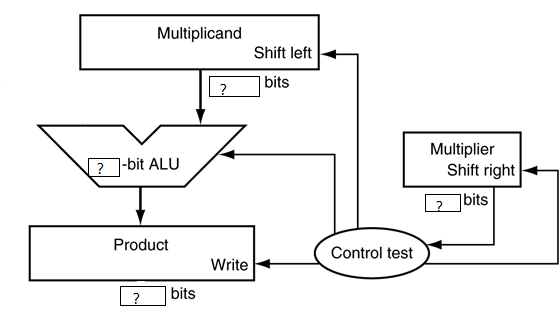
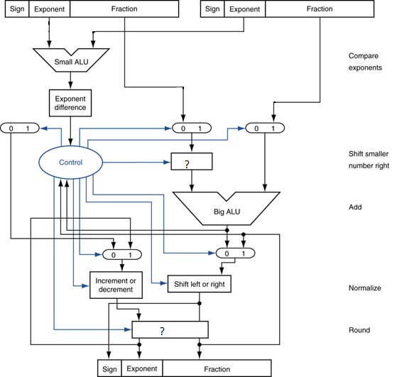
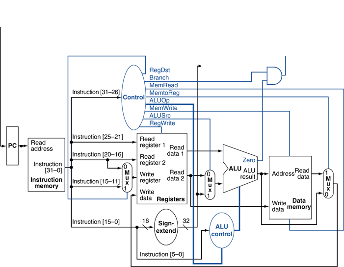
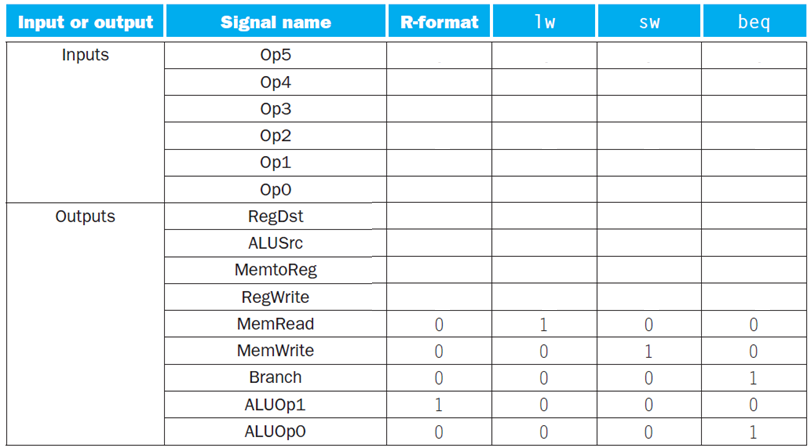
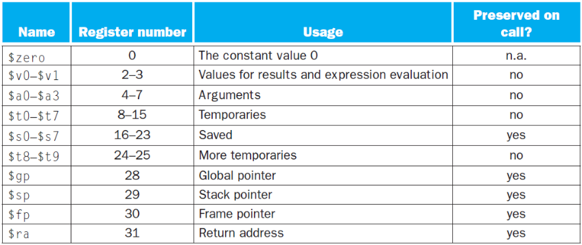

学号： 姓名： 得分：

1.  请画出R型指令、I型指令和J型指令的字段划分，请注明字段名、所占位数，按最高为在左，最低位在右边的布局绘制。
1.  对于一下C语句：a=b+c; 其中a/b/c为整形变量，保存在一块连续内存中，t0保存了上述内存的起点地址。请写出相应的MIPS汇编代码。
1.  已知寄存编号方案和指令编码（见所附表格）。请写出lw \$t0,16(\$t1)指令的机器码。
1.  当执行位于地址0x1000的指令bne \$t0,\$t1, 100时，t0=10,t1=11，请问：下一条指令将从什么地址获取？
1.  请补充完善下面的8bit x 8bit乘法器结构，1）完成ALU的输入连线；2）在带问号的方框中写上寄存器宽度；3）如果有部件需要移位功能，请在部件上方画出移位方向

1.  请补充完成下面的浮点加法器的结构图，1）补充必要的数据连线；2）请在图中两个带问号的方框中填写上其功能。

    

2.  请画出单周期数据通路中的地址更新电路

    

3.  在第7题给出的在单周期数据通路上执行add t0,t1,s2时，假设t0/t1/s2寄存器值分别为10/15/20，请问寄存器部件read read register1和register2输入的数值是什么？ Read data2输出的数值多少？
4.  将以下代码翻译成C代码，假定t1存放c语言整数变量i，s2存放整数变量result，s0存放整数数组MemArray起始地址。

1.  对于第7题给出的在单周期数据通路，请完成控制部件的真值表：

    

2.  有三种不同处理器P1/P2/P3执行同样的指令集，P1的时钟频率3Ghz，CPI=1.5；P2为2.5Ghz,CPI=1.0; P3为4Ghz，CPI=2.2。1）如果按每秒执行的指令数为标准，那个处理器性能最高？2）如果每个处理器都执行10秒的程序，它们的执行的时钟周期数和指令数是多少？3）我们试图将时间减少30%，但这会引起CPI增加20%。问：时钟频率应该多少才能达到减少30%的目的？

