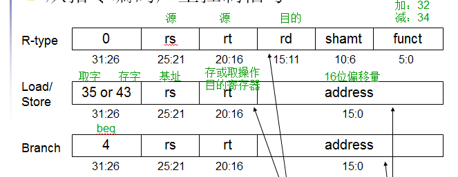
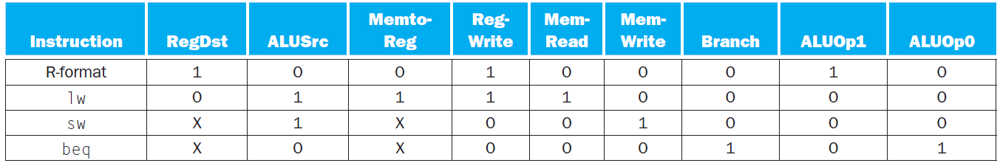
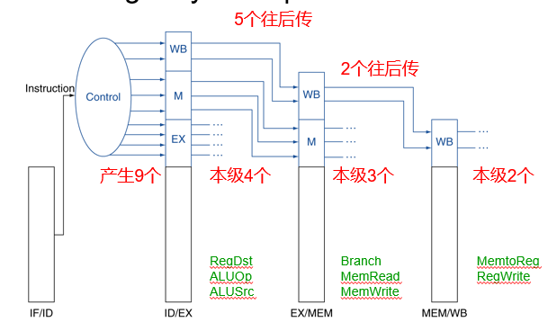
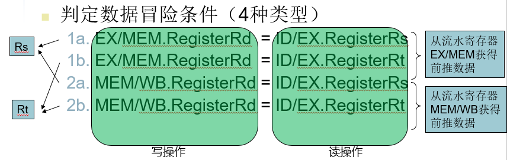
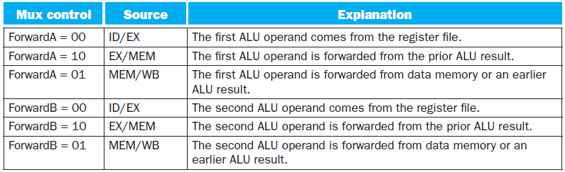
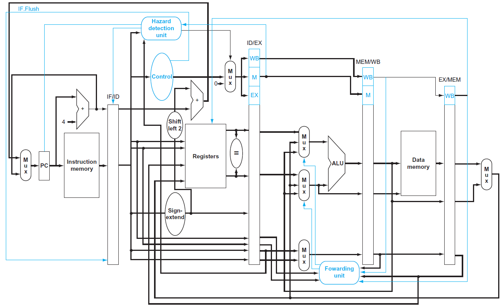

第一章 计算机概要与技术

1.  引言
-   了解计算应用的分类及其特征：个人计算机、服务器、嵌入式计算机
-   了解后PC时代的特点。PC个人移动设备，传统服务器云计算
    1.  计算机系统结构中的8个伟大思想
-   掌握计算机系统结构中的8个伟大思想：面向摩尔定律的设计、加速大概率事件、通过并行提高性能、通过流水线提高性能、通过预测提高性能、存储器层次、通过冗余提高可靠性
    1.  程序概念入门
-   理解软件和硬件层次图：硬件、系统软件、应用软件
-   理解高级语言程序到汇编语言程序，再到二进制机器语言程序的过程
    1.  硬件概念入门
-   理解计算机的基础硬件都要完成的基本功能：输入数据、输出数据、处理数据、存储数据
-   理解易失性存储器、非易失性存储器
    1.  处理器和存储器制造技术
-   了解集成电路是晶体管组成的芯片。
-   了解芯片制造的最基本单元是硅
-   了解芯片制造的过程
-   了解成品率的概念
    1.  性能
-   理解性能的评价指标：响应时间和吞吐率
-   理解相对性能
-   掌握CPU性能及其因素：执行时间=时钟周期数\*时钟周期时间
-   掌握CPI：每条指令所需要的时钟周期数
-   掌握指令的性能：CPU时钟周期数=程序的指令数\*每条指令的平均时钟周期数
-   掌握经典CPU性能公式：CPU时间=指令数\*CPI\*时钟周期时间
    1.  功耗墙
-   了解时钟频率与功耗之间的趋势图，过去25年，时钟频率增长1000倍、功耗只增长了30倍
-   理解功耗与电压的平方成正比
    1.  沧海巨变：从单处理器向多处理器转变
-   理解沧海巨变的主要技术革命：并行
-   第二章（多核处理器）、第三章（摩尔定律提供子字并行）、第四章（流水线、预测）、第五章（cache、RAID）
    1.  实例：Intel Core i7基准
-   了解基准测试程序SPEC
    1.  谬误与陷阱
-   理解Amdahl定律
-   了解MIPS的概念, MIPS = 指令数/（执行时间\*10 6）

    第二章 指令：计算机的语言

1.  
    1.  引言
-   理解指令集的概念
-   理解MIPS汇编语言的几种常见类别：算术、数据传输、逻辑、条件分支、无条件跳转
-   掌握常用指令的助记符
-   掌握立即数算术逻辑指令
-   掌握无条件跳转（j, jr, jal）目标地址
    1.  计算机硬件的操作
-   掌握源操作数、目的操作数
-   掌握将高级语言（C语言）编译成MIPS语言的方法
    1.  计算机硬件的操作数
-   理解“字”的概念
-   掌握使用寄存器编译C赋值语句
-   掌握编译一个操作数在存储器中的C赋值语句
-   掌握用取数、存数指令进行编译
-   掌握常数或立即数操作数的指令
    1.  有符号数和无符号数
-   理解进制转换的方法
-   了解符号扩展
    1.  计算机中指令的表示
-   掌握指令格式
-   掌握MIPS字段
-   掌握将MIPS汇编语言翻译成机器指令的方法
    1.  逻辑操作
-   理解逻辑左移等逻辑操作
    1.  决策指令
-   理解beq等决策指令
-   掌握循环判断的指令
    1.  计算机硬件对过程的支持
-   掌握jr, jal指令
-   理解过程调用和栈
-   掌握编译一个不调用其他过程的C过程
-   掌握堆栈调整、参数获取、算术运算、结果返回等步骤及使用的寄存器
-   掌握寄存器名与32个寄存器之间的映射关系
    1.  MIPS中32位立即数和寻址
-   理解分支和跳转的寻址
-   理解MIPS寻址模式
-   理解机器语言解码

第三章 计算机的算术运算

1.  
    1.  引言
    2.  加法和减法
-   理解加减法溢出的条件
    1.  乘法
-   掌握第一版乘法器的硬件结构
-   掌握改进版乘法器的硬件结构
-   掌握乘法算法
-   掌握mult、div、mfhi、mflo等指令
    1.  除法
-   理解除法算法
    1.  浮点运算
-   掌握用IEEE754单精度格式表示浮点数
-   掌握浮点数加法的具体步骤
-   掌握浮点数的结构框图
-   理解浮点数乘法的步骤
-   理解浮点C程序编译为MIPS汇编代码
-   了解二维矩阵的浮点C程序编译为MIPS

第四章 处理器

1.  
    1.  引言
-   掌握指令执行的过程
-   前两步（各指令一样）：
    1.  PC 在指令所在的存储单元取出指令
    2.  Register numbers 根据寄存器的编号从寄存器文件读取寄存器内容
-   后续操作与指令类型有关

    利用ALU（除了跳转指令外）

    -   算数逻辑指令的计算
        -   存储访问指令的访存地址计算
        -   分支指令的条件判定计算
-   掌握CPU抽象视图
    1.  PC程序计数器
    2.  指令存储器
    3.  加法器
    4.  寄存器堆
    5.  ALU
    6.  数据存储器

1.  逻辑设计的一般方法
-   了解组合逻辑电路，时序逻辑电路
    1.  建立数据通路
-   掌握核心子集（9个）的数据通路（会画）
    1.  存储访问指令：取字（lw）和存字（sw）
    2.  算术逻辑指令：加法（add）减法（sub）与（AND）或（OR）小于则设置（slt）
    3.  分支指令：相等则分支（beq）跳转（j）
    4.  一个简单的实现机制
-   掌握三种指令类型使用的指令格式

    

-   掌握控制信号

    1\. 7个1bit的控制信号

    RegDst, RegWrite, ALUSrc, PCSrc, MemRead, MemWrite, MemtoReg

    2\. 1个2bit控制信号

    ALUOp 用于区分：1）访问内存的地址计算的加法；2）beq所需的减法；3）算术逻辑运算（加/减/与/或/slt）

-   掌握数据通路的操作
    1.  流水线概述
-   掌握指令流水线的执行：五级：IF、ID、EX、MEM、WB
    1.  IF: 从内存中取指令
    2.  ID: 指令解码& 读寄存器
    3.  EX: 执行运算或计算地址
    4.  MEM: 访问内存操作
    5.  WB: 将结果写回寄存器
-   掌握流水线冒险

    1\. 结构冒险（部件忙）

    2\. 数据冒险（数据依赖）：前推/旁路、指令调度

    3\. 控制冒险（分支指令）：分支预测

-   掌握取数-使用型数据冒险
-   掌握利用重新安排代码避免流水线阻塞
-   掌握控制冒险造成的阻塞
1.  流水线数据通路及其控制
-   掌握流水线寄存器, 流水线寄存器存储的数据
-   掌握流水线控制信号

    

    1.  数据冒险：旁路与阻塞
-   掌握相关性检测的方法，能发现数据相关

    

-   掌握旁路多选器的控制信号

-   掌握数据冒险的逻辑表达式
    1.  控制冒险
-   理解动态分支预测
-   理解分支预测缓存BPB
-   了解分支延迟时间槽
-   掌握控制单元、旁路单元与冒险单元的位置

1.  异常
-   理解MIPS体系结构中的异常处理
-   了解流水线计算机中的异常
    1.  指令级并行
-   理解静态多发射
-   理解多发射流水线中的循环展开
-   了解动态流水线调度

第五章 大容量和高速度：开发存储器层次结构

1.  引言
-   理解时间局部性和空间局部性
-   掌握存储器层次结构
-   理解狭义cache和广义cache
-   掌握命中率、缺失率的概念
-   掌握缺失代价
    1.  存储器技术
-   了解SRAM、DRAM，闪存，磁盘
    1.  Cache的基本原理
-   掌握直接映射的映射方法，
-   掌握直接映射的cache的访问
-   掌握写操作处理的两种方法：写直达、写回
    1.  Cache性能的评估和改进
-   掌握CPU时间的计算方法
-   掌握AMAT的概念和计算方法、AMAT=命中时间+缺失率\*缺失代价
-   掌握替换块选择的常用方法
-   掌握组相联、全相联的概念
-   掌握组相联、全相联的映射方法
-   掌握多级cache结构减少缺失代价的方法，掌握有效CPI的计算方法
    1.  可信存储器层次
-   了解MTTF, MTTR, ECC
    1.  虚拟机
-   了解虚拟机监视器
    1.  虚拟存储器
-   掌握虚拟地址到物理地址的映射方法
-   掌握缺页处理的方法
-   掌握TLB的概念
-   掌握TLB的工作原理
    1.  存储器层次结构的一般框架
-   理解存储器层次结构的四个基本问题
-   掌握3C 模型
