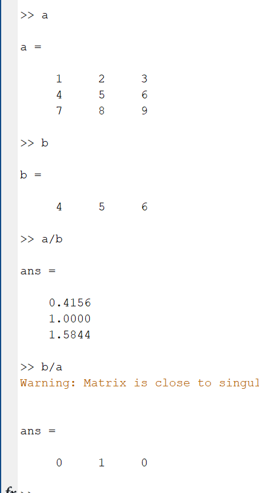
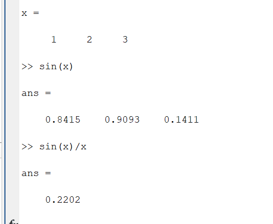
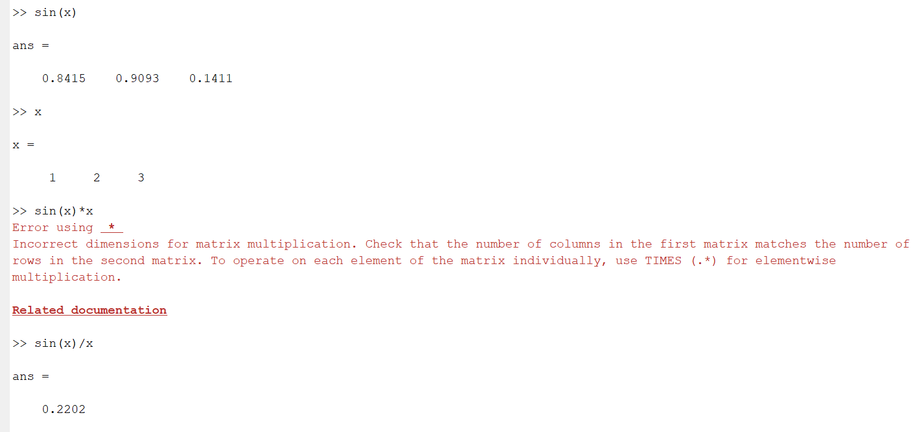
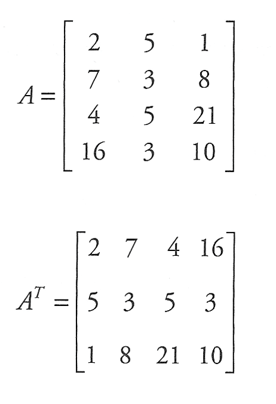
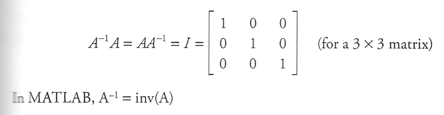
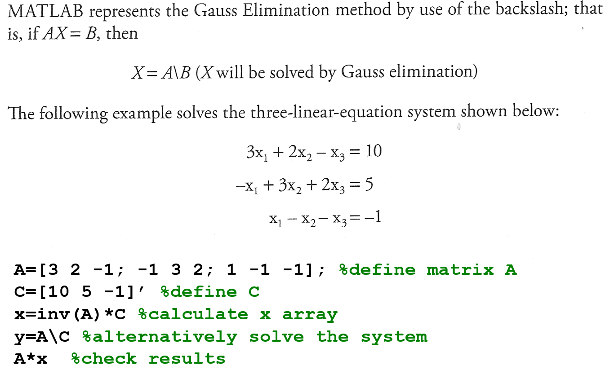
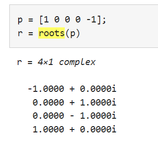
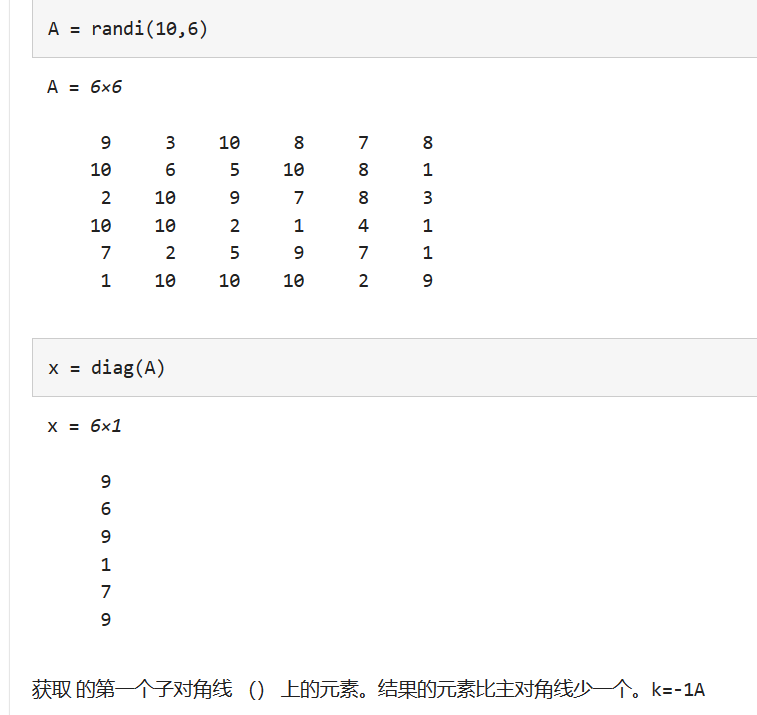

# Programming Summarize

1. ### i 作为变量的时候是可以赋值的，但是当他变成4i的时候默认就是虚数的意思，如果是4*i就是代表变量的意思。

2. ### sin(pi) 理论上等于0，但是在matlab里面等于1.2246e-16，且sin(k*pi)的值各不相等，此时可以使用sinpi(k) 或 sind(角度)

3. ### tan(pi/2)本应该是无限值，但是在matlab里面却等于1.6331e+16，此时可以使用tand(90)用角度表示可以避免有限值的问题。

4. ### acos表示cos^-1，若想表示反函数的角度的话就可以使用rad2deg函数。

5. ### e^-1用exp(-1)表示

6. ### a = [1:1:10]表示初始值为1 每次步长1 终点为10

7. ### matlab里面*为矩阵乘法 要满足前矩阵列与后矩阵行相等，.**为数组乘法，表示对应位置元素相乘。

8. ### matlab 里面^为指数，.^为对应位置加指数  比如 a.^b 就是a对应位置是 a1^b1 这样子

9. ### .^或。*运算里面只要两者行数或者列相等就行，后续只要扩行/列即可



1. ### a/b 首先b就转换成逆矩阵 也就是[4;5;6]/(4^2+5^2+6^2)然后与a矩阵*即可算出：

2. ### 0.4156=(4 * 1+5 * 2+6 * 3)/(4^2+5^2+6^2)

   ### 

   1. ### sin(x)/x=0.2202=(0.8415 * 1+0.9093 * 2+0.1411 * 3)/(1^2+2^2+3^2)

   2. 

   3. ### linspace(0,2*pi,1000); 意思就是从0到2PI 中间划出1000项出来

   4. ### inf和NaN分别代表无穷和没有定义，在进行除法和点除计算的时候matlab并不会提示错误

   5. ### rand表随机函数

   6. #### nthroot 和 ^1/n的区别在于nthroot 优先返回实数而^1/n优先返回虚数。

   

   1. #### 矩阵转置A^T=A.'

   

   1. #### A^-1=inv(A)

   2. #### A·B=dot(A,B)=AB矩阵对应位置相乘后相加成一个数字，二维的话就是对应位置相乘列合并，变成一行的行向量。

   

   1. \表示高斯消去法，A\C效果等于inv（A）*C

   

   1. #### fzero(fun,x0) 这个函数会找出来fun函数的x的零点，x0为初始点。

   2. #### roots(p) 可以指出p向量代表的函数的根，并表示为一个列向量。

      

      Bracketing methods（区间缩小法）是一类数值优化算法，主要用于寻找函数的极小值或最大值。这种方法通过逐步缩小包含目标极值的区间（bracket），最终确定一个足够小的区间，使得目标函数在该区间内的极值位置能够满足预定的精度要求。

      Bracketing methods 的基本思想是通过选择初始的搜索区间，该区间保证目标函数在端点上具有不同的符号。然后，通过在初始区间内逐步缩小搜索范围，最终找到包含极小值或最大值的小区间。

      其中，经典的 Bracketing methods 包括黄金分割法（Golden Section Method）和抛物线插值法（Quadratic Interpolation Method）。这些方法在不需要目标函数的导数信息的情况下，能够有效地定位函数的极值点。

   3. #### `@(x)` 表示一个匿名函数（Anonymous Function）。这是一种创建临时函数的方式，通常用于需要短暂使用的情况。

   4. ```matlab
      % 使用函数句柄来表示方程
      fun = @myfun;
      
      % 使用字符串表达式来表示方程
      fun = 'sin(x)';
      
      % 使用匿名函数来表示方程
      fun = @(x) x^3-2*x^2-x+2;
      ```

   

   5. MatLab 并不会检测溢出 inf  Nan都需要自己去判断
   6. size   可以返回矩阵的维度
   7. 对角矩阵    对角线不为0  其余位置为0
   8. diag(A) 获取A矩阵的对角线上的数值，输出成一个n行列向量



9. ```
   x1 = diag(A,-1) 获取A对角线下一条线的元素
   ```

10. ```
    A1 = diag(diag(A)) 获取A的对角线矩阵
    ```

11. det(A) 表示A矩阵的模

13. float与定值不可用做比较，除非两个float变量比较

14. matlab默认存放矩阵使用double类型存储而不是int

15. eye(3) 用于  创建单位矩阵

16. 换底公式 log_base_5 = log(x) / log(5);

17. 求几元一次方程    A=[c11 c12 c13; c21 c22 c23; c31 c32 c33] B=[c14; c24; c34]  X=A\B