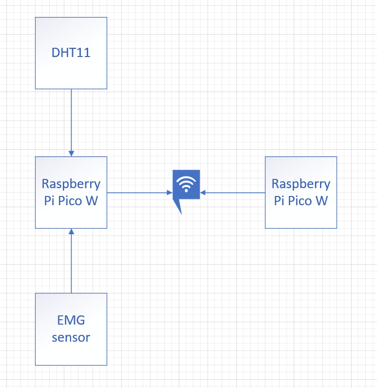
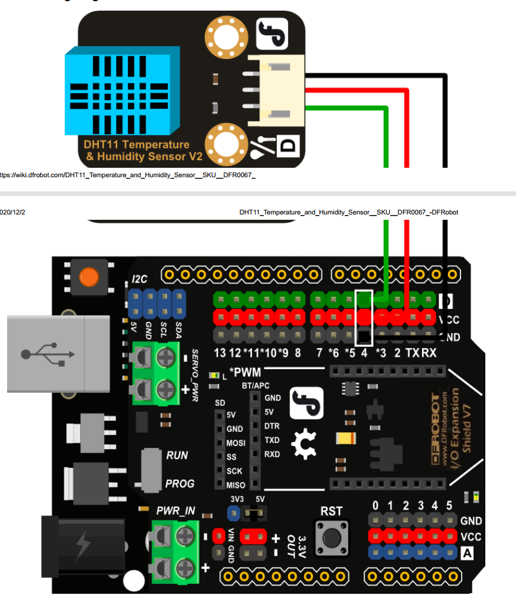
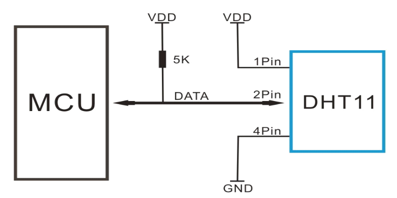
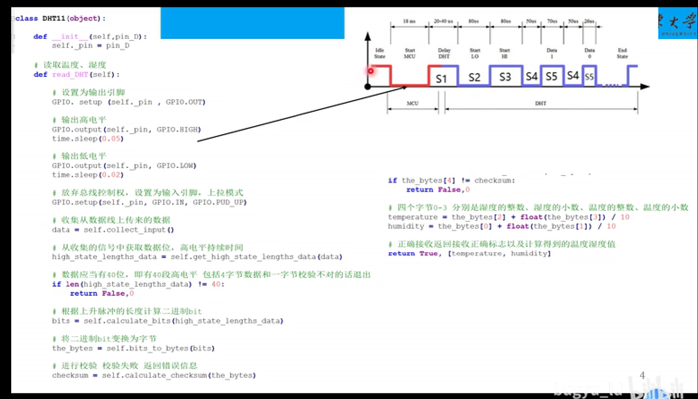
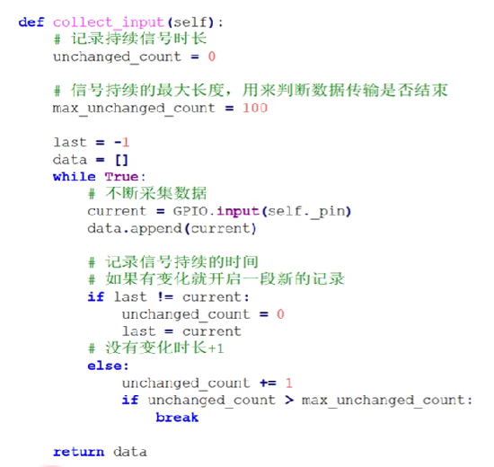
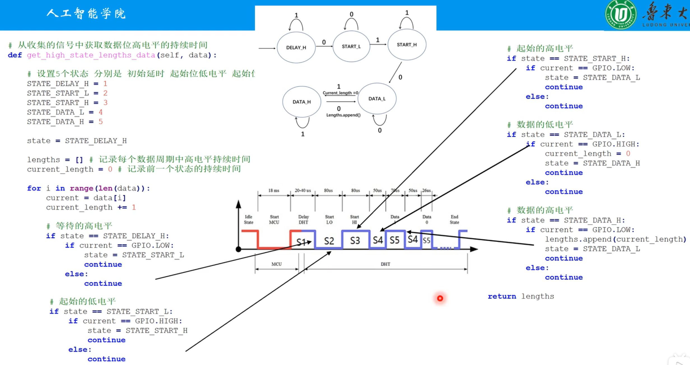
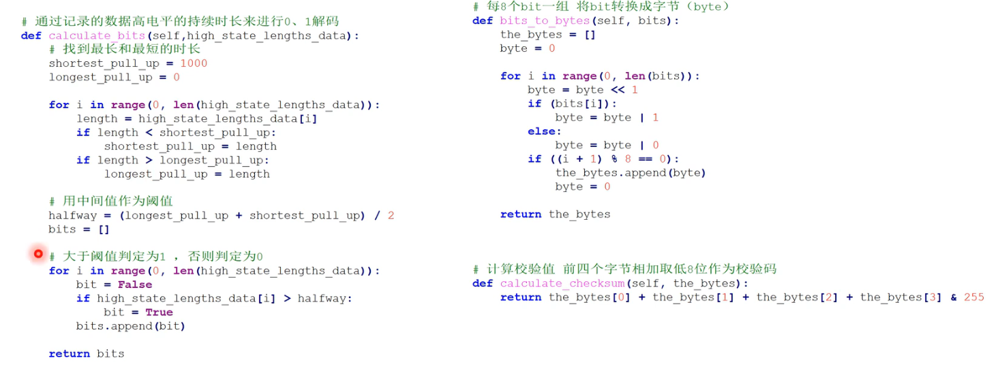
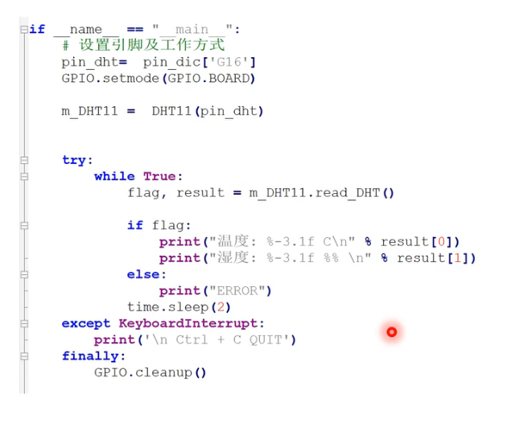
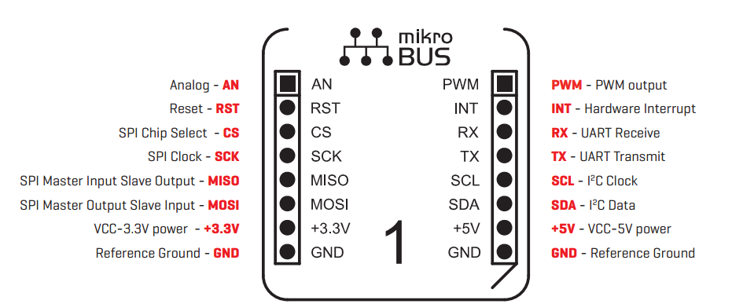
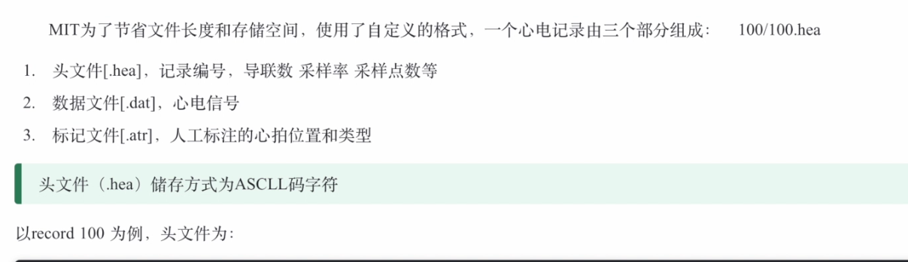

# A Raspberry Pi based Multi sensor array recording device, for stand-alone data EMG data capture

## 1. Requirement

**A project based around a graphical user interface focused application or interface development, using raspberry Pi to control the Pico-Pi or another embedded system over WIFI and to read from various sensors - temperature initially, but more importantly reading from a Multi electrode array (MEA) of Electromyography sensors  (EMG) sensors - voltages in the 100mV to 1V level signals and maybe other sensors reading force or pressure data and capable of saving on to a onto USB stick and or into an on-line data base, whichever is easier - an open E-PHYS style interface would be good to use as a target / model for any GUI.**

### 1.1 Equipment Required

1. Raspberry Pi Pico W

2. [Raspberry Pi 4 Model B](https://www.raspberrypi.com/products/raspberry-pi-4-model-b/)

3. [DHT11]([DFR0067 | DFRobot Gravity: DHT11 Temperature & Humidity Sensor For Arduino, Arduino Compatible Kit | RS (rs-online.com)](https://uk.rs-online.com/web/p/arduino-compatible-boards-kits/2163753?gb=s))
4. [EMG sensor]([MIKROE-2621 - 仅供科研 |MikroElektronika 肌电图点击 |RS (rs-online.com)](https://uk.rs-online.com/web/p/sensor-development-tools/1683023))

## 1.2 Circuit Design

## 2 DHT11

!(1-

1. The calibration coefficients stored in the OTP program memory. The product is 4-pin single row pin package. 
2. Supply Voltage: +5 V
   Temperature range :0-50 °C error of ± 2 °C
   Humidity :20-90% RH ± 5% RH error
   Interface: Digital 
3. the Pin of the DHT11:

| Pin  | NAME | COMMENT                       |
| :--: | ---- | ----------------------------- |
|  1   | VDD  | Power 3-5.5V                  |
|  2   | DATA | Serial data, single bus       |
|  3   | NC   | Suspension                    |
|  4   | GND  | Negative pole of power supply |

4. The way of communication: Single bus protocol.

   1. After power on the sensor, waiting for 1 second to avoid the unstable state.(between the VDD and GND should add a 100nF capacitance to delete the coupling filter). Every time communicate costs 4ms.
   2. The format of the data is: Humidity integer data(8 bit)+Humidity decimal data(8 bit)+Temperature integer data(8 bit)+Temperature decimal data(8 bit)
   3. The checksum data is the last 4 digits of the Humidity integer data(8 bit)+Humidity decimal data(8 bit)+Temperature integer data(8 bit)+Temperature decimal data(8 bit).

5. Communication steps:

   1. Pull down at least 18ms to let the DHT11 switch the idle state to high speed state, and then pull high for 20-40us.
   2. DHT11 responds with pulled down signal for 80us, and then pull high for 80us.
   3. Every single bit begins with pulled down signal for 50us, after which it will pull high for 26-28us if the signal is '0' or it will pull high for 70us if the signal is '1'.
   4. After 40 bits the transmission will be finished, the signal will be pulled high forever to switch to idle state.

   ### 2.1 DHT11:Code design flow chart and implementation

## 3. EMG Sensor

[使用MyoWare肌电传感器和Arduino开发板获取肌电图 (EMG)信号 - Arduino专区 - 一板网电子技术论坛 (yiboard.com)](https://www.yiboard.com/thread-1732-1-1.html)

[MIKROE-2623 - 仅供科研 |MikroElektronika EMG Click 套装 |RS (rs-online.com)](https://uk.rs-online.com/web/p/sensor-development-tools/1683024)

[EMG肌电传感器介绍合集 - 肌肉电 (sichiray.com)](https://www.sichiray.com/blog/emg-7cbf9392-e9d6-4d45-b54a-cdab78142f99)

[微电极阵列 Microelectrode Array: 最新的百科全书、新闻、评论和研究 (academic-accelerator.com)](https://academic-accelerator.com/encyclopedia/zh-cn/microelectrode-array)

### 3.1 Pinout Specification

接下来是分析多级阵列+EMG的如何适配与选品

[手势识别和生物识别肌电图 （GRABMyo） v1.0.2 (physionet.org)](https://physionet.org/content/grabmyo/1.0.2/)

[肌电图 v1.0.0 示例 (physionet.org)](https://physionet.org/content/emgdb/1.0.0/)

[基于tensorflow深度学习的心电图识别——树莓派硬件_哔哩哔哩_bilibili](https://www.bilibili.com/video/BV1Hz4y167np/?spm_id_from=333.337.search-card.all.click&vd_source=8fecbffc1175060bef27ca3d4b73e002)

1. Hyeyun Lee、Soyoung Lee、Jaeseong Kim、Heesoo Jung、Kyung Jae Yoon、Srinivas Gandla、Hogun Park、Sunkook Kim。 具有图神经网络的可拉伸阵列肌电图传感器，用于静态和动态手势识别系统。 *NPJ 柔性电子* **2023**， *7* （1） https://doi.org/10.1038/s41528-023-00246-3

   [视图](https://pubs.acs.org/action/getFTRLinkout?url=https%3A%2F%2Fct.prod.getft.io%2FYWNzLHNwcmluZ2VyLGh0dHA6Ly9uYXR1cmUuY29tL2FydGljbGVzL2RvaToxMC4xMDM4L3M0MTUyOC0wMjMtMDAyNDYtMz91dG1fc291cmNlPWdldGZ0ciZ1dG1fbWVkaXVtPWdldGZ0ciZ1dG1fY2FtcGFpZ249Z2V0ZnRyX3BpbG90.FZnI7KYAvxUHICBidnI9t0fNpz52ehCYQdl2uZyBiOY&doi=10.1021%2Facsaelm.0c01129&doiOfLink=10.1038%2Fs41528-023-00246-3&linkType=VIEW_FULL_ACCESS&linkLocation=CitedBy&linkSource=FULL_TEXT)

2. 杨帅健， 程金浩， 尚进， 陈航， 齐杰， 钟乐妮， 饶庆燕， 何磊， 刘晨琪， 丁丽， 张明明， Samit Chakrabarty， 蒋星宇. 可拉伸的表面肌电图电极阵列贴片，用于肌腱定位和肌肉损伤预防。 *自然通讯* **2023**， *14* （1） https://doi.org/10.1038/s41467-023-42149-x

   [视图](https://pubs.acs.org/action/getFTRLinkout?url=https%3A%2F%2Fct.prod.getft.io%2FYWNzLHNwcmluZ2VyLGh0dHA6Ly9uYXR1cmUuY29tL2FydGljbGVzL2RvaToxMC4xMDM4L3M0MTQ2Ny0wMjMtNDIxNDkteD91dG1fc291cmNlPWdldGZ0ciZ1dG1fbWVkaXVtPWdldGZ0ciZ1dG1fY2FtcGFpZ249Z2V0ZnRyX3BpbG90.Lmu3jqs_eu1Kfs5RR_Cj4K7Ju3NuTMK_bQnva0bK4Iw&doi=10.1021%2Facsaelm.0c01129&doiOfLink=10.1038%2Fs41467-023-42149-x&linkType=VIEW_FULL_ACCESS&linkLocation=CitedBy&linkSource=FULL_TEXT)

3. 程莲， 李军， 郭爱英， 张建华. 用于表面肌电图采集的柔性无创电极的最新进展。 *NPJ 柔性电子* **2023**， *7* （1） https://doi.org/10.1038/s41528-023-00273-0

   [视图](https://pubs.acs.org/action/getFTRLinkout?url=https%3A%2F%2Fct.prod.getft.io%2FYWNzLHNwcmluZ2VyLGh0dHA6Ly9uYXR1cmUuY29tL2FydGljbGVzL2RvaToxMC4xMDM4L3M0MTUyOC0wMjMtMDAyNzMtMD91dG1fc291cmNlPWdldGZ0ciZ1dG1fbWVkaXVtPWdldGZ0ciZ1dG1fY2FtcGFpZ249Z2V0ZnRyX3BpbG90.9yRltXl0VThTOQH7Eff5oAmtospQrSQ87zALkdclKKE&doi=10.1021%2Facsaelm.0c01129&doiOfLink=10.1038%2Fs41528-023-00273-0&linkType=VIEW_FULL_ACCESS&linkLocation=CitedBy&linkSource=FULL_TEXT)

4. 张丁， 陈志涛， 肖龙亚， 朱北辰， 吴若轩， 欧成建， 马毅， 谢龙汉， 蒋宏杰. 可拉伸且耐用的 HD-sEMG 电极，用于准确识别复杂表皮表面的吞咽活动。 *微系统与纳米工程* **2023**， *9* （1） https://doi.org/10.1038/s41378-023-00591-3

   [视图](https://pubs.acs.org/action/getFTRLinkout?url=https%3A%2F%2Fct.prod.getft.io%2FYWNzLHNwcmluZ2VyLGh0dHA6Ly9uYXR1cmUuY29tL2FydGljbGVzL2RvaToxMC4xMDM4L3M0MTM3OC0wMjMtMDA1OTEtMz91dG1fc291cmNlPWdldGZ0ciZ1dG1fbWVkaXVtPWdldGZ0ciZ1dG1fY2FtcGFpZ249Z2V0ZnRyX3BpbG90.GJcIQzam0fC4vPchHDI5tgZg383orIjZuzYNx64G1s8&doi=10.1021%2Facsaelm.0c01129&doiOfLink=10.1038%2Fs41378-023-00591-3&linkType=VIEW_FULL_ACCESS&linkLocation=CitedBy&linkSource=FULL_TEXT)

5. 徐伟， 刘洪珍， 黄文忠， 何慧敏， 郝建华， 徐立志. 坚固耐用的摩擦纳米发电机，由机械强度高且可轻度愈合的聚合物制成。 *材料化学 A* **2023**， *11* （35） , 18893-18900.https://doi.org/10.1039/D3TA02340K

   [视图](https://doi.org/10.1039/D3TA02340K)

6. Jaehyon Kim、Yewon Kim、Jaebeom Lee、Mikyung Shin、Donghee Son。 可穿戴液态金属复合材料与皮肤粘附壳聚糖-海藻酸盐-壳聚糖水凝胶，用于稳定的肌电图信号监测。 *聚合物* **2023**， *15 （18* ） , 3692.https://doi.org/10.3390/polym15183692

   [视图](https://pubs.acs.org/action/getFTRLinkout?url=https%3A%2F%2Fct.prod.getft.io%2FYWNzLHVuZGVmaW5lZCxodHRwOi8vZHguZG9pLm9yZy8xMC4zMzkwL3BvbHltMTUxODM2OTI.m8GI_jX9ffz7gi8nAJUEoOqMVsasvTVfT-cvVQZs78U&doi=10.1021%2Facsaelm.0c01129&doiOfLink=10.3390%2Fpolym15183692&linkType=VIEW_FULL_ACCESS&linkLocation=CitedBy&linkSource=FULL_TEXT)

7. 薛佳琪， 邹晓阳， Colin Pak Yu Chan， King Wai Chiu Lai. 基于肌电信号的智能可穿戴系统力分类. **2023**， 157-160.https://doi.org/10.1109/NEMS57332.2023.10190898

   [视图](https://doi.org/10.1109/NEMS57332.2023.10190898)

8. 刘一轩， 郝建雄， 郑欣然， 石朝阳， 杨辉. 丝网印刷可拉伸银纳米材料油墨，实现稳定的人机界面。 *材料化学* **C 2023**， *11 （15* ） , 5009-5017.https://doi.org/10.1039/D3TC00388D

   [视图](https://doi.org/10.1039/D3TC00388D)

9. 胡明霜， 杨辉. 高粘附性可拉伸聚合物和高动态稳定的人体电生理监测。 *中国科学化学* **2022**， *52* （11） , 1873-1882.https://doi.org/10.1360/SSC-2022-0155

   [视图](https://doi.org/10.1360/SSC-2022-0155)

10. 高硕， 龚静， 陈博飞， 张亳洲， 罗凤荣， Mustafa O. Yerabakan， 潘宇， 胡博义. 在肌电图信号检测和解释中使用先进材料和人工智能。 *先进智能系统* **2022**， *4* （10） https://doi.org/10.1002/aisy.202200063

    [视图](https://pubs.acs.org/action/getFTRLinkout?url=https%3A%2F%2Fct.prod.getft.io%2FYWNzLHdpbGV5LGh0dHBzOi8vb25saW5lbGlicmFyeS53aWxleS5jb20vZG9pL2VwZGYvMTAuMTAwMi9haXN5LjIwMjIwMDA2Mz9zcmM9Z2V0ZnRy.tyDYjcXq57D5ZaGp_HlwE3guRKrw3b9CwsBCW_WD_V0&doi=10.1021%2Facsaelm.0c01129&doiOfLink=10.1002%2Faisy.202200063&linkType=VIEW_FULL_ACCESS&linkLocation=CitedBy&linkSource=FULL_TEXT)

11. 舒巴姆·帕特尔、法希姆·埃尔沙德、吉米·李、卢尔德·查孔·阿尔贝蒂、王一凡、马可·莫拉莱斯·加尔萨、阿图罗·哈塞斯·加西亚、张善民、雷·冈萨雷斯、路易斯·孔特雷拉斯、阿曼·阿加瓦尔、饶周柳、刘格蕾丝、伊戈尔·埃菲莫夫、张俏伯劳、赵敏、罗斯林·里夫卡·伊瑟罗夫、 阿兰吉尔·卡里姆， 阿卜杜勒莫塔加利·埃尔加拉德， 朱伟航， 吴晓阳， 于存江.从完全生物相容性墨水到高质量电生理学的皮肤传感器。 *小* **2022**， *18* （36） https://doi.org/10.1002/smll.202107099

    [视图](https://pubs.acs.org/action/getFTRLinkout?url=https%3A%2F%2Fct.prod.getft.io%2FYWNzLHdpbGV5LGh0dHBzOi8vb25saW5lbGlicmFyeS53aWxleS5jb20vZG9pL2VwZGYvMTAuMTAwMi9zbWxsLjIwMjEwNzA5OT9zcmM9Z2V0ZnRy.qMzspsfKcxoU0mwZpE8yS5SXA8dkLIjNvsW6QHZyfGs&doi=10.1021%2Facsaelm.0c01129&doiOfLink=10.1002%2Fsmll.202107099&linkType=VIEW_FULL_ACCESS&linkLocation=CitedBy&linkSource=FULL_TEXT)

12. 吴昊， 黄永安， 尹周平. 灵活的混合电子器件：实现集成技术和应用。 *中国科学 技术科学* **2022**， *65* （9） , 1995-2006.https://doi.org/10.1007/s11431-022-2074-8

    [视图](https://pubs.acs.org/action/getFTRLinkout?url=https%3A%2F%2Fct.prod.getft.io%2FYWNzLHNwcmluZ2VyLGh0dHA6Ly9saW5rLnNwcmluZ2VyLmNvbS8xMC4xMDA3L3MxMTQzMS0wMjItMjA3NC04P3V0bV9zb3VyY2U9Z2V0ZnRyJnV0bV9tZWRpdW09Z2V0ZnRyJnV0bV9jYW1wYWlnbj1nZXRmdHJfcGlsb3Q.cgcTPlaCnOlsGJMSR67h-mBCgqgBS_tTFQOoIEgaCrA&doi=10.1021%2Facsaelm.0c01129&doiOfLink=10.1007%2Fs11431-022-2074-8&linkType=VIEW_FULL_ACCESS&linkLocation=CitedBy&linkSource=FULL_TEXT)

13. 胡明霜， 张军， 刘一轩， 郑欣然， 李湘祥， 李希明， 杨慧. 用于动态电生理传感的高保形聚合物。 *高分子快速通讯* **2022**， *43* （16） https://doi.org/10.1002/marc.202200047

    [视图](https://pubs.acs.org/action/getFTRLinkout?url=https%3A%2F%2Fct.prod.getft.io%2FYWNzLHdpbGV5LGh0dHBzOi8vb25saW5lbGlicmFyeS53aWxleS5jb20vZG9pL2VwZGYvMTAuMTAwMi9tYXJjLjIwMjIwMDA0Nz9zcmM9Z2V0ZnRy.3vgRu--5Cpdq8F4JLiz53cxe06uLdToccUHIFbSjs2U&doi=10.1021%2Facsaelm.0c01129&doiOfLink=10.1002%2Fmarc.202200047&linkType=VIEW_FULL_ACCESS&linkLocation=CitedBy&linkSource=FULL_TEXT)

14. 杨甘光， 朱坎浩， 郭伟， 吴东瑞， 全雪良， 黄昕， 刘少宇， 李洋洋， 方晗， 邱玉琪， 郑庆阳， 朱梦亮， 黄健， 曾志刚， 尹周平， 吴昊. 粘合剂和疏水性双层水凝胶使皮肤上的生物传感器能够对人类情绪进行高保真分类。 *先进功能材料* **2022**， *32* （29） https://doi.org/10.1002/adfm.202200457

    [视图](https://pubs.acs.org/action/getFTRLinkout?url=https%3A%2F%2Fct.prod.getft.io%2FYWNzLHdpbGV5LGh0dHBzOi8vb25saW5lbGlicmFyeS53aWxleS5jb20vZG9pL2VwZGYvMTAuMTAwMi9hZGZtLjIwMjIwMDQ1Nz9zcmM9Z2V0ZnRy.U8v-opkqBR5E4QwSHrUbfolDqUa87yVxyxamOk7sqoE&doi=10.1021%2Facsaelm.0c01129&doiOfLink=10.1002%2Fadfm.202200457&linkType=VIEW_FULL_ACCESS&linkLocation=CitedBy&linkSource=FULL_TEXT)

15. 弗朗西斯科·佩雷斯-雷诺索、内因·法雷拉-巴斯克斯、塞萨尔·卡佩蒂略、内斯特·门德斯-洛萨诺、卡洛斯·冈萨雷斯-古铁雷斯、伊曼纽尔·洛佩斯-内里。 通过机器学习对肌电信号进行模式识别，用于控制机械手机器人。 *传感器* **2022**， *22* （9） , 3424.https://doi.org/10.3390/s22093424

16. > J.G. Gall and J.R. McIntosh, “Landmark Papers in Cell Biology”, Cold Spring Harbor Laboratory Pr, 2000. 
    > [2] B. R. Masters, “History of the Optical Microscope in Cell Biology and Medicine,” in Encyclopedia of Life Sciences, 2008. doi: 10.1002/9780470015902.a0003082. 
    > [3] S. Grimnes and O. Martinsen, “Bio-impedance and Bioelectricity Basics”. 2nd edition. Academic Press, Elsevier, 2008. 
    > [4] S. Abasi, J. R. Aggas, N. Venkatesh, I. G. Vallavanatt, and A. GuiseppiElie, “Design, fabrication and testing of an electrical cell stimulation and recording apparatus (ECSARA) for cells in electroculture,” Biosensors and Bioelectronics, vol. 147, 2020, doi: 10.1016/j.bios.2019.111793. 
    > [5] J. Pine, “A history of MEA development,” in Advances in Network Electrophysiology: Using Multi-Electrode Arrays, 2006. doi: 10.1007/0-387-25858-2_1. 
    > [6] C. A. Thomas, P. A. Springer, G. E. Loeb, Y. Berwald-Netter, and L. M. Okun, “A miniature microelectrode array to monitor the bioelectric activity of cultured cells,” Experimental Cell Research, vol. 74, no. 1, 1972, doi: 10.1016/0014-4827(72)90481-8. 
    > [7] P. Thiébaud, N. F. de Rooij, M. Koudelka-Hep, and L. Stoppini, “Microelectrode arrays for electrophysiological monitoring of hippocampal organotypic slice cultures,” IEEE Transactions on Biomedical Engineering, vol. 44, no. 11, 1997, doi: 10.1109/10.641344. 
    > [8] P. Villanueva et al., “Electrical pulse stimulation of skeletal myoblasts cell cultures with simulated action potentials,” Journal of Tissue Engineering and Regenerative Medicine, vol. 13, no. 7, 2019, doi: 
    > 10.1002/term.2869.
    >
    >  [9] P. Villanueva et al., “Electrical pulse stimulation of skeletal myoblasts cell cultures with simulated action potentials,” Journal of Tissue Engineering and Regenerative Medicine, vol. 13, no. 7, 2019, doi: 10.1002/term.2869. 
    > [10] F. Fambrini, M. A. Barreto, and J. H. Saito, “Low noise microelectrode array signal headstage pre-amplifier for in-vitro neuron culture,” 2014. doi: 10.1109/CBMS.2014.39.
    >
    > [11] Texas Instrument, 2021, TINA-TI Simulation tool, v9.3.200.277 [computer software for circuit modelling] [12] Multi Channel Systems,” 60MEA-Signal Generator for MEA2100-(2x)60-Systems”, 2019, Distributed by Multi Channel Systems.

    1. G. Dahia, L. Jesus, and M. Pamplona Segundo, "Continuous authentication using biometrics: An advanced review," Wiley Interdisciplinary Reviews: Data Mining and Knowledge Discovery, vol. 10, no. 4, p. e1365, 2020

    2. A. Pradhan, J. He, and N. Jiang, "Score, Rank, and Decision-Level Fusion Strategies of Multicode Electromyogram-based Verification and Identification Biometrics," IEEE Journal of Biomedical and Health Informatics, 2021.

    3. J. He and N. Jiang, "Biometric From Surface Electromyogram (sEMG): Feasibility of User Verification and Identification Based on Gesture Recognition," Frontiers in Bioengineering and Biotechnology, vol. 8, p. 58, 2020

    4. X. Jiang et al., "Enhancing IoT Security via Cancelable HD-sEMG-based Biometric Authentication Password, Encoded by Gesture," IEEE Internet of Things Journal, 2021.

    5. L. Lu, J. Mao, W. Wang, G. Ding, and Z. Zhang, "A study of personal recognition method based on EMG signal," IEEE Transactions on Biomedical Circuits and Systems, vol. 14, no. 4, pp. 681-691, 2020.

    6. S. Said, A. S. Karar, T. Beyrouthy, S. Alkork, and A. Nait-ali, "Biometrics Verification Modality Using Multi-Channel sEMG Wearable Bracelet," Applied Sciences, vol. 10, no. 19, p. 6960, 2020

    7. A. Pradhan, J. He, and N. Jiang, "Performance Optimization of Surface Electromyography based Biometric Sensing System for both Verification and Identification," IEEE Sensors Journal, 2021.

    8. B. Fan, X. Su, J. Niu, and P. Hui, "EmgAuth: Unlocking Smartphones with EMG Signals," arXiv preprint arXiv:2103.12542, 2021

    9. S. Shin, M. Kang, J. Jung, and Y. T. Kim, "Development of Miniaturized Wearable Wristband Type Surface EMG Measurement System for Biometric Authentication," Electronics, vol. 10, no. 8, p. 923, 2021.

    10. P. Kaczmarek, T. Mańkowski, and J. Tomczyński, "putEMG—a surface electromyography hand gesture recognition dataset," Sensors, vol. 19, no. 16, p. 3548, 2019

    11. A. Turgunov, K. Zohirov, and B. Muhtorov, "A new dataset for the detection of hand movements based on the SEMG signal," in 2020 IEEE 14th International Conference on Application of Information and Communication Technologies (AICT), 2020, pp. 1-4: IEEE

    12. F. Giordaniello et al., "Megane pro: myo-electricity, visual and gaze tracking data acquisitions to improve hand prosthetics," in 2017 International Conference on Rehabilitation Robotics (ICORR), 2017, pp. 1148-1153: IEEE

    13. Y. Fang, X. Zhang, D. Zhou, and H. Liu, "Improve inter-day hand gesture recognition via convolutional neural network based feature fusion," International Journal of Humanoid Robotics, 2020

    14. A. Dwivedi, Y. Kwon, and M. Liarokapis, "EMG-Based Decoding of Manipulation Motions in Virtual Reality: Towards Immersive Interfaces," in 2020 IEEE International Conference on Systems, Man, and Cybernetics (SMC), 2020, pp. 3296-3303: IEEE.

    15. J. Wu, L. Sun, and R. Jafari, "A wearable system for recognizing American sign language in real-time using IMU and surface EMG sensors," IEEE Journal of Biomedical and Health Informatics, vol. 20, no. 5, pp. 1281-1290, 2016.

    16. G. Marano, C. Brambilla, R. M. Mira, A. Scano, H. Müller, and M. Atzori, "Questioning Domain Adaptation in Myoelectric Hand Prostheses Control: An Inter-and Intra-Subject Study," Sensors, vol. 21, no. 22, p. 7500, 2021.

    17. U. Côté-Allard et al., "Unsupervised domain adversarial self-calibration for electromyography-based gesture recognition," IEEE Access, vol. 8, pp. 177941-177955, 2020

    18. U. Côté-Allard, E. Campbell, A. Phinyomark, F. Laviolette, B. Gosselin, and E. Scheme, "Interpreting deep learning features for myoelectric control: A comparison with handcrafted features," Frontiers in Bioengineering and Biotechnology, vol. 8, p. 158, 2020.

    19. M. M.-C. Vidovic, H.-J. Hwang, S. Amsüss, J. M. Hahne, D. Farina, and K.-R. Müller, "Improving the robustness of myoelectric pattern recognition for upper limb prostheses by covariate shift adaptation," IEEE Transactions on Neural Systems and Rehabilitation Engineering, vol. 24, no. 9, pp. 961-970, 2015.

    20. C. Prahm et al., "Counteracting electrode shifts in upper-limb prosthesis control via transfer learning," IEEE Transactions on Neural Systems and Rehabilitation Engineering, vol. 27, no. 5, pp. 956-962, 2019

    21. Pradhan, A., Jiang, N., Chester, V., & Kuruganti, U. (2020). Linear regression with frequency division technique for robust simultaneous and proportional myoelectric control during medium and high contraction-level variation. Biomedical Signal Processing and Control, 61, 101984.

    22. > 1. Ribeiro, A. H. et al. Automatic diagnosis of the 12-lead ECG using a deep neural network. *Nat. Commun.* **11**, 1760 (2020).
        >
        >    [ADS](http://adsabs.harvard.edu/cgi-bin/nph-data_query?link_type=ABSTRACT&bibcode=2020NatCo..11.1760R) [CAS](https://www.nature.com/articles/cas-redirect/1:CAS:528:DC%2BB3cXmvFGrs7k%3D) [PubMed](http://www.ncbi.nlm.nih.gov/entrez/query.fcgi?cmd=Retrieve&db=PubMed&dopt=Abstract&list_uids=32273514) [PubMed Central](http://www.ncbi.nlm.nih.gov/pmc/articles/PMC7145824) [Google Scholar](http://scholar.google.com/scholar_lookup?&title=Automatic diagnosis of the 12-lead ECG using a deep neural network&journal=Nat. Commun.&volume=11&publication_year=2020&author=Ribeiro%2CAH) 
        >
        > 2. Reaz, M. B. I., Hussain, M. S. & Mohd-Yasin, F. Techniques of EMG signal analysis: detection, processing, classification and applications. *Biol. Proced. Online* **8**, 11–35 (2006).
        >
        >    [Google Scholar](http://scholar.google.com/scholar_lookup?&title=Techniques of EMG signal analysis%3A detection%2C processing%2C classification and applications&journal=Biol. Proced. Online&volume=8&pages=11-35&publication_year=2006&author=Reaz%2CMBI&author=Hussain%2CMS&author=Mohd-Yasin%2CF) 
        >
        > 3. Tan, P. et al. Solution-processable, soft, self-adhesive, and conductive polymer composites for soft electronics. *Nat. Commun.* **13**, 358 (2022).
        >
        >    [ADS](http://adsabs.harvard.edu/cgi-bin/nph-data_query?link_type=ABSTRACT&bibcode=2022NatCo..13..358T) [CAS](https://www.nature.com/articles/cas-redirect/1:CAS:528:DC%2BB38XhsVWrsL8%3D) [PubMed](http://www.ncbi.nlm.nih.gov/entrez/query.fcgi?cmd=Retrieve&db=PubMed&dopt=Abstract&list_uids=35042877) [PubMed Central](http://www.ncbi.nlm.nih.gov/pmc/articles/PMC8766561) [Google Scholar](http://scholar.google.com/scholar_lookup?&title=Solution-processable%2C soft%2C self-adhesive%2C and conductive polymer composites for soft electronics&journal=Nat. Commun.&volume=13&publication_year=2022&author=Tan%2CP) 
        >
        > 4. Jang, H. et al. Graphene e-tattoos for unobstructive ambulatory electrodermal activity sensing on the palm enabled by heterogeneous serpentine ribbons. *Nat. Commun.* **13**, 6604 (2022).
        >
        >    [ADS](http://adsabs.harvard.edu/cgi-bin/nph-data_query?link_type=ABSTRACT&bibcode=2022NatCo..13.6604J) [CAS](https://www.nature.com/articles/cas-redirect/1:CAS:528:DC%2BB38XivVaiu7bI) [PubMed](http://www.ncbi.nlm.nih.gov/entrez/query.fcgi?cmd=Retrieve&db=PubMed&dopt=Abstract&list_uids=36329038) [PubMed Central](http://www.ncbi.nlm.nih.gov/pmc/articles/PMC9633646) [Google Scholar](http://scholar.google.com/scholar_lookup?&title=Graphene e-tattoos for unobstructive ambulatory electrodermal activity sensing on the palm enabled by heterogeneous serpentine ribbons&journal=Nat. Commun.&volume=13&publication_year=2022&author=Jang%2CH) 
        >
        > 5. Srinivasan S, S. & Herr H, M. A cutaneous mechanoneural interface for neuroprosthetic feedback. *Nat. Biomed. Eng.* **6**, 731–740 (2022).
        >
        >    [Google Scholar](http://scholar.google.com/scholar_lookup?&title=A cutaneous mechanoneural interface for neuroprosthetic feedback&journal=Nat. Biomed. Eng.&volume=6&pages=731-740&publication_year=2022&author=Srinivasan S%2CS&author=Herr H%2CM) 
        >
        > 6. Farina, D. et al. Toward higher-performance bionic limbs for wider clinical use. *Nat. Biomed. Eng.* **7**, 473–485 (2021).
        >
        >    [PubMed](http://www.ncbi.nlm.nih.gov/entrez/query.fcgi?cmd=Retrieve&db=PubMed&dopt=Abstract&list_uids=34059810) [Google Scholar](http://scholar.google.com/scholar_lookup?&title=Toward higher-performance bionic limbs for wider clinical use&journal=Nat. Biomed. Eng.&volume=7&pages=473-485&publication_year=2021&author=Farina%2CD) 
        >
        > 7. Gu, G. et al. A soft neuroprosthetic hand providing simultaneous myoelectric control and tactile feedback. *Nat. Biomed. Eng.* **7**, 589–598 (2021).
        >
        >    [PubMed](http://www.ncbi.nlm.nih.gov/entrez/query.fcgi?cmd=Retrieve&db=PubMed&dopt=Abstract&list_uids=34400808) [Google Scholar](http://scholar.google.com/scholar_lookup?&title=A soft neuroprosthetic hand providing simultaneous myoelectric control and tactile feedback&journal=Nat. Biomed. Eng.&volume=7&pages=589-598&publication_year=2021&author=Gu%2CG) 
        >
        > 8. Bonizzato, M. & Martinez, M. An intracortical neuroprosthesis immediately alleviates walking deficits and improves recovery of leg control after spinal cord injury. *Sci. Transl. Med.* **13**, eabb4422 (2021).
        >
        >    [PubMed](http://www.ncbi.nlm.nih.gov/entrez/query.fcgi?cmd=Retrieve&db=PubMed&dopt=Abstract&list_uids=33762436) [Google Scholar](http://scholar.google.com/scholar_lookup?&title=An intracortical neuroprosthesis immediately alleviates walking deficits and improves recovery of leg control after spinal cord injury&journal=Sci. Transl. Med.&volume=13&publication_year=2021&author=Bonizzato%2CM&author=Martinez%2CM) 
        >
        > 9. Vu, P. P. et al. A regenerative peripheral nerve interface allows real-time control of an artificial hand in upper limb amputees. *Sci. Transl. Med.* **12**, eaay2857 (2020).
        >
        >    [PubMed](http://www.ncbi.nlm.nih.gov/entrez/query.fcgi?cmd=Retrieve&db=PubMed&dopt=Abstract&list_uids=32132217) [PubMed Central](http://www.ncbi.nlm.nih.gov/pmc/articles/PMC8082695) [Google Scholar](http://scholar.google.com/scholar_lookup?&title=A regenerative peripheral nerve interface allows real-time control of an artificial hand in upper limb amputees&journal=Sci. Transl. Med.&volume=12&publication_year=2020&author=Vu%2CPP) 
        >
        > 10. Choi, Y. S. et al. Stretchable, dynamic covalent polymers for soft, long-lived bioresorbable electronic stimulators designed to facilitate neuromuscular regeneration. *Nat. Commun.* **11**, 5990 (2020).

