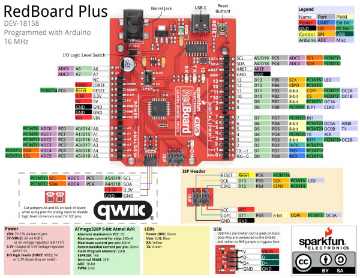
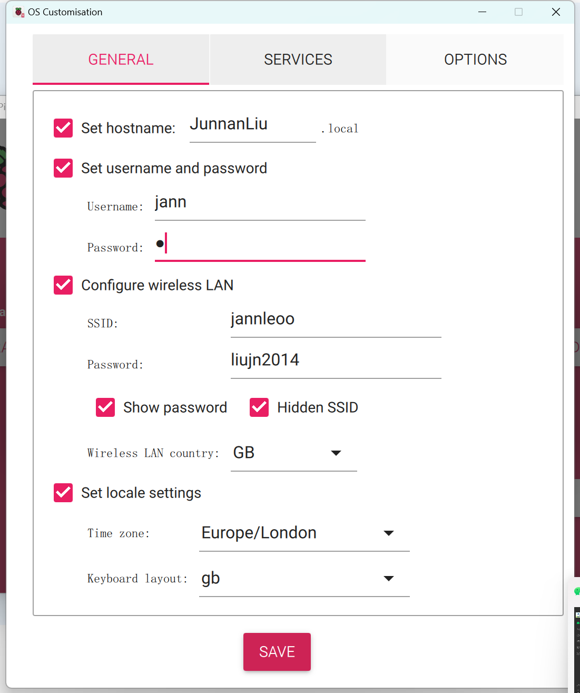
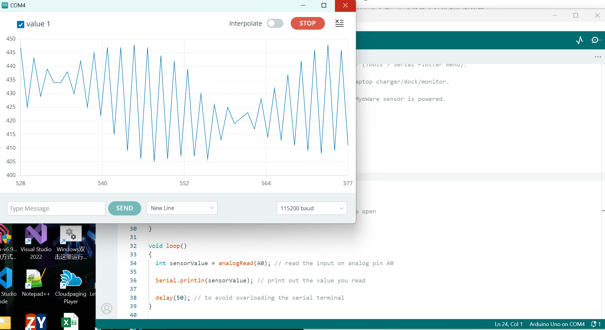

# week 5-6 summary

### 1. SparkFun RedBoard Plus

#### 1.1 链接

[SparkFun RedBoard Plus - DEV-18158 - 火花缤纷电子](https://www.sparkfun.com/products/18158)

2.0MyoWare教程：

[Getting Started with the MyoWare® 2.0 Muscle Sensor Ecosystem - SparkFun Learn](https://learn.sparkfun.com/tutorials/getting-started-with-the-myoware-20-muscle-sensor-ecosystem)

#### 1.2 特性

- ATmega328P microcontroller with the Optiboot (UNO) Bootloader
  - ATmega328P是Atmel 生产的一个8位AVR系列微控制器的一种型号
  - 它有32KB内存，2KB的静态随机存取存储器
  - Optiboot Bootloader 是用于ATmega328P的一个芯片开源引导加载程序
    - 目的是通过串口将程序烧录到微控制器中
    - 节约空间，提高了上传代码速度
  
- 32KB flash内存空间， 6MHz时钟速度

- 使用USB C连接器 ， CH340G USB串口协议通讯

- 内置可复位的PTC保险丝   5V/2A

- 提供3.3V 到5V的 开关调节电压

- 22个数字I/O口

- 6个PWM 输出口

- 8 个模拟输入口

- 1 个UART

- 1 个 I2C

- 1 个SPI

- 1个Qwiic 连接器，采用4针接口，包括 VCC GND SDA SCL

- A4/A5 Jumpers ， 是A4和A5引脚之间的跳线或跳线帽，可以方便连接I2C设备。

- 7V DC to 15V DC 直流电压范围

- LM1117 adjusted to 5V 电压稳压器芯片被调整为输出5福特的电压

- AP2112 for 3.3V 电压稳压器芯片设置为3.3V输出电压

- 具有Arduino R3 Shield 兼容插槽

  

#### 1.3 如何使用

[RedBoard Plus 联播指南 - SparkFun Learn](https://learn.sparkfun.com/tutorials/redboard-plus-hookup-guide#hardware-overview)

[MyoWare肌肉传感器与Arduino的实验 (dronebotworkshop.com)](https://dronebotworkshop.com/myoware/)

#### 1.4 代码

```arduino
/*
  MyoWare Example_01_analogRead_SINGLE
  SparkFun Electronics
  Pete Lewis
  3/24/2022
  License: This code is public domain but you buy me a beverage if you use this and we meet someday.
  This code was adapted from the MyoWare analogReadValue.ino example found here:
  https://github.com/AdvancerTechnologies/MyoWare_MuscleSensor

  This example streams the data from a single MyoWare sensor attached to ADC A0.
  Graphical representation is available using Serial Plotter (Tools > Serial Plotter menu).

  *Only run on a laptop using its battery. Do not plug in laptop charger/dock/monitor.

  *Do not touch your laptop trackpad or keyboard while the MyoWare sensor is powered.

  Hardware:
  SparkFun RedBoard Artemis (or Arduino of choice)
  USB from Artemis to Computer.
  Output from sensor connected to your Arduino pin A0

  This example code is in the public domain.
*/

void setup() 
{
  Serial.begin(115200);
  while (!Serial); // optionally wait for serial terminal to open
  Serial.println("MyoWare Example_01_analogRead_SINGLE");
}

void loop() 
{  
  int sensorValue = analogRead(A0); // read the input on analog pin A0

  Serial.println(sensorValue); // print out the value you read

  delay(50); // to avoid overloading the serial terminal
}

```

- #### 安装过程

- 

#### 4. 测试代码所示的输出图



#### 5. wifi扩展版

[SparkFun Qwiic WiFi 扩展板 - DA16200 - WRL-18567 - SparkFun 电子](https://www.sparkfun.com/products/18567)

[对话 ULP WiFi DA16200 R3 Shield 连接指南 - SparkFun Learn](https://learn.sparkfun.com/tutorials/dialog-ulp-wifi-da16200-r3-shield-hookup-guide)

#### 6. 蓝牙扩展版

[410-359 Digilent, Inc. | Development Boards, Kits, Programmers | DigiKey](https://www.digikey.co.uk/en/products/detail/digilent-inc/410-359/8605090)

[RN4870/71 Data Sheet (microchip.com)](https://ww1.microchip.com/downloads/aemDocuments/documents/WSG/ProductDocuments/DataSheets/RN4870-71-Bluetooth-Low-Energy-Module-DS50002489.pdf)

#### 7.面包板

[Breadboard - Self-Adhesive (White) - PRT-12002 - SparkFun Electronics](https://www.sparkfun.com/products/12002?_gl=1*1k0rzw5*_ga*NjE0MTAzODY0LjE3MDI0MjA1MTQ.*_ga_T369JS7J9N*MTcwNjI3NTk1My4xNy4xLjE3MDYyNzc2NDcuNTguMC4w&_ga=2.233157786.543089915.1706126323-614103864.1702420514)

#### 8. 接下来的计划

-  理解stm32并且比较stm32与arduino的区别

  - |           |                         STM32 Nucleo                         |                    SparkFun RedBoard Plus                    |
    | :-------: | :----------------------------------------------------------: | :----------------------------------------------------------: |
    |   架构    |                            STM32                             |                           Arduino                            |
    |  兼容性   |                      需要考虑连接肌肉群                      |   可直接通过MyoWare 2.0 Arduino Shield扩展版直连6个肌肉群    |
    |   蓝牙    |                             自带                             |                         需要外接模块                         |
    |   WiFi    |                             自带                             |                         需要外接模块                         |
    |  单片机   |                          NUCLEO系列                          |                        ATmega328P系列                        |
    | datasheet | [Data brief - NUCLEO‑XXXXCX NUCLEO‑XXXXRX NUCLEO‑XXXXRX‑P NUCLEO-XXXXRX-Q - STM32 Nucleo-64 boards](https://www.st.com/resource/en/data_brief/nucleo-f030r8.pdf) | [RedBoard Plus 联播指南 - SparkFun Learn](https://learn.sparkfun.com/tutorials/redboard-plus-hookup-guide#hardware-overview) |
    | 相关代码  | [STM32 Nucleo Boards - PDF Documentation](https://www.st.com/en/evaluation-tools/stm32-nucleo-boards/documentation.html) | [sparkfun/RedBoard_Plus：基于 Uno 外形尺寸的 ATmega328 板，具有 Qwiic、PTH 孔和所有额外的位，以制造更好的 Uno。 (github.com)](https://github.com/sparkfun/RedBoard_Plus) |
    |   链接    | [Elektor STM32 Nucleo Starter Kit - KIT-18005 - SparkFun Electronics](https://www.sparkfun.com/products/18005) | [SparkFun RedBoard Plus - DEV-18158 - SparkFun Electronics](https://www.sparkfun.com/products/18158) |

  - Arduino R3 Shield 有兼容插槽，可以兼容扩展版使用，直接连接就可以测

  - 但是当前买的板子没有蓝牙功能，需要外接一个蓝牙模块

  - 而stm32没有这种担忧，蓝牙和wifi自带

  - 保险起见两者都试试，优先考虑arduino

#### 9. MyoWare 2.0 Arduino Shield扩展板

