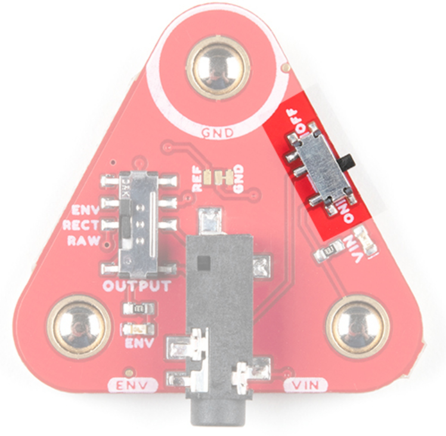
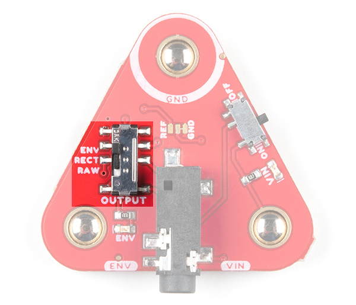
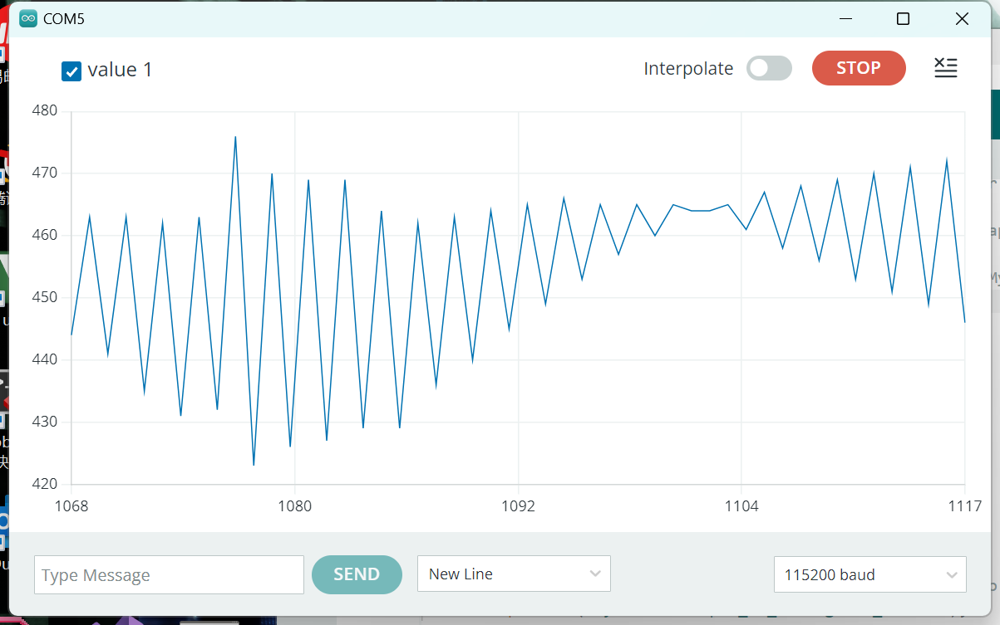

# Week 15 summarize

- #### 对肌肉传感器的分析------MyoWare 2.0 链路扩展板

- 电源开关

无阴影部分是输出开关，当它调为ON的时候表示开机。

- 输出开关

下图中的不同选择会导致输出为不同类型，ENV是包络输出，REC是整流输出，RAW是原始输出。

当我们选择RAW时，输出样式为这样：

原始输出：未经修改的信号变成输出，通常用于分析系统性能或行为。

包络输出：通过提取信号的包络（振幅的慢速变化部分）而得到的输出，通常表示信号的主要特征而忽略高频部分的细节。用于调制解调。

整流输出：通过将信号的负振幅部分转换成正半轴来输出，通常会把负部分信号变成0。 用于提取直流成分

- 3.5mm TRS连接器

TRS连接器引脚：

| 引脚排列             | TRS引脚 |
| -------------------- | ------- |
| 接地（GND）          | Sleeve  |
| 电压输入（VIN）      | Ring    |
| ENV/RECT/RAW（输出） | Tip     |

所以输出方式是通过Tip引脚传出去的。