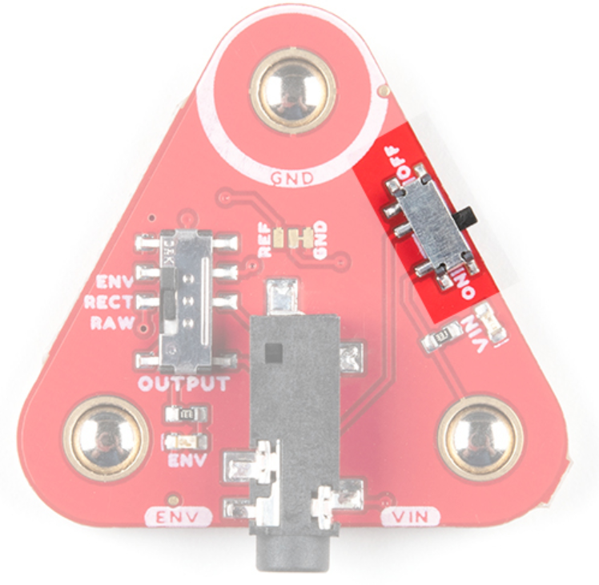
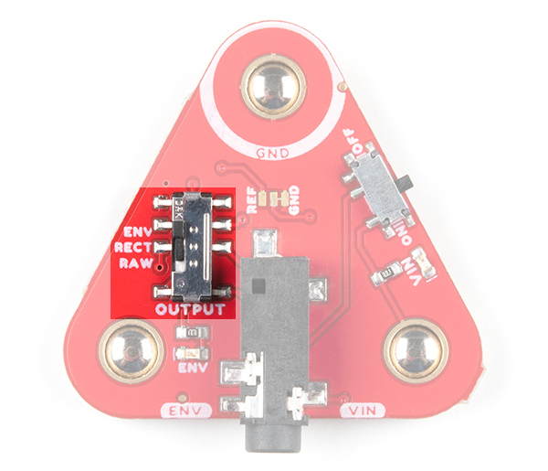
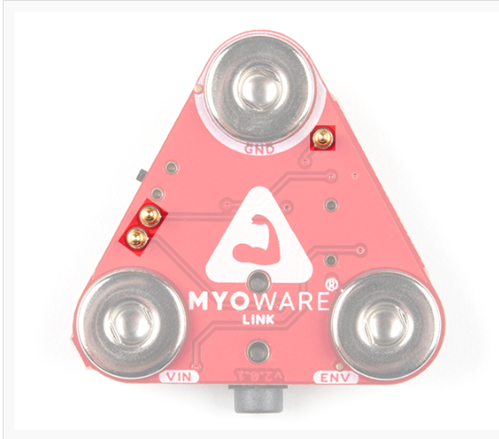
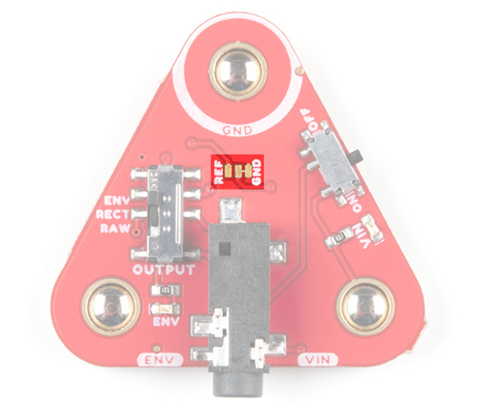

# Link Shield

- #### Analysis of Muscle Sensors -- MyoWare 2.0 Link Extension Board

- Power Switch

The unshaded part is the output switch, which means the device is turned on when it is set to ON.

- Output Switch

The different selections in the figure below will result in different types of output. ENV is envelope output, REC is rectified output, and RAW is raw output.

When we choose RAW, the output style is as follows:

- Raw output: The unmodified signal becomes output, typically used for analyzing system performance or behavior.

- Envelope output: The output obtained by extracting the envelope of the signal (the slowly varying part of the amplitude), typically representing the main characteristics of the signal while ignoring the details of the high frequency part. Used for demodulation.

- Rectified output: By converting the negative amplitude part of the signal to the positive half axis to output, the negative part of the signal usually turns into 0. Used to extract DC components.

- #### 3.5mm TRS connector

TRS connector pins:

| Pin arrangement | TRS pin |
| ---------------- | ------- |
| Ground (GND)  | Sleeve  |
| Voltage Input (VIN)  | Ring    |
| ENV/RECT/RAW (Output) | Tip     |

Hence, the output method is transmitted through the Tip pin.

The voltage of the VIN input port may be 5V or 3V depending on the position of the PWR jumper on the arduinoshield

The range of ENV envelope signal is between 0-VIN and it is connected to the ADC on the microcontroller

#### POGO pin

A Pogo pin, also known as a spring-loaded contact pin, is used for temporary, repeatable connections. On the MyoWare 2.0 Link Shield, the Pogo pin's primary purpose is to provide a fast, convenient way to connect to the MyoWare muscle sensor and other electronic components (such as Arduino board, sensors, or other peripherals) without needing to solder. 

These Pogo pins establish a connection through physical contact pressure, allowing users to easily connect or disconnect the MyoWare 2.0 Link Shield with muscle sensors and other components, making prototyping, testing, and iteration simpler and faster. Using Pogo pins, you can quickly change configurations or replace components without worrying about potential damage or permanent connections caused by soldering.

The POGO pin is raw output.

#### Jumper

There is a three-pin jumper in the middle of the circuit board.

Jumper: A component that changes the state of a circuit by inserting or moving pins.

By default, the RAW output uses VIN/2 as the reference voltage. If the user needs to change this setting to 0, it would be necessary to change the jumper.

