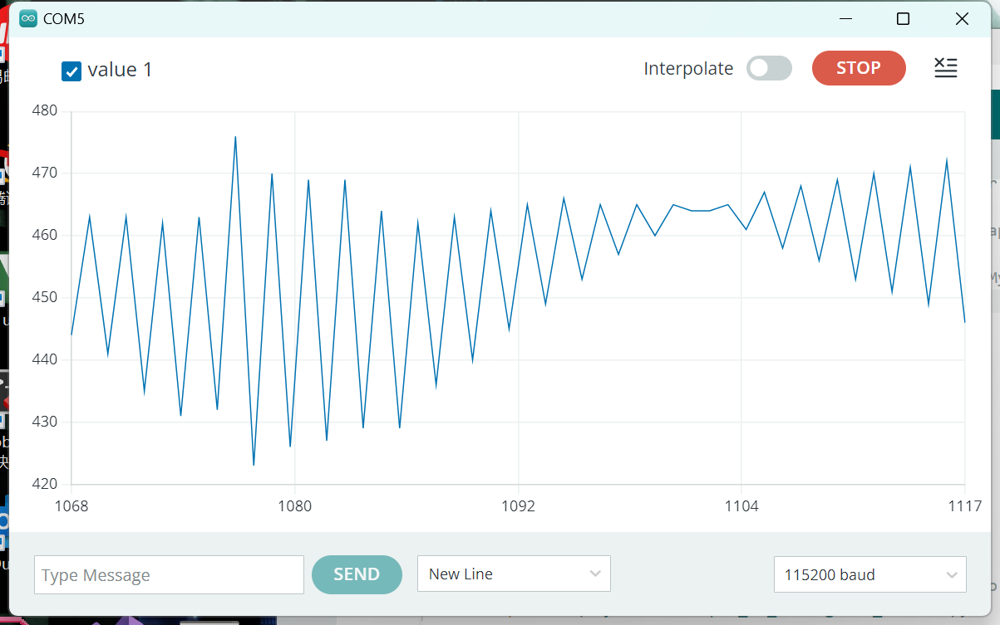
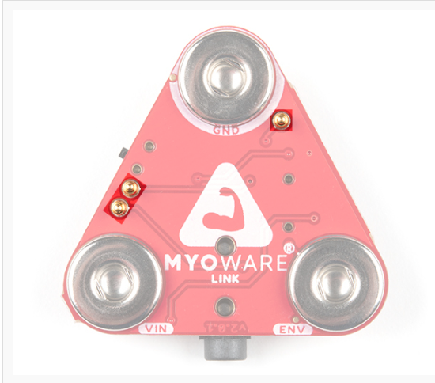
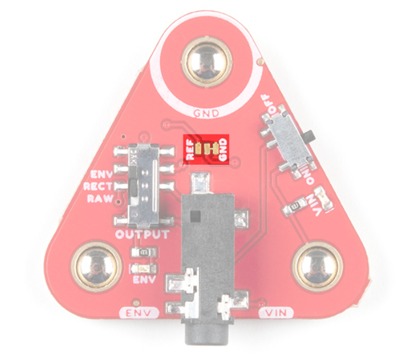

# Link Shield

- #### 对肌肉传感器的分析------MyoWare 2.0 链路扩展板

- 电源开关

无阴影部分是输出开关，当它调为ON的时候表示开机。

- 输出开关

下图中的不同选择会导致输出为不同类型，ENV是包络输出，REC是整流输出，RAW是原始输出。

当我们选择RAW时，输出样式为这样：

原始输出：未经修改的信号变成输出，通常用于分析系统性能或行为。

包络输出：通过提取信号的包络（振幅的慢速变化部分）而得到的输出，通常表示信号的主要特征而忽略高频部分的细节。用于调制解调。

整流输出：通过将信号的负振幅部分转换成正半轴来输出，通常会把负部分信号变成0。 用于提取直流成分

- #### 3.5mm TRS连接器

TRS连接器引脚：

| 引脚排列             | TRS引脚 |
| -------------------- | ------- |
| 接地（GND）          | Sleeve  |
| 电压输入（VIN）      | Ring    |
| ENV/RECT/RAW（输出） | Tip     |

所以输出方式是通过Tip引脚传出去的。

VIN输入口的电压可能是5V或者3V 取决于 arduinoshield上PWR跳线的位置

ENV  包络信号范围介于0-VIN之间  并且将其连接到微控制器上的ADC

#### POGO引脚

Pogo 引脚，或者叫做 Pogo Pin，是一种弹簧加载的接触引脚，用于临时的、可重复的连接。在 MyoWare 2.0 Link Shield 上，Pogo 引脚的主要用途是为了提供一种快速、方便地与 MyoWare 肌肉传感器及其他电子组件（如Arduino板、传感器或其他外围设备）连接的方式，而不需要进行焊接。

这些Pogo 引脚通过物理压力接触来建立连接，允许用户轻松地将 MyoWare 2.0 Link Shield 与肌肉传感器和其他组件连接或断开，这使得原型制作、测试和迭代变得更加简单和快捷。使用 Pogo 引脚，你可以快速更改配置或替换组件，而无需担心因焊接而可能造成的损害或永久性连接。

POGO引脚是原始输出。

#### 跳线

电路板中间有个三引脚的跳线器。

跳线器：一种通过插入或移动引脚来改变电路状态的组件。

默认情况下RAW输出是以VIN/2为参考电压，可能用户需要改变此设置为0，就需要更改跳线。